# 003_중국인 관광객추이

## 1. 외국인 출입국 데이터 구하기

- 한국관광 데이터렙
  https://datalab.visitkorea.or.kr/datalab/portal/main/getMainForm.do
- 공공데이터포털
  https://www.data.go.kr/index.do

## 2. 전처리(객별로)

### 1)정보 불러오고 정보 확인하기


```python
import pandas as pd
import numpy as np
```


```python
kto=pd.read_excel('./files/kto_201901.xlsx',header=1,usecols='A:G',skipfooter=4)
print(kto, kto.info(), kto.describe())
```

    <class 'pandas.core.frame.DataFrame'>
    RangeIndex: 67 entries, 0 to 66
    Data columns (total 7 columns):
     #   Column  Non-Null Count  Dtype 
    ---  ------  --------------  ----- 
     0   국적      67 non-null     object
     1   관광      67 non-null     int64 
     2   상용      67 non-null     int64 
     3   공용      67 non-null     int64 
     4   유학/연수   67 non-null     int64 
     5   기타      67 non-null     int64 
     6   계       67 non-null     int64 
    dtypes: int64(6), object(1)
    memory usage: 3.8+ KB
             국적      관광     상용    공용  유학/연수      기타       계
    0      아시아주  765082  10837  1423  14087  125521  916950
    1        일본  198805   2233   127    785    4576  206526
    2        대만   86393     74    22    180    1285   87954
    3        홍콩   34653     59     2     90    1092   35896
    4       마카오    2506      2     0     17      45    2570
    ..      ...     ...    ...   ...    ...     ...     ...
    62  아프리카 기타     768    718    90    206     908    2690
    63     기타대륙      33      4     0      1      16      54
    64     국적미상      33      4     0      1      16      54
    65     교포소계       0      0     0      0   15526   15526
    66       교포       0      0     0      0   15526   15526
    
    [67 rows x 7 columns] None                  관광            상용           공용         유학/연수             기타  \
    count      67.00000     67.000000    67.000000     67.000000      67.000000   
    mean    26396.80597    408.208955   132.507463    477.462687    5564.208955   
    std    102954.04969   1416.040302   474.406339   2009.484800   17209.438418   
    min         0.00000      0.000000     0.000000      0.000000      16.000000   
    25%       505.00000     14.500000     2.500000     17.500000     260.000000   
    50%      1304.00000     45.000000    14.000000     43.000000     912.000000   
    75%      8365.00000    176.500000    38.000000    182.000000    2824.500000   
    max    765082.00000  10837.000000  2657.000000  14087.000000  125521.000000   
    
                       계  
    count      67.000000  
    mean    32979.194030  
    std    122821.369969  
    min        54.000000  
    25%       927.000000  
    50%      2695.000000  
    75%     14905.500000  
    max    916950.000000  


### 참고사항


```python
kto[(kto['관광']==0)|(kto['상용']==0)|(kto['공용']==0)|(kto['유학/연수']==0)|(kto['기타']==0)]
```


<div>
<style scoped>
    .dataframe tbody tr th:only-of-type {
        vertical-align: middle;
    }


    .dataframe tbody tr th {
        vertical-align: top;
    }
    
    .dataframe thead th {
        text-align: right;
    }

</style>

<table border="1" class="dataframe">
  <thead>
    <tr style="text-align: right;">
      <th></th>
      <th>국적</th>
      <th>관광</th>
      <th>상용</th>
      <th>공용</th>
      <th>유학/연수</th>
      <th>기타</th>
      <th>계</th>
    </tr>
  </thead>
  <tbody>
    <tr>
      <th>4</th>
      <td>마카오</td>
      <td>2506</td>
      <td>2</td>
      <td>0</td>
      <td>17</td>
      <td>45</td>
      <td>2570</td>
    </tr>
    <tr>
      <th>20</th>
      <td>이스라엘</td>
      <td>727</td>
      <td>12</td>
      <td>0</td>
      <td>9</td>
      <td>57</td>
      <td>805</td>
    </tr>
    <tr>
      <th>22</th>
      <td>우즈베키스탄</td>
      <td>1958</td>
      <td>561</td>
      <td>0</td>
      <td>407</td>
      <td>2828</td>
      <td>5754</td>
    </tr>
    <tr>
      <th>38</th>
      <td>스위스</td>
      <td>613</td>
      <td>18</td>
      <td>0</td>
      <td>19</td>
      <td>97</td>
      <td>747</td>
    </tr>
    <tr>
      <th>45</th>
      <td>그리스</td>
      <td>481</td>
      <td>17</td>
      <td>4</td>
      <td>0</td>
      <td>273</td>
      <td>775</td>
    </tr>
    <tr>
      <th>46</th>
      <td>포르투갈</td>
      <td>416</td>
      <td>14</td>
      <td>0</td>
      <td>13</td>
      <td>121</td>
      <td>564</td>
    </tr>
    <tr>
      <th>51</th>
      <td>크로아티아</td>
      <td>226</td>
      <td>12</td>
      <td>0</td>
      <td>3</td>
      <td>250</td>
      <td>491</td>
    </tr>
    <tr>
      <th>54</th>
      <td>폴란드</td>
      <td>713</td>
      <td>10</td>
      <td>0</td>
      <td>27</td>
      <td>574</td>
      <td>1324</td>
    </tr>
    <tr>
      <th>59</th>
      <td>대양주 기타</td>
      <td>555</td>
      <td>3</td>
      <td>4</td>
      <td>0</td>
      <td>52</td>
      <td>614</td>
    </tr>
    <tr>
      <th>63</th>
      <td>기타대륙</td>
      <td>33</td>
      <td>4</td>
      <td>0</td>
      <td>1</td>
      <td>16</td>
      <td>54</td>
    </tr>
    <tr>
      <th>64</th>
      <td>국적미상</td>
      <td>33</td>
      <td>4</td>
      <td>0</td>
      <td>1</td>
      <td>16</td>
      <td>54</td>
    </tr>
    <tr>
      <th>65</th>
      <td>교포소계</td>
      <td>0</td>
      <td>0</td>
      <td>0</td>
      <td>0</td>
      <td>15526</td>
      <td>15526</td>
    </tr>
    <tr>
      <th>66</th>
      <td>교포</td>
      <td>0</td>
      <td>0</td>
      <td>0</td>
      <td>0</td>
      <td>15526</td>
      <td>15526</td>
    </tr>
  </tbody>
</table>

</div>


### 2)기준월일 추가


```python
kto['기준월일']='2019-01'
```

### 3)대륙 행삭제, 대륙을 열에 생성하기


```python
kto['국적'].nunique()
kto['국적'].value_counts()
kto['국적'].unique()
```


    array(['아시아주', '일본', '대만', '홍콩', '마카오', '태국', '말레이시아', '필리핀', '인도네시아',
           '싱가포르', '미얀마', '베트남', '인도', '스리랑카', '파키스탄', '방글라데시', '캄보디아', '몽골',
           '중국', '이란', '이스라엘', '터키', '우즈베키스탄', '카자흐스탄', 'GCC', '아시아 기타', '미주',
           '미국', '캐나다', '멕시코', '브라질', '미주 기타', '구주', '영국', '독일', '프랑스',
           '네덜란드', '스웨덴', '스위스', '이탈리아', '덴마크', '노르웨이', '벨기에', '오스트리아', '스페인',
           '그리스', '포르투갈', '핀란드', '아일랜드', '우크라이나', '러시아', '크로아티아', '루마니아',
           '불가리아', '폴란드', '구주 기타', '대양주', '오스트레일리아', '뉴질랜드', '대양주 기타',
           '아프리카주', '남아프리카공화국', '아프리카 기타', '기타대륙', '국적미상', '교포소계', '교포'],
          dtype=object)


```python
contients_list=['아시아주','미주','구주','대양주','아프리카주','기타대륙', '국적미상', '교포소계', '교포']
condition=kto['국적'].isin(contients_list)
kto[condition==False]
kto_country=kto[~condition]
```


```python
kto_country=kto_country.reset_index(drop=True)
```


```python
continents=['아시아']*25+['아메리카']*5+['유럽']*23+['오세아니아']*3+['아프리카']*2
kto_country['대륙']=continents
kto_country.head()
```


<div>
<style scoped>
    .dataframe tbody tr th:only-of-type {
        vertical-align: middle;
    }


    .dataframe tbody tr th {
        vertical-align: top;
    }
    
    .dataframe thead th {
        text-align: right;
    }

</style>

<table border="1" class="dataframe">
  <thead>
    <tr style="text-align: right;">
      <th></th>
      <th>국적</th>
      <th>관광</th>
      <th>상용</th>
      <th>공용</th>
      <th>유학/연수</th>
      <th>기타</th>
      <th>계</th>
      <th>기준월일</th>
      <th>대륙</th>
    </tr>
  </thead>
  <tbody>
    <tr>
      <th>0</th>
      <td>일본</td>
      <td>198805</td>
      <td>2233</td>
      <td>127</td>
      <td>785</td>
      <td>4576</td>
      <td>206526</td>
      <td>2019-01</td>
      <td>아시아</td>
    </tr>
    <tr>
      <th>1</th>
      <td>대만</td>
      <td>86393</td>
      <td>74</td>
      <td>22</td>
      <td>180</td>
      <td>1285</td>
      <td>87954</td>
      <td>2019-01</td>
      <td>아시아</td>
    </tr>
    <tr>
      <th>2</th>
      <td>홍콩</td>
      <td>34653</td>
      <td>59</td>
      <td>2</td>
      <td>90</td>
      <td>1092</td>
      <td>35896</td>
      <td>2019-01</td>
      <td>아시아</td>
    </tr>
    <tr>
      <th>3</th>
      <td>마카오</td>
      <td>2506</td>
      <td>2</td>
      <td>0</td>
      <td>17</td>
      <td>45</td>
      <td>2570</td>
      <td>2019-01</td>
      <td>아시아</td>
    </tr>
    <tr>
      <th>4</th>
      <td>태국</td>
      <td>34004</td>
      <td>37</td>
      <td>199</td>
      <td>96</td>
      <td>6998</td>
      <td>41334</td>
      <td>2019-01</td>
      <td>아시아</td>
    </tr>
  </tbody>
</table>

</div>


### 4)관광객 비율


```python
kto_country['관광객비율(%)']=round(kto_country['관광']*100/kto_country['계'], 2)
```


```python
kto_country.sort_values(by='관광객비율(%)',ascending=False, inplace=True)
kto_country.head()
```


<div>
<style scoped>
    .dataframe tbody tr th:only-of-type {
        vertical-align: middle;
    }


    .dataframe tbody tr th {
        vertical-align: top;
    }
    
    .dataframe thead th {
        text-align: right;
    }

</style>

<table border="1" class="dataframe">
  <thead>
    <tr style="text-align: right;">
      <th></th>
      <th>국적</th>
      <th>관광</th>
      <th>상용</th>
      <th>공용</th>
      <th>유학/연수</th>
      <th>기타</th>
      <th>계</th>
      <th>기준월일</th>
      <th>대륙</th>
      <th>관광객비율(%)</th>
    </tr>
  </thead>
  <tbody>
    <tr>
      <th>1</th>
      <td>대만</td>
      <td>86393</td>
      <td>74</td>
      <td>22</td>
      <td>180</td>
      <td>1285</td>
      <td>87954</td>
      <td>2019-01</td>
      <td>아시아</td>
      <td>98.23</td>
    </tr>
    <tr>
      <th>3</th>
      <td>마카오</td>
      <td>2506</td>
      <td>2</td>
      <td>0</td>
      <td>17</td>
      <td>45</td>
      <td>2570</td>
      <td>2019-01</td>
      <td>아시아</td>
      <td>97.51</td>
    </tr>
    <tr>
      <th>2</th>
      <td>홍콩</td>
      <td>34653</td>
      <td>59</td>
      <td>2</td>
      <td>90</td>
      <td>1092</td>
      <td>35896</td>
      <td>2019-01</td>
      <td>아시아</td>
      <td>96.54</td>
    </tr>
    <tr>
      <th>0</th>
      <td>일본</td>
      <td>198805</td>
      <td>2233</td>
      <td>127</td>
      <td>785</td>
      <td>4576</td>
      <td>206526</td>
      <td>2019-01</td>
      <td>아시아</td>
      <td>96.26</td>
    </tr>
    <tr>
      <th>55</th>
      <td>대양주 기타</td>
      <td>555</td>
      <td>3</td>
      <td>4</td>
      <td>0</td>
      <td>52</td>
      <td>614</td>
      <td>2019-01</td>
      <td>오세아니아</td>
      <td>90.39</td>
    </tr>
  </tbody>
</table>

</div>


### 5) 피봇테이블


```python
kto_country.pivot_table(values='관광객비율(%)',index="대륙",aggfunc='mean')
```


<div>
<style scoped>
    .dataframe tbody tr th:only-of-type {
        vertical-align: middle;
    }


    .dataframe tbody tr th {
        vertical-align: top;
    }
    
    .dataframe thead th {
        text-align: right;
    }

</style>

<table border="1" class="dataframe">
  <thead>
    <tr style="text-align: right;">
      <th></th>
      <th>관광객비율(%)</th>
    </tr>
    <tr>
      <th>대륙</th>
      <th></th>
    </tr>
  </thead>
  <tbody>
    <tr>
      <th>아메리카</th>
      <td>68.196000</td>
    </tr>
    <tr>
      <th>아시아</th>
      <td>59.618800</td>
    </tr>
    <tr>
      <th>아프리카</th>
      <td>32.675000</td>
    </tr>
    <tr>
      <th>오세아니아</th>
      <td>84.806667</td>
    </tr>
    <tr>
      <th>유럽</th>
      <td>63.823043</td>
    </tr>
  </tbody>
</table>

</div>


### 6)전체비율 추가  


```python
kto_country[kto_country['국적']=='중국']
```


<div>
<style scoped>
    .dataframe tbody tr th:only-of-type {
        vertical-align: middle;
    }


    .dataframe tbody tr th {
        vertical-align: top;
    }
    
    .dataframe thead th {
        text-align: right;
    }

</style>

<table border="1" class="dataframe">
  <thead>
    <tr style="text-align: right;">
      <th></th>
      <th>국적</th>
      <th>관광</th>
      <th>상용</th>
      <th>공용</th>
      <th>유학/연수</th>
      <th>기타</th>
      <th>계</th>
      <th>기준월일</th>
      <th>대륙</th>
      <th>관광객비율(%)</th>
    </tr>
  </thead>
  <tbody>
    <tr>
      <th>17</th>
      <td>중국</td>
      <td>320113</td>
      <td>2993</td>
      <td>138</td>
      <td>8793</td>
      <td>60777</td>
      <td>392814</td>
      <td>2019-01</td>
      <td>아시아</td>
      <td>81.49</td>
    </tr>
  </tbody>
</table>

</div>


```python
kto_country['전체비율(%)']=round(kto_country['관광']*100/(kto_country['관광'].sum()), 2)
kto_country.sort_values(by='전체비율(%)',ascending=False, inplace=True)
kto_country.head()
```


<div>
<style scoped>
    .dataframe tbody tr th:only-of-type {
        vertical-align: middle;
    }


    .dataframe tbody tr th {
        vertical-align: top;
    }
    
    .dataframe thead th {
        text-align: right;
    }

</style>

<table border="1" class="dataframe">
  <thead>
    <tr style="text-align: right;">
      <th></th>
      <th>국적</th>
      <th>관광</th>
      <th>상용</th>
      <th>공용</th>
      <th>유학/연수</th>
      <th>기타</th>
      <th>계</th>
      <th>기준월일</th>
      <th>대륙</th>
      <th>관광객비율(%)</th>
      <th>전체비율(%)</th>
    </tr>
  </thead>
  <tbody>
    <tr>
      <th>17</th>
      <td>중국</td>
      <td>320113</td>
      <td>2993</td>
      <td>138</td>
      <td>8793</td>
      <td>60777</td>
      <td>392814</td>
      <td>2019-01</td>
      <td>아시아</td>
      <td>81.49</td>
      <td>36.20</td>
    </tr>
    <tr>
      <th>0</th>
      <td>일본</td>
      <td>198805</td>
      <td>2233</td>
      <td>127</td>
      <td>785</td>
      <td>4576</td>
      <td>206526</td>
      <td>2019-01</td>
      <td>아시아</td>
      <td>96.26</td>
      <td>22.48</td>
    </tr>
    <tr>
      <th>1</th>
      <td>대만</td>
      <td>86393</td>
      <td>74</td>
      <td>22</td>
      <td>180</td>
      <td>1285</td>
      <td>87954</td>
      <td>2019-01</td>
      <td>아시아</td>
      <td>98.23</td>
      <td>9.77</td>
    </tr>
    <tr>
      <th>25</th>
      <td>미국</td>
      <td>42989</td>
      <td>418</td>
      <td>2578</td>
      <td>229</td>
      <td>16523</td>
      <td>62737</td>
      <td>2019-01</td>
      <td>아메리카</td>
      <td>68.52</td>
      <td>4.86</td>
    </tr>
    <tr>
      <th>2</th>
      <td>홍콩</td>
      <td>34653</td>
      <td>59</td>
      <td>2</td>
      <td>90</td>
      <td>1092</td>
      <td>35896</td>
      <td>2019-01</td>
      <td>아시아</td>
      <td>96.54</td>
      <td>3.92</td>
    </tr>
  </tbody>
</table>

</div>


## 함수화 하기

### 1)함수 정의


```python
def create_kto_data(yy, mm):
    kto=pd.read_excel('./files/kto_{}{}.xlsx'.format(yy,mm),header=1,usecols='A:G',skipfooter=4)
    kto['기준년월']='{}-{}'.format(yy, mm)
    kto_country=kto[~(kto['국적'].isin(['아시아주','미주','구주','대양주','아프리카주','기타대륙', '국적미상', '교포소계', '교포']))]
    kto_country['대륙']=['아시아']*25+['아메리카']*5+['유럽']*23+['오세아니아']*3+['아프리카']*2
    kto_country['관광객비율(%)']=round(kto_country['관광']*100/kto_country['계'], 2)
    kto_country['전체비율(%)']=round(kto_country['관광']*100/(kto_country['관광'].sum()), 2)
    return(kto_country)
```

### 2)함수 적용해보기


```python
create_kto_data(2010, 10)
```

    C:\Users\nadai\AppData\Local\Temp/ipykernel_9760/2013000452.py:5: SettingWithCopyWarning: 
    A value is trying to be set on a copy of a slice from a DataFrame.
    Try using .loc[row_indexer,col_indexer] = value instead
    
    See the caveats in the documentation: https://pandas.pydata.org/pandas-docs/stable/user_guide/indexing.html#returning-a-view-versus-a-copy
      kto_country['대륙']=['아시아']*25+['아메리카']*5+['유럽']*23+['오세아니아']*3+['아프리카']*2
    C:\Users\nadai\AppData\Local\Temp/ipykernel_9760/2013000452.py:6: SettingWithCopyWarning: 
    A value is trying to be set on a copy of a slice from a DataFrame.
    Try using .loc[row_indexer,col_indexer] = value instead
    
    See the caveats in the documentation: https://pandas.pydata.org/pandas-docs/stable/user_guide/indexing.html#returning-a-view-versus-a-copy
      kto_country['관광객비율(%)']=round(kto_country['관광']*100/kto_country['계'], 2)
    C:\Users\nadai\AppData\Local\Temp/ipykernel_9760/2013000452.py:7: SettingWithCopyWarning: 
    A value is trying to be set on a copy of a slice from a DataFrame.
    Try using .loc[row_indexer,col_indexer] = value instead
    
    See the caveats in the documentation: https://pandas.pydata.org/pandas-docs/stable/user_guide/indexing.html#returning-a-view-versus-a-copy
      kto_country['전체비율(%)']=round(kto_country['관광']*100/(kto_country['관광'].sum()), 2)


<div>
<style scoped>
    .dataframe tbody tr th:only-of-type {
        vertical-align: middle;
    }


    .dataframe tbody tr th {
        vertical-align: top;
    }
    
    .dataframe thead th {
        text-align: right;
    }

</style>

<table border="1" class="dataframe">
  <thead>
    <tr style="text-align: right;">
      <th></th>
      <th>국적</th>
      <th>관광</th>
      <th>상용</th>
      <th>공용</th>
      <th>유학/연수</th>
      <th>기타</th>
      <th>계</th>
      <th>기준년월</th>
      <th>대륙</th>
      <th>관광객비율(%)</th>
      <th>전체비율(%)</th>
    </tr>
  </thead>
  <tbody>
    <tr>
      <th>1</th>
      <td>일본</td>
      <td>295488</td>
      <td>1270</td>
      <td>85</td>
      <td>199</td>
      <td>5528</td>
      <td>302570</td>
      <td>2010-10</td>
      <td>아시아</td>
      <td>97.66</td>
      <td>44.89</td>
    </tr>
    <tr>
      <th>2</th>
      <td>대만</td>
      <td>39087</td>
      <td>55</td>
      <td>1</td>
      <td>36</td>
      <td>650</td>
      <td>39829</td>
      <td>2010-10</td>
      <td>아시아</td>
      <td>98.14</td>
      <td>5.94</td>
    </tr>
    <tr>
      <th>3</th>
      <td>홍콩</td>
      <td>21148</td>
      <td>62</td>
      <td>0</td>
      <td>8</td>
      <td>809</td>
      <td>22027</td>
      <td>2010-10</td>
      <td>아시아</td>
      <td>96.01</td>
      <td>3.21</td>
    </tr>
    <tr>
      <th>4</th>
      <td>마카오</td>
      <td>812</td>
      <td>0</td>
      <td>0</td>
      <td>0</td>
      <td>1</td>
      <td>813</td>
      <td>2010-10</td>
      <td>아시아</td>
      <td>99.88</td>
      <td>0.12</td>
    </tr>
    <tr>
      <th>5</th>
      <td>태국</td>
      <td>29243</td>
      <td>30</td>
      <td>14</td>
      <td>24</td>
      <td>4802</td>
      <td>34113</td>
      <td>2010-10</td>
      <td>아시아</td>
      <td>85.72</td>
      <td>4.44</td>
    </tr>
    <tr>
      <th>6</th>
      <td>말레이시아</td>
      <td>8311</td>
      <td>78</td>
      <td>3</td>
      <td>25</td>
      <td>1192</td>
      <td>9609</td>
      <td>2010-10</td>
      <td>아시아</td>
      <td>86.49</td>
      <td>1.26</td>
    </tr>
    <tr>
      <th>7</th>
      <td>필리핀</td>
      <td>7086</td>
      <td>347</td>
      <td>65</td>
      <td>38</td>
      <td>18416</td>
      <td>25952</td>
      <td>2010-10</td>
      <td>아시아</td>
      <td>27.30</td>
      <td>1.08</td>
    </tr>
    <tr>
      <th>8</th>
      <td>인도네시아</td>
      <td>3903</td>
      <td>658</td>
      <td>29</td>
      <td>22</td>
      <td>4111</td>
      <td>8723</td>
      <td>2010-10</td>
      <td>아시아</td>
      <td>44.74</td>
      <td>0.59</td>
    </tr>
    <tr>
      <th>9</th>
      <td>싱가포르</td>
      <td>8998</td>
      <td>152</td>
      <td>5</td>
      <td>4</td>
      <td>1192</td>
      <td>10351</td>
      <td>2010-10</td>
      <td>아시아</td>
      <td>86.93</td>
      <td>1.37</td>
    </tr>
    <tr>
      <th>10</th>
      <td>미얀마</td>
      <td>697</td>
      <td>53</td>
      <td>52</td>
      <td>5</td>
      <td>3741</td>
      <td>4548</td>
      <td>2010-10</td>
      <td>아시아</td>
      <td>15.33</td>
      <td>0.11</td>
    </tr>
    <tr>
      <th>11</th>
      <td>베트남</td>
      <td>4737</td>
      <td>628</td>
      <td>29</td>
      <td>114</td>
      <td>4484</td>
      <td>9992</td>
      <td>2010-10</td>
      <td>아시아</td>
      <td>47.41</td>
      <td>0.72</td>
    </tr>
    <tr>
      <th>12</th>
      <td>인도</td>
      <td>2276</td>
      <td>2612</td>
      <td>15</td>
      <td>25</td>
      <td>3306</td>
      <td>8234</td>
      <td>2010-10</td>
      <td>아시아</td>
      <td>27.64</td>
      <td>0.35</td>
    </tr>
    <tr>
      <th>13</th>
      <td>스리랑카</td>
      <td>327</td>
      <td>84</td>
      <td>25</td>
      <td>3</td>
      <td>901</td>
      <td>1340</td>
      <td>2010-10</td>
      <td>아시아</td>
      <td>24.40</td>
      <td>0.05</td>
    </tr>
    <tr>
      <th>14</th>
      <td>파키스탄</td>
      <td>242</td>
      <td>389</td>
      <td>2</td>
      <td>12</td>
      <td>313</td>
      <td>958</td>
      <td>2010-10</td>
      <td>아시아</td>
      <td>25.26</td>
      <td>0.04</td>
    </tr>
    <tr>
      <th>15</th>
      <td>방글라데시</td>
      <td>179</td>
      <td>129</td>
      <td>65</td>
      <td>17</td>
      <td>398</td>
      <td>788</td>
      <td>2010-10</td>
      <td>아시아</td>
      <td>22.72</td>
      <td>0.03</td>
    </tr>
    <tr>
      <th>16</th>
      <td>캄보디아</td>
      <td>446</td>
      <td>17</td>
      <td>18</td>
      <td>8</td>
      <td>494</td>
      <td>983</td>
      <td>2010-10</td>
      <td>아시아</td>
      <td>45.37</td>
      <td>0.07</td>
    </tr>
    <tr>
      <th>17</th>
      <td>몽골</td>
      <td>2483</td>
      <td>218</td>
      <td>10</td>
      <td>144</td>
      <td>529</td>
      <td>3384</td>
      <td>2010-10</td>
      <td>아시아</td>
      <td>73.37</td>
      <td>0.38</td>
    </tr>
    <tr>
      <th>18</th>
      <td>중국</td>
      <td>107237</td>
      <td>11371</td>
      <td>374</td>
      <td>3102</td>
      <td>59344</td>
      <td>181428</td>
      <td>2010-10</td>
      <td>아시아</td>
      <td>59.11</td>
      <td>16.29</td>
    </tr>
    <tr>
      <th>19</th>
      <td>이란</td>
      <td>266</td>
      <td>442</td>
      <td>2</td>
      <td>6</td>
      <td>89</td>
      <td>805</td>
      <td>2010-10</td>
      <td>아시아</td>
      <td>33.04</td>
      <td>0.04</td>
    </tr>
    <tr>
      <th>20</th>
      <td>이스라엘</td>
      <td>1192</td>
      <td>7</td>
      <td>0</td>
      <td>1</td>
      <td>87</td>
      <td>1287</td>
      <td>2010-10</td>
      <td>아시아</td>
      <td>92.62</td>
      <td>0.18</td>
    </tr>
    <tr>
      <th>21</th>
      <td>터키</td>
      <td>1043</td>
      <td>17</td>
      <td>3</td>
      <td>4</td>
      <td>530</td>
      <td>1597</td>
      <td>2010-10</td>
      <td>아시아</td>
      <td>65.31</td>
      <td>0.16</td>
    </tr>
    <tr>
      <th>22</th>
      <td>우즈베키스탄</td>
      <td>411</td>
      <td>514</td>
      <td>5</td>
      <td>11</td>
      <td>1607</td>
      <td>2548</td>
      <td>2010-10</td>
      <td>아시아</td>
      <td>16.13</td>
      <td>0.06</td>
    </tr>
    <tr>
      <th>23</th>
      <td>카자흐스탄</td>
      <td>341</td>
      <td>60</td>
      <td>0</td>
      <td>4</td>
      <td>154</td>
      <td>559</td>
      <td>2010-10</td>
      <td>아시아</td>
      <td>61.00</td>
      <td>0.05</td>
    </tr>
    <tr>
      <th>24</th>
      <td>GCC</td>
      <td>691</td>
      <td>135</td>
      <td>23</td>
      <td>15</td>
      <td>83</td>
      <td>947</td>
      <td>2010-10</td>
      <td>아시아</td>
      <td>72.97</td>
      <td>0.10</td>
    </tr>
    <tr>
      <th>25</th>
      <td>아시아 기타</td>
      <td>1459</td>
      <td>834</td>
      <td>107</td>
      <td>25</td>
      <td>470</td>
      <td>2895</td>
      <td>2010-10</td>
      <td>아시아</td>
      <td>50.40</td>
      <td>0.22</td>
    </tr>
    <tr>
      <th>27</th>
      <td>미국</td>
      <td>49798</td>
      <td>1327</td>
      <td>1228</td>
      <td>69</td>
      <td>11534</td>
      <td>63956</td>
      <td>2010-10</td>
      <td>아메리카</td>
      <td>77.86</td>
      <td>7.57</td>
    </tr>
    <tr>
      <th>28</th>
      <td>캐나다</td>
      <td>8929</td>
      <td>118</td>
      <td>0</td>
      <td>7</td>
      <td>2802</td>
      <td>11856</td>
      <td>2010-10</td>
      <td>아메리카</td>
      <td>75.31</td>
      <td>1.36</td>
    </tr>
    <tr>
      <th>29</th>
      <td>멕시코</td>
      <td>807</td>
      <td>16</td>
      <td>1</td>
      <td>19</td>
      <td>175</td>
      <td>1018</td>
      <td>2010-10</td>
      <td>아메리카</td>
      <td>79.27</td>
      <td>0.12</td>
    </tr>
    <tr>
      <th>30</th>
      <td>브라질</td>
      <td>1095</td>
      <td>44</td>
      <td>0</td>
      <td>1</td>
      <td>291</td>
      <td>1431</td>
      <td>2010-10</td>
      <td>아메리카</td>
      <td>76.52</td>
      <td>0.17</td>
    </tr>
    <tr>
      <th>31</th>
      <td>미주 기타</td>
      <td>1396</td>
      <td>41</td>
      <td>6</td>
      <td>13</td>
      <td>529</td>
      <td>1985</td>
      <td>2010-10</td>
      <td>아메리카</td>
      <td>70.33</td>
      <td>0.21</td>
    </tr>
    <tr>
      <th>33</th>
      <td>영국</td>
      <td>8727</td>
      <td>358</td>
      <td>4</td>
      <td>3</td>
      <td>1402</td>
      <td>10494</td>
      <td>2010-10</td>
      <td>유럽</td>
      <td>83.16</td>
      <td>1.33</td>
    </tr>
    <tr>
      <th>34</th>
      <td>독일</td>
      <td>8083</td>
      <td>202</td>
      <td>22</td>
      <td>21</td>
      <td>2034</td>
      <td>10362</td>
      <td>2010-10</td>
      <td>유럽</td>
      <td>78.01</td>
      <td>1.23</td>
    </tr>
    <tr>
      <th>35</th>
      <td>프랑스</td>
      <td>5486</td>
      <td>269</td>
      <td>12</td>
      <td>28</td>
      <td>1098</td>
      <td>6893</td>
      <td>2010-10</td>
      <td>유럽</td>
      <td>79.59</td>
      <td>0.83</td>
    </tr>
    <tr>
      <th>36</th>
      <td>네덜란드</td>
      <td>1893</td>
      <td>39</td>
      <td>1</td>
      <td>9</td>
      <td>404</td>
      <td>2346</td>
      <td>2010-10</td>
      <td>유럽</td>
      <td>80.69</td>
      <td>0.29</td>
    </tr>
    <tr>
      <th>37</th>
      <td>스웨덴</td>
      <td>1433</td>
      <td>65</td>
      <td>14</td>
      <td>3</td>
      <td>155</td>
      <td>1670</td>
      <td>2010-10</td>
      <td>유럽</td>
      <td>85.81</td>
      <td>0.22</td>
    </tr>
    <tr>
      <th>38</th>
      <td>스위스</td>
      <td>1156</td>
      <td>18</td>
      <td>2</td>
      <td>1</td>
      <td>94</td>
      <td>1271</td>
      <td>2010-10</td>
      <td>유럽</td>
      <td>90.95</td>
      <td>0.18</td>
    </tr>
    <tr>
      <th>39</th>
      <td>이탈리아</td>
      <td>2496</td>
      <td>24</td>
      <td>7</td>
      <td>3</td>
      <td>648</td>
      <td>3178</td>
      <td>2010-10</td>
      <td>유럽</td>
      <td>78.54</td>
      <td>0.38</td>
    </tr>
    <tr>
      <th>40</th>
      <td>덴마크</td>
      <td>782</td>
      <td>23</td>
      <td>1</td>
      <td>4</td>
      <td>110</td>
      <td>920</td>
      <td>2010-10</td>
      <td>유럽</td>
      <td>85.00</td>
      <td>0.12</td>
    </tr>
    <tr>
      <th>41</th>
      <td>노르웨이</td>
      <td>902</td>
      <td>289</td>
      <td>0</td>
      <td>0</td>
      <td>71</td>
      <td>1262</td>
      <td>2010-10</td>
      <td>유럽</td>
      <td>71.47</td>
      <td>0.14</td>
    </tr>
    <tr>
      <th>42</th>
      <td>벨기에</td>
      <td>777</td>
      <td>27</td>
      <td>0</td>
      <td>0</td>
      <td>198</td>
      <td>1002</td>
      <td>2010-10</td>
      <td>유럽</td>
      <td>77.54</td>
      <td>0.12</td>
    </tr>
    <tr>
      <th>43</th>
      <td>오스트리아</td>
      <td>915</td>
      <td>5</td>
      <td>2</td>
      <td>1</td>
      <td>227</td>
      <td>1150</td>
      <td>2010-10</td>
      <td>유럽</td>
      <td>79.57</td>
      <td>0.14</td>
    </tr>
    <tr>
      <th>44</th>
      <td>스페인</td>
      <td>1265</td>
      <td>12</td>
      <td>9</td>
      <td>6</td>
      <td>178</td>
      <td>1470</td>
      <td>2010-10</td>
      <td>유럽</td>
      <td>86.05</td>
      <td>0.19</td>
    </tr>
    <tr>
      <th>45</th>
      <td>그리스</td>
      <td>461</td>
      <td>34</td>
      <td>1</td>
      <td>1</td>
      <td>283</td>
      <td>780</td>
      <td>2010-10</td>
      <td>유럽</td>
      <td>59.10</td>
      <td>0.07</td>
    </tr>
    <tr>
      <th>46</th>
      <td>포르투갈</td>
      <td>688</td>
      <td>6</td>
      <td>0</td>
      <td>1</td>
      <td>63</td>
      <td>758</td>
      <td>2010-10</td>
      <td>유럽</td>
      <td>90.77</td>
      <td>0.10</td>
    </tr>
    <tr>
      <th>47</th>
      <td>핀란드</td>
      <td>861</td>
      <td>15</td>
      <td>0</td>
      <td>3</td>
      <td>246</td>
      <td>1125</td>
      <td>2010-10</td>
      <td>유럽</td>
      <td>76.53</td>
      <td>0.13</td>
    </tr>
    <tr>
      <th>48</th>
      <td>아일랜드</td>
      <td>458</td>
      <td>13</td>
      <td>0</td>
      <td>0</td>
      <td>78</td>
      <td>549</td>
      <td>2010-10</td>
      <td>유럽</td>
      <td>83.42</td>
      <td>0.07</td>
    </tr>
    <tr>
      <th>49</th>
      <td>우크라이나</td>
      <td>520</td>
      <td>24</td>
      <td>0</td>
      <td>7</td>
      <td>1854</td>
      <td>2405</td>
      <td>2010-10</td>
      <td>유럽</td>
      <td>21.62</td>
      <td>0.08</td>
    </tr>
    <tr>
      <th>50</th>
      <td>러시아</td>
      <td>5508</td>
      <td>952</td>
      <td>15</td>
      <td>20</td>
      <td>9574</td>
      <td>16069</td>
      <td>2010-10</td>
      <td>유럽</td>
      <td>34.28</td>
      <td>0.84</td>
    </tr>
    <tr>
      <th>51</th>
      <td>크로아티아</td>
      <td>202</td>
      <td>13</td>
      <td>0</td>
      <td>0</td>
      <td>258</td>
      <td>473</td>
      <td>2010-10</td>
      <td>유럽</td>
      <td>42.71</td>
      <td>0.03</td>
    </tr>
    <tr>
      <th>52</th>
      <td>루마니아</td>
      <td>346</td>
      <td>12</td>
      <td>0</td>
      <td>0</td>
      <td>508</td>
      <td>866</td>
      <td>2010-10</td>
      <td>유럽</td>
      <td>39.95</td>
      <td>0.05</td>
    </tr>
    <tr>
      <th>53</th>
      <td>불가리아</td>
      <td>202</td>
      <td>3</td>
      <td>2</td>
      <td>2</td>
      <td>401</td>
      <td>610</td>
      <td>2010-10</td>
      <td>유럽</td>
      <td>33.11</td>
      <td>0.03</td>
    </tr>
    <tr>
      <th>54</th>
      <td>폴란드</td>
      <td>715</td>
      <td>17</td>
      <td>2</td>
      <td>7</td>
      <td>474</td>
      <td>1215</td>
      <td>2010-10</td>
      <td>유럽</td>
      <td>58.85</td>
      <td>0.11</td>
    </tr>
    <tr>
      <th>55</th>
      <td>구주 기타</td>
      <td>1785</td>
      <td>46</td>
      <td>3</td>
      <td>17</td>
      <td>746</td>
      <td>2597</td>
      <td>2010-10</td>
      <td>유럽</td>
      <td>68.73</td>
      <td>0.27</td>
    </tr>
    <tr>
      <th>57</th>
      <td>오스트레일리아</td>
      <td>8192</td>
      <td>550</td>
      <td>126</td>
      <td>3</td>
      <td>1517</td>
      <td>10388</td>
      <td>2010-10</td>
      <td>오세아니아</td>
      <td>78.86</td>
      <td>1.24</td>
    </tr>
    <tr>
      <th>58</th>
      <td>뉴질랜드</td>
      <td>2025</td>
      <td>65</td>
      <td>2</td>
      <td>2</td>
      <td>380</td>
      <td>2474</td>
      <td>2010-10</td>
      <td>오세아니아</td>
      <td>81.85</td>
      <td>0.31</td>
    </tr>
    <tr>
      <th>59</th>
      <td>대양주 기타</td>
      <td>614</td>
      <td>4</td>
      <td>0</td>
      <td>2</td>
      <td>94</td>
      <td>714</td>
      <td>2010-10</td>
      <td>오세아니아</td>
      <td>85.99</td>
      <td>0.09</td>
    </tr>
    <tr>
      <th>61</th>
      <td>남아프리카공화국</td>
      <td>528</td>
      <td>35</td>
      <td>1</td>
      <td>1</td>
      <td>288</td>
      <td>853</td>
      <td>2010-10</td>
      <td>아프리카</td>
      <td>61.90</td>
      <td>0.08</td>
    </tr>
    <tr>
      <th>62</th>
      <td>아프리카 기타</td>
      <td>1075</td>
      <td>921</td>
      <td>103</td>
      <td>25</td>
      <td>473</td>
      <td>2597</td>
      <td>2010-10</td>
      <td>아프리카</td>
      <td>41.39</td>
      <td>0.16</td>
    </tr>
  </tbody>
</table>

</div>


### 3)함수를 모든 데이터에 적용하기


```python
df = pd.DataFrame()
for yy in range(2010, 2021):
    for mm in range(1, 13):
        mm_str = str(mm).zfill(2)
        
        try:
            temp = create_kto_data(str(yy), mm_str)
            df = df.append(temp, ignore_index=True)
            
        except:
            pass
```

    C:\Users\nadai\AppData\Local\Temp/ipykernel_9760/2013000452.py:5: SettingWithCopyWarning: 
    A value is trying to be set on a copy of a slice from a DataFrame.
    Try using .loc[row_indexer,col_indexer] = value instead
    
    See the caveats in the documentation: https://pandas.pydata.org/pandas-docs/stable/user_guide/indexing.html#returning-a-view-versus-a-copy
      kto_country['대륙']=['아시아']*25+['아메리카']*5+['유럽']*23+['오세아니아']*3+['아프리카']*2
    C:\Users\nadai\AppData\Local\Temp/ipykernel_9760/2013000452.py:6: SettingWithCopyWarning: 
    A value is trying to be set on a copy of a slice from a DataFrame.
    Try using .loc[row_indexer,col_indexer] = value instead
    
    See the caveats in the documentation: https://pandas.pydata.org/pandas-docs/stable/user_guide/indexing.html#returning-a-view-versus-a-copy
      kto_country['관광객비율(%)']=round(kto_country['관광']*100/kto_country['계'], 2)
    C:\Users\nadai\AppData\Local\Temp/ipykernel_9760/2013000452.py:7: SettingWithCopyWarning: 
    A value is trying to be set on a copy of a slice from a DataFrame.
    Try using .loc[row_indexer,col_indexer] = value instead
    
    See the caveats in the documentation: https://pandas.pydata.org/pandas-docs/stable/user_guide/indexing.html#returning-a-view-versus-a-copy
      kto_country['전체비율(%)']=round(kto_country['관광']*100/(kto_country['관광'].sum()), 2)


### 4)엑셀로 저장


```python
df.to_excel('./files/kto_total.xlsx',index=False)
```

## 국적별로 저장하기

### 1)개별 국적


```python
df_1=df[df['국적']=='중국']
df_1.to_excel('./files/[국가별데이터]중국.xlsx',index=False)
```

### 2)전체 국가


```python
for country in df['국적'].unique():
    df_1=df[df['국적']==country]
    df_1.to_excel('./files/[국가별데이터]{}.xlsx'.format(country),index=False)
```

## 데이터 시각화


```python
from matplotlib import rc, font_manager
path = 'c:/Windows/Fonts/malgun.ttf'
font_name = font_manager.FontProperties(fname = path).get_name()
rc('font', family = font_name)
#pip install seaborn
import seaborn as sns
import matplotlib.pyplot as plt
```

### 1)시계열

#### (1)하나의 국가


```python
condition = df['국적']=='중국'
df_filter = df[condition]
df_filter.head()
```


<div>
<style scoped>
    .dataframe tbody tr th:only-of-type {
        vertical-align: middle;
    }


    .dataframe tbody tr th {
        vertical-align: top;
    }
    
    .dataframe thead th {
        text-align: right;
    }

</style>

<table border="1" class="dataframe">
  <thead>
    <tr style="text-align: right;">
      <th></th>
      <th>국적</th>
      <th>관광</th>
      <th>상용</th>
      <th>공용</th>
      <th>유학/연수</th>
      <th>기타</th>
      <th>계</th>
      <th>기준년월</th>
      <th>대륙</th>
      <th>관광객비율(%)</th>
      <th>전체비율(%)</th>
    </tr>
  </thead>
  <tbody>
    <tr>
      <th>17</th>
      <td>중국</td>
      <td>40425</td>
      <td>11930</td>
      <td>55</td>
      <td>2751</td>
      <td>36091</td>
      <td>91252</td>
      <td>2010-01</td>
      <td>아시아</td>
      <td>44.30</td>
      <td>10.09</td>
    </tr>
    <tr>
      <th>75</th>
      <td>중국</td>
      <td>60590</td>
      <td>7907</td>
      <td>68</td>
      <td>29546</td>
      <td>42460</td>
      <td>140571</td>
      <td>2010-02</td>
      <td>아시아</td>
      <td>43.10</td>
      <td>13.57</td>
    </tr>
    <tr>
      <th>133</th>
      <td>중국</td>
      <td>50330</td>
      <td>13549</td>
      <td>174</td>
      <td>14924</td>
      <td>62480</td>
      <td>141457</td>
      <td>2010-03</td>
      <td>아시아</td>
      <td>35.58</td>
      <td>9.23</td>
    </tr>
    <tr>
      <th>191</th>
      <td>중국</td>
      <td>84252</td>
      <td>13306</td>
      <td>212</td>
      <td>2199</td>
      <td>47711</td>
      <td>147680</td>
      <td>2010-04</td>
      <td>아시아</td>
      <td>57.05</td>
      <td>15.51</td>
    </tr>
    <tr>
      <th>249</th>
      <td>중국</td>
      <td>89056</td>
      <td>12325</td>
      <td>360</td>
      <td>2931</td>
      <td>49394</td>
      <td>154066</td>
      <td>2010-05</td>
      <td>아시아</td>
      <td>57.80</td>
      <td>16.95</td>
    </tr>
  </tbody>
</table>

</div>


```python
plt.figure(figsize = (10, 6))
plt.plot(df_filter['기준년월'], df_filter['관광'])
plt.title('중국 국적의 관광객 추이')
plt.xlabel('기준년월')
plt.ylabel('관광객수')
plt.show()
```


​    
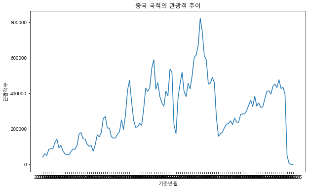
​    


#### (2)여러나라 동시에


```python
for cntry in ['중국','일본','대만','미국','홍콩']:
    plt.figure(figsize=(12,4))
    df_filter=df[df['국적']==cntry]
    plt.plot(df_filter['기준년월'], df_filter['관광'])
    plt.title('{}인 관광객 추이'.format(cntry))
    plt.xlabel('기준년월')
    plt.xlabel('관광객수')
    plt.show()
```


​    
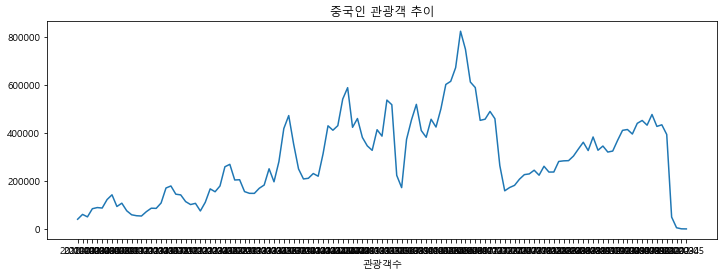
​    


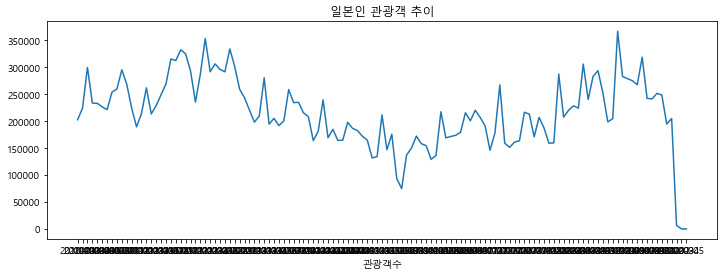
    


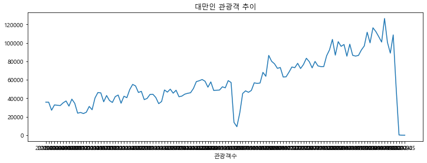
    


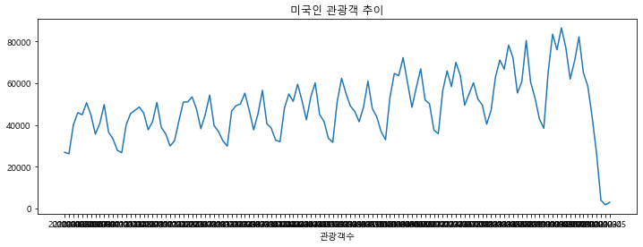
    


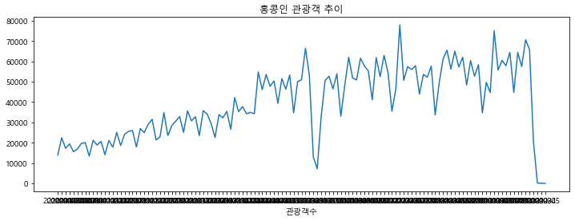
    


### 2) 히트맵 그리기


```python
df.head()
```


<div>
<style scoped>
    .dataframe tbody tr th:only-of-type {
        vertical-align: middle;
    }


    .dataframe tbody tr th {
        vertical-align: top;
    }
    
    .dataframe thead th {
        text-align: right;
    }

</style>

<table border="1" class="dataframe">
  <thead>
    <tr style="text-align: right;">
      <th></th>
      <th>국적</th>
      <th>관광</th>
      <th>상용</th>
      <th>공용</th>
      <th>유학/연수</th>
      <th>기타</th>
      <th>계</th>
      <th>기준년월</th>
      <th>대륙</th>
      <th>관광객비율(%)</th>
      <th>전체비율(%)</th>
    </tr>
  </thead>
  <tbody>
    <tr>
      <th>0</th>
      <td>일본</td>
      <td>202825</td>
      <td>1750</td>
      <td>89</td>
      <td>549</td>
      <td>3971</td>
      <td>209184</td>
      <td>2010-01</td>
      <td>아시아</td>
      <td>96.96</td>
      <td>50.60</td>
    </tr>
    <tr>
      <th>1</th>
      <td>대만</td>
      <td>35788</td>
      <td>41</td>
      <td>17</td>
      <td>37</td>
      <td>516</td>
      <td>36399</td>
      <td>2010-01</td>
      <td>아시아</td>
      <td>98.32</td>
      <td>8.93</td>
    </tr>
    <tr>
      <th>2</th>
      <td>홍콩</td>
      <td>13874</td>
      <td>55</td>
      <td>0</td>
      <td>21</td>
      <td>595</td>
      <td>14545</td>
      <td>2010-01</td>
      <td>아시아</td>
      <td>95.39</td>
      <td>3.46</td>
    </tr>
    <tr>
      <th>3</th>
      <td>마카오</td>
      <td>554</td>
      <td>0</td>
      <td>0</td>
      <td>0</td>
      <td>0</td>
      <td>554</td>
      <td>2010-01</td>
      <td>아시아</td>
      <td>100.00</td>
      <td>0.14</td>
    </tr>
    <tr>
      <th>4</th>
      <td>태국</td>
      <td>13374</td>
      <td>39</td>
      <td>13</td>
      <td>53</td>
      <td>4335</td>
      <td>17814</td>
      <td>2010-01</td>
      <td>아시아</td>
      <td>75.08</td>
      <td>3.34</td>
    </tr>
  </tbody>
</table>

</div>


```python
df['년도']=df["기준년월"].str.slice(0,4)
df['월']=df["기준년월"].str.slice(5,7)
df.head()
```


<div>
<style scoped>
    .dataframe tbody tr th:only-of-type {
        vertical-align: middle;
    }


    .dataframe tbody tr th {
        vertical-align: top;
    }
    
    .dataframe thead th {
        text-align: right;
    }

</style>

<table border="1" class="dataframe">
  <thead>
    <tr style="text-align: right;">
      <th></th>
      <th>국적</th>
      <th>관광</th>
      <th>상용</th>
      <th>공용</th>
      <th>유학/연수</th>
      <th>기타</th>
      <th>계</th>
      <th>기준년월</th>
      <th>대륙</th>
      <th>관광객비율(%)</th>
      <th>전체비율(%)</th>
      <th>년도</th>
      <th>월</th>
    </tr>
  </thead>
  <tbody>
    <tr>
      <th>0</th>
      <td>일본</td>
      <td>202825</td>
      <td>1750</td>
      <td>89</td>
      <td>549</td>
      <td>3971</td>
      <td>209184</td>
      <td>2010-01</td>
      <td>아시아</td>
      <td>96.96</td>
      <td>50.60</td>
      <td>2010</td>
      <td>01</td>
    </tr>
    <tr>
      <th>1</th>
      <td>대만</td>
      <td>35788</td>
      <td>41</td>
      <td>17</td>
      <td>37</td>
      <td>516</td>
      <td>36399</td>
      <td>2010-01</td>
      <td>아시아</td>
      <td>98.32</td>
      <td>8.93</td>
      <td>2010</td>
      <td>01</td>
    </tr>
    <tr>
      <th>2</th>
      <td>홍콩</td>
      <td>13874</td>
      <td>55</td>
      <td>0</td>
      <td>21</td>
      <td>595</td>
      <td>14545</td>
      <td>2010-01</td>
      <td>아시아</td>
      <td>95.39</td>
      <td>3.46</td>
      <td>2010</td>
      <td>01</td>
    </tr>
    <tr>
      <th>3</th>
      <td>마카오</td>
      <td>554</td>
      <td>0</td>
      <td>0</td>
      <td>0</td>
      <td>0</td>
      <td>554</td>
      <td>2010-01</td>
      <td>아시아</td>
      <td>100.00</td>
      <td>0.14</td>
      <td>2010</td>
      <td>01</td>
    </tr>
    <tr>
      <th>4</th>
      <td>태국</td>
      <td>13374</td>
      <td>39</td>
      <td>13</td>
      <td>53</td>
      <td>4335</td>
      <td>17814</td>
      <td>2010-01</td>
      <td>아시아</td>
      <td>75.08</td>
      <td>3.34</td>
      <td>2010</td>
      <td>01</td>
    </tr>
  </tbody>
</table>

</div>


```python
condition = df['국적'] == '중국'

df_filter = df[condition]
df_filter.head()
```


<div>
<style scoped>
    .dataframe tbody tr th:only-of-type {
        vertical-align: middle;
    }


    .dataframe tbody tr th {
        vertical-align: top;
    }
    
    .dataframe thead th {
        text-align: right;
    }

</style>

<table border="1" class="dataframe">
  <thead>
    <tr style="text-align: right;">
      <th></th>
      <th>국적</th>
      <th>관광</th>
      <th>상용</th>
      <th>공용</th>
      <th>유학/연수</th>
      <th>기타</th>
      <th>계</th>
      <th>기준년월</th>
      <th>대륙</th>
      <th>관광객비율(%)</th>
      <th>전체비율(%)</th>
      <th>년도</th>
      <th>월</th>
    </tr>
  </thead>
  <tbody>
    <tr>
      <th>17</th>
      <td>중국</td>
      <td>40425</td>
      <td>11930</td>
      <td>55</td>
      <td>2751</td>
      <td>36091</td>
      <td>91252</td>
      <td>2010-01</td>
      <td>아시아</td>
      <td>44.30</td>
      <td>10.09</td>
      <td>2010</td>
      <td>01</td>
    </tr>
    <tr>
      <th>75</th>
      <td>중국</td>
      <td>60590</td>
      <td>7907</td>
      <td>68</td>
      <td>29546</td>
      <td>42460</td>
      <td>140571</td>
      <td>2010-02</td>
      <td>아시아</td>
      <td>43.10</td>
      <td>13.57</td>
      <td>2010</td>
      <td>02</td>
    </tr>
    <tr>
      <th>133</th>
      <td>중국</td>
      <td>50330</td>
      <td>13549</td>
      <td>174</td>
      <td>14924</td>
      <td>62480</td>
      <td>141457</td>
      <td>2010-03</td>
      <td>아시아</td>
      <td>35.58</td>
      <td>9.23</td>
      <td>2010</td>
      <td>03</td>
    </tr>
    <tr>
      <th>191</th>
      <td>중국</td>
      <td>84252</td>
      <td>13306</td>
      <td>212</td>
      <td>2199</td>
      <td>47711</td>
      <td>147680</td>
      <td>2010-04</td>
      <td>아시아</td>
      <td>57.05</td>
      <td>15.51</td>
      <td>2010</td>
      <td>04</td>
    </tr>
    <tr>
      <th>249</th>
      <td>중국</td>
      <td>89056</td>
      <td>12325</td>
      <td>360</td>
      <td>2931</td>
      <td>49394</td>
      <td>154066</td>
      <td>2010-05</td>
      <td>아시아</td>
      <td>57.80</td>
      <td>16.95</td>
      <td>2010</td>
      <td>05</td>
    </tr>
  </tbody>
</table>

</div>


```python
df_pivot = df_filter.pivot_table(values = '관광',
                                index = '년도',
                                columns = '월')
df_pivot
```


<div>
<style scoped>
    .dataframe tbody tr th:only-of-type {
        vertical-align: middle;
    }


    .dataframe tbody tr th {
        vertical-align: top;
    }
    
    .dataframe thead th {
        text-align: right;
    }

</style>

<table border="1" class="dataframe">
  <thead>
    <tr style="text-align: right;">
      <th>월</th>
      <th>01</th>
      <th>02</th>
      <th>03</th>
      <th>04</th>
      <th>05</th>
      <th>06</th>
      <th>07</th>
      <th>08</th>
      <th>09</th>
      <th>10</th>
      <th>11</th>
      <th>12</th>
    </tr>
    <tr>
      <th>년도</th>
      <th></th>
      <th></th>
      <th></th>
      <th></th>
      <th></th>
      <th></th>
      <th></th>
      <th></th>
      <th></th>
      <th></th>
      <th></th>
      <th></th>
    </tr>
  </thead>
  <tbody>
    <tr>
      <th>2010</th>
      <td>40425.0</td>
      <td>60590.0</td>
      <td>50330.0</td>
      <td>84252.0</td>
      <td>89056.0</td>
      <td>87080.0</td>
      <td>122432.0</td>
      <td>142180.0</td>
      <td>93545.0</td>
      <td>107237.0</td>
      <td>75686.0</td>
      <td>58987.0</td>
    </tr>
    <tr>
      <th>2011</th>
      <td>55070.0</td>
      <td>53863.0</td>
      <td>72003.0</td>
      <td>86397.0</td>
      <td>85668.0</td>
      <td>108060.0</td>
      <td>170524.0</td>
      <td>178937.0</td>
      <td>144704.0</td>
      <td>141824.0</td>
      <td>113856.0</td>
      <td>101605.0</td>
    </tr>
    <tr>
      <th>2012</th>
      <td>106606.0</td>
      <td>74895.0</td>
      <td>110965.0</td>
      <td>166843.0</td>
      <td>154841.0</td>
      <td>179074.0</td>
      <td>258907.0</td>
      <td>268988.0</td>
      <td>203857.0</td>
      <td>204866.0</td>
      <td>155503.0</td>
      <td>148320.0</td>
    </tr>
    <tr>
      <th>2013</th>
      <td>148118.0</td>
      <td>169395.0</td>
      <td>182850.0</td>
      <td>250549.0</td>
      <td>196306.0</td>
      <td>280319.0</td>
      <td>417991.0</td>
      <td>472005.0</td>
      <td>353359.0</td>
      <td>249850.0</td>
      <td>208175.0</td>
      <td>210950.0</td>
    </tr>
    <tr>
      <th>2014</th>
      <td>230706.0</td>
      <td>219533.0</td>
      <td>313400.0</td>
      <td>429419.0</td>
      <td>410971.0</td>
      <td>429991.0</td>
      <td>540683.0</td>
      <td>588181.0</td>
      <td>423133.0</td>
      <td>459708.0</td>
      <td>381118.0</td>
      <td>345957.0</td>
    </tr>
    <tr>
      <th>2015</th>
      <td>327225.0</td>
      <td>413096.0</td>
      <td>386386.0</td>
      <td>536428.0</td>
      <td>517154.0</td>
      <td>223101.0</td>
      <td>172075.0</td>
      <td>372990.0</td>
      <td>453670.0</td>
      <td>518651.0</td>
      <td>409635.0</td>
      <td>381722.0</td>
    </tr>
    <tr>
      <th>2016</th>
      <td>456636.0</td>
      <td>424232.0</td>
      <td>500018.0</td>
      <td>601460.0</td>
      <td>614636.0</td>
      <td>671493.0</td>
      <td>823016.0</td>
      <td>747818.0</td>
      <td>611538.0</td>
      <td>588561.0</td>
      <td>452082.0</td>
      <td>456882.0</td>
    </tr>
    <tr>
      <th>2017</th>
      <td>489256.0</td>
      <td>458952.0</td>
      <td>263788.0</td>
      <td>158784.0</td>
      <td>172527.0</td>
      <td>181507.0</td>
      <td>207099.0</td>
      <td>226153.0</td>
      <td>229172.0</td>
      <td>244541.0</td>
      <td>223743.0</td>
      <td>260983.0</td>
    </tr>
    <tr>
      <th>2018</th>
      <td>236825.0</td>
      <td>237075.0</td>
      <td>281020.0</td>
      <td>283533.0</td>
      <td>284317.0</td>
      <td>303405.0</td>
      <td>332657.0</td>
      <td>360982.0</td>
      <td>326438.0</td>
      <td>382922.0</td>
      <td>327664.0</td>
      <td>345135.0</td>
    </tr>
    <tr>
      <th>2019</th>
      <td>320113.0</td>
      <td>324291.0</td>
      <td>369165.0</td>
      <td>410542.0</td>
      <td>413949.0</td>
      <td>395196.0</td>
      <td>439699.0</td>
      <td>451570.0</td>
      <td>432018.0</td>
      <td>476460.0</td>
      <td>426849.0</td>
      <td>433577.0</td>
    </tr>
    <tr>
      <th>2020</th>
      <td>393336.0</td>
      <td>49520.0</td>
      <td>5040.0</td>
      <td>522.0</td>
      <td>179.0</td>
      <td>NaN</td>
      <td>NaN</td>
      <td>NaN</td>
      <td>NaN</td>
      <td>NaN</td>
      <td>NaN</td>
      <td>NaN</td>
    </tr>
  </tbody>
</table>

</div>


```python
plt.figure(figsize = (12, 8))
sns.heatmap(df_pivot,
           annot = True,
           fmt = '.0f')
plt.show()
```


​    
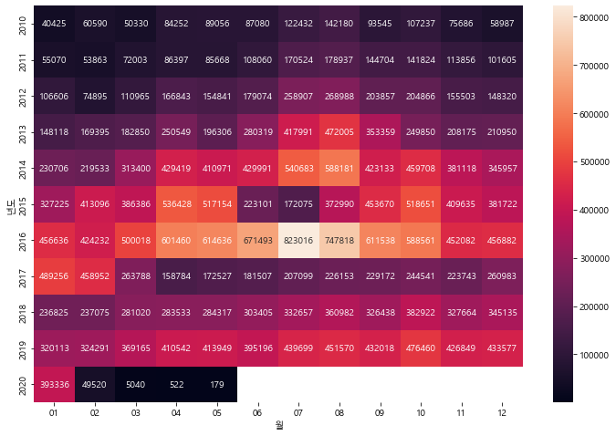
​    


```python
cntry_list = ['중국', '일본', '대만', '미국', '홍콩']
for cntry in cntry_list:
    condition = df['국적'] == cntry
    
    df_filter = df[condition]
    
    df_pivot = df_filter.pivot_table(values = '관광',
                                    index = '년도',
                                    columns= '월')
    
    plt.figure(figsize = (10, 8))
    
    sns.heatmap(df_pivot, annot = True,
               fmt = '.0f',
               cmap = 'rocket_r')
    
    plt.title('{} 관광객 히트맵'.format(cntry))
    
    plt.show()
```


​    
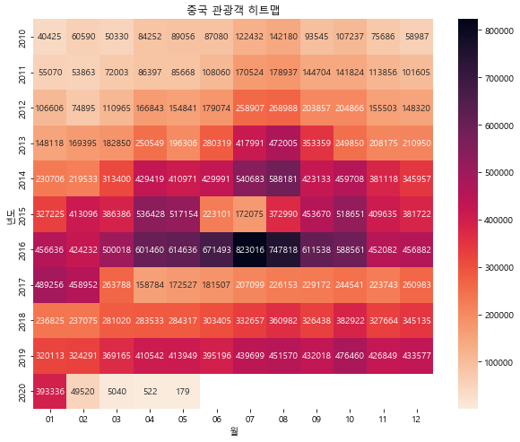
​    


    


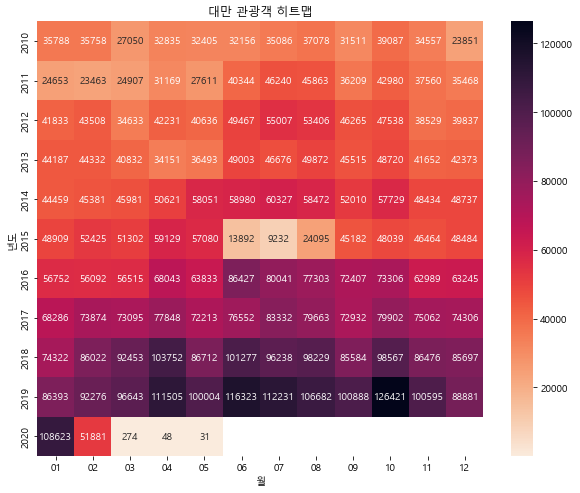
    


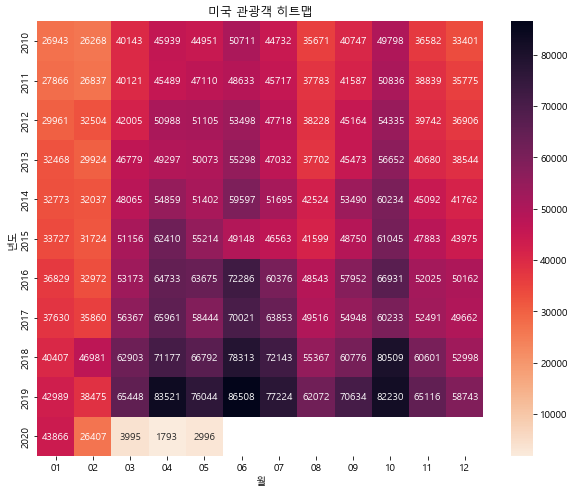
    


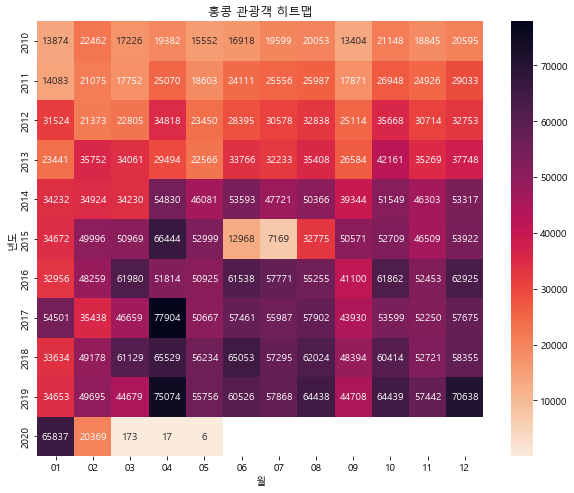
    
