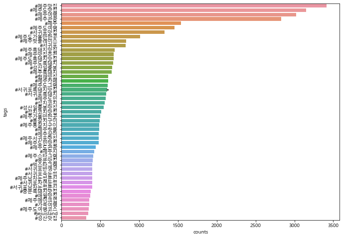

# 004_제주도 핫플래이스
---
## 목차
- 1.인스타 크롤링
- 2.헤시테그 시각화
---
## 1.인스타 크롤링
### 1)크롤링 시작


```python
import pandas as pd
import numpy as np
import time
from selenium import webdriver
from selenium.webdriver.chrome.service import Service
from bs4 import BeautifulSoup
ser=Service('../chromedriver/chromedriver.exe')
driver=webdriver.Chrome(service=ser)
```


```python
url='https://www.instagram.com/'
driver.get(url)
time.sleep(3)
html=driver.page_source
soup=BeautifulSoup(html,'html.parser')
```

### 2)인스타 접속 후 로그인

- 로그인 하기 -> 직접하자 보안이슈
- -> 제주도맛집 검색 
[https://www.instagram.com/explore/tags/+()]()만 변하는 군


```python
email = '인스타계정입력해주세요'   ### 계정 정보 수정 필요
input_id = driver.find_elements_by_css_selector('input._2hvTZ.pexuQ.zyHYP')[0]
input_id.clear()
input_id.send_keys(email)

password = '인스타비번입력해주세요' ### 비번 정보 수정 필요
input_pw = driver.find_elements_by_css_selector('input._2hvTZ.pexuQ.zyHYP')[1]
input_pw.clear()
input_pw.send_keys(password)
input_pw.submit()
time.sleep(3)
```

### 3)인스타 검색 결과 url만들어 접속


```python
def insta_searching(word):
    url='https://www.instagram.com/explore/tags/'+word
    return(url)
```


```python
word='제주도맛집'
driver.get(insta_searching(word))
time.sleep(5) #오류방지용
```

### 4)첫 개시글 열기


```python
from selenium.webdriver.common.by import By
#first=driver.find_element_by_css_selector('div._9AhH0')
def select_first(driver):
    first=driver.find_element(By.CSS_SELECTOR, 'div._9AhH0')
    first.click()
    time.sleep(5)
select_first(driver)
```

### 5)게시글 정보 가져오기
#### (1)본문 긁기


```python
html=driver.page_source
soup=BeautifulSoup(html, 'html.parser')
import unicodedata #멕용 한글때문
content=soup.select('div.C4VMK > span')[0].text
content=unicodedata.normalize('NFC', content) #멕용 한글때문
content
```


    '제주 산방산 가기전 먹방투어출출할 때 유명한 #천지연숯화로구이 에서!!흑돼지오겹살 + 소고기꽃갈비진짜 잘나옴!맛도 좋고 사장님도 친절해서한번만 갔다온 사람은 없는 그 곳!천지연숯화로구이064-794-6243#천지연숯화로구이#산방산맛집#송악산맛집#산방산흑돼지맛집#제주흑돼지맛집#제주용머리해안맛집#안덕맛집#오설록맛집#산방산흑돼지#오설록흑돼지맛집#모슬포맛집#서귀포흑돼지#신화월드맛집#중문관광단지흑돼지#제주도맛집#제주가볼만한곳'


#### (2)헤시테그 긁기 


```python
import re

tags = re.findall(r'#[^\s#,\\]+',content)
# tags = re.findall(r'#\w+',content)
tags
```


    ['#천지연숯화로구이',
     '#천지연숯화로구이',
     '#산방산맛집',
     '#송악산맛집',
     '#산방산흑돼지맛집',
     '#제주흑돼지맛집',
     '#제주용머리해안맛집',
     '#안덕맛집',
     '#오설록맛집',
     '#산방산흑돼지',
     '#오설록흑돼지맛집',
     '#모슬포맛집',
     '#서귀포흑돼지',
     '#신화월드맛집',
     '#중문관광단지흑돼지',
     '#제주도맛집',
     '#제주가볼만한곳']


#### (3)작성일자 긁기 


```python
date = soup.select('time._1o9PC.Nzb55')[0]['datetime'][:10]
date
```


    '2022-01-17'


#### (4)좋아요 수 긁기 


```python
like = soup.select('div.Nm9Fw > a > span')[0].text#여러개 하면 문제발생
like = soup.select('a.zV_Nj > span')[0].text
like
```


    '1,600'


#### (5)위치정보 긁기 


```python
place = soup.select('a.O4GlU')
place = unicodedata.normalize('NFC', place)
place
```

#### (6)함수화 하기


```python
def get_content(driver):
    html = driver.page_source
    soup = BeautifulSoup(html, 'html.parser')
    
    try:
        content = soup.select('div.C4VMK > span')[0].text
        content = unicodedata.normalize('NFC', content)
    except:
        content = ""
    
    
    try:
        tags = re.findall(r'#[^\s#,\\]+',content)
    except:
        tags = ""
        
    date = soup.select('time._1o9PC.Nzb55')[0]['datetime'][:10]
    
    try:
        like = soup.select('a.zV_Nj > span')[0].text
    except:
        like = 0
    
    try:
        place = soup.select('a.O4GlU')
        place = unicodedata.normalize('NFC', place)
    except:
        place = ""    
    data = [content, date, like, place, tags]    
    return(data)
          
```


```python
mylist = get_content(driver)
mylist
```


    ['제주 산방산 가기전 먹방투어출출할 때 유명한 #천지연숯화로구이 에서!!흑돼지오겹살 + 소고기꽃갈비진짜 잘나옴!맛도 좋고 사장님도 친절해서한번만 갔다온 사람은 없는 그 곳!천지연숯화로구이064-794-6243#천지연숯화로구이#산방산맛집#송악산맛집#산방산흑돼지맛집#제주흑돼지맛집#제주용머리해안맛집#안덕맛집#오설록맛집#산방산흑돼지#오설록흑돼지맛집#모슬포맛집#서귀포흑돼지#신화월드맛집#중문관광단지흑돼지#제주도맛집#제주가볼만한곳',
     '2022-01-17',
     '1,600',
     '',
     ['#천지연숯화로구이',
      '#천지연숯화로구이',
      '#산방산맛집',
      '#송악산맛집',
      '#산방산흑돼지맛집',
      '#제주흑돼지맛집',
      '#제주용머리해안맛집',
      '#안덕맛집',
      '#오설록맛집',
      '#산방산흑돼지',
      '#오설록흑돼지맛집',
      '#모슬포맛집',
      '#서귀포흑돼지',
      '#신화월드맛집',
      '#중문관광단지흑돼지',
      '#제주도맛집',
      '#제주가볼만한곳']]


### 6)다음페이지로 이동


```python
def move_next(driver):
    
    right = driver.find_element(By.CSS_SELECTOR, 'div.l8mY4.feth3')
    right.click()
    time.sleep(3)
    
move_next(driver)
```

### 7)자동으로 크롱링 하기(함수화)


```python
def insta_crawling(word, n):
    url = insta_searching(word)
    
    driver.get(url)
    time.sleep(5)
    
    select_first(driver)
    time.sleep(5)
    
    
#     target = n
    results = []
    
    for i in range(n):
        try:
            data = get_content(driver)
            results.append(data)
            move_next(driver)
            
        except:
            time.sleep(2)
            move_next(driver)
            
    return(results)
```


```python
result_1 = insta_crawling('제주도맛집', 20)
len(result_1)
result_1[0]
```


    ['많은 연예인들도 왔다 갈 정도로 유명해서 먹어보았어요생물갈치만 쓴다고 하는데 사이즈가 정말 상상이상이라 강추!#서귀포맛집 #제주중문맛집 #색달식당중문본점.....#제주도맛집#제주갈치조림#중문갈치조림#중문관광단지맛집#제주도중문맛집#중문맛집색달식당#제주갈치구이#제주갈치조림맛집',
     '2022-01-16',
     '158',
     '',
     ['#서귀포맛집',
      '#제주중문맛집',
      '#색달식당중문본점.....',
      '#제주도맛집',
      '#제주갈치조림',
      '#중문갈치조림',
      '#중문관광단지맛집',
      '#제주도중문맛집',
      '#중문맛집색달식당',
      '#제주갈치구이',
      '#제주갈치조림맛집']]


### 8) 수집데이터 저장


```python
result_df = pd.DataFrame(result_1)
result_df.columns = ['content','date','like','place','tags']
result_df.to_excel('./files/1_crawling_jejuMatJip.xlsx', index=False)
result_df.head()
```


<div>
<style scoped>
    .dataframe tbody tr th:only-of-type {
        vertical-align: middle;
    }

    .dataframe tbody tr th {
        vertical-align: top;
    }

    .dataframe thead th {
        text-align: right;
    }
</style>
<table border="1" class="dataframe">
  <thead>
    <tr style="text-align: right;">
      <th></th>
      <th>content</th>
      <th>date</th>
      <th>like</th>
      <th>place</th>
      <th>tags</th>
    </tr>
  </thead>
  <tbody>
    <tr>
      <th>0</th>
      <td>많은 연예인들도 왔다 갈 정도로 유명해서 먹어보았어요생물갈치만 쓴다고 하는데 사이즈...</td>
      <td>2022-01-16</td>
      <td>158</td>
      <td></td>
      <td>[#서귀포맛집, #제주중문맛집, #색달식당중문본점....., #제주도맛집, #제주갈...</td>
    </tr>
    <tr>
      <th>1</th>
      <td>가성비갑👍제주통갈치구이, 전복구이, 갈치조림, 보말국 등 제주대표 음식들을 가장 가...</td>
      <td>2022-01-17</td>
      <td>0</td>
      <td></td>
      <td>[#제주시맛집, #동문시장맛집, #제주공항근처맛집, #용두암맛집, #탑동맛집, #제...</td>
    </tr>
    <tr>
      <th>2</th>
      <td>&lt;광고&gt;온가족이 즐길 수 있는 제주갈비국수!!💕✔손소독제 항시 배치(입장시 입구부터...</td>
      <td>2022-01-16</td>
      <td>0</td>
      <td></td>
      <td>[#제주맛집, #제주도맛집, #제주아쿠아플라넷, #표선맛집, #성산맛집, #성산일출...</td>
    </tr>
    <tr>
      <th>3</th>
      <td>...제주 데이트코스추천!@@여자친구,남자친구와 함께하면 좋은 제주공항근처 완벽코스...</td>
      <td>2022-01-17</td>
      <td>161</td>
      <td></td>
      <td>[#충민정-제주가면, #도두봉키세스존-도두봉, #우무-제주공항근처, #우마담풍하-한...</td>
    </tr>
    <tr>
      <th>4</th>
      <td>제주 산방산 가기전 먹방투어출출할 때 유명한 #천지연숯화로구이 에서!!흑돼지오겹살 ...</td>
      <td>2022-01-17</td>
      <td>1,601</td>
      <td></td>
      <td>[#천지연숯화로구이, #천지연숯화로구이, #산방산맛집, #송악산맛집, #산방산흑돼지...</td>
    </tr>
  </tbody>
</table>
</div>


### 9)여러 엑셀의 중복을 제거한후 통합
#### (1)통합


```python
jeju_insta_df = pd.DataFrame()

f_list = ['1_crawling_jejudoMatJip.xlsx', '1_crawling_jejudoGwanGwang.xlsx', 
          '1_crawling_jejuMatJip.xlsx', '1_crawling_jejuYeoHang.xlsx']

for fname in f_list:
    fpath = './files/' + fname
    temp = pd.read_excel(fpath)
    jeju_insta_df = jeju_insta_df.append(temp)
```

#### (2)제거


```python
jeju_insta_df.shape
```


    (12780, 5)


```python
jeju_insta_df.drop_duplicates(subset = ['content'], inplace = True)
jeju_insta_df.shape
```


    (8369, 5)


## 2.헤시테그 시각화
### 1)헤시테그 데이터 불러오기


```python
jeju_insta_df.to_excel('./files/1_crawling_raw.xlsx', index = False)
raw_total = jeju_insta_df.copy()
```


```python
raw_total.columns
raw_total['tags']
```


    0       ['#제주분식', '#제주맛집', '#제주도맛집', '#제주맛집추천', '#제주도맛...
    1       ['#함덕맛집', '#제주도카페투어', '#제주일상', '#함덕', '#jejudo...
    2       ['#동문시장', '#제주동문시장', '#제주도기념품', '#제주기념품', '#제주...
    3       ['#제주여행', '#2일차무거버거', '#제주도여행', '#제주맛집', '#함덕맛...
    4                                                      []
                                  ...                        
    1702    ['#일상', '#구기자', '#티타임', '#2019', '#새해', '#차스타그...
    1703    ['#제주', '#친정여행', '#겨울방학', '#제주여행앞머리는', '#친정찬스'...
    1705                           ['#사진좀찍으시는님덕에건져또', '#이순간']
    1706                                                   []
    1707                            ['#HappyNewYearEveryone']
    Name: tags, Length: 8369, dtype: object


```python
tags_total = []

for tags in raw_total['tags']:
    tags_list = tags[2:-2].split("', '")
    for tag in tags_list:
        tags_total.append(tag)

raw_total['tags'][1].str[2:-2]
```


    1    #함덕맛집', '#제주도카페투어', '#제주일상', '#함덕', '#jejudo',...
    1    #제주핫플', '#제주여행', '#제주', '#제주도', '#제주도맛집', '#제주...
    1    #함스타푸드_속초청초수물회✔️속초핫플레이스해삼전복물회✔️40.000₩.대한민국', ...
    1    #동백군락지', '#제주위미동백군락지', '#제주', '#위미', '#동백', '#...
    Name: tags, dtype: object


### 2)해시태그 출현 빈도 집계
#### (1)빈도수 집계


```python
from collections import Counter

tag_counts = Counter(tags_total)
tag_counts
# pd.Series(tags_total).value_counts()
```


    Counter({'#제주분식': 76,
             '#제주맛집': 3412,
             '#제주도맛집': 3149,
             '#제주맛집추천': 675,
             '#제주도맛집추천': 187,
             '#제주도': 2053,
             '#용두암': 18,
             '#신제주맛집': 157,
             '#연동맛집': 58,
             '#제주연동맛집': 14,
             '#애월맛집': 373,
             '#연동제주분식': 30,
             '#제주공항근처맛집': 231,
             '#제주공항맛집': 207,
             '#돔베김밥': 16,
             '#전복김밥': 84,
             '#제주돈까스': 14,
             '#jeju': 749,
             '#제주도가볼만한곳': 1014,
             '#함덕맛집': 97,
             '#제주도카페투어': 46,
             '#제주일상': 398,
             '#함덕': 54,
             '#jejudo': 191,
             '#함덕맛집무거버거짱': 15,
             '#일상': 701,
             '#제주살이': 480,
             '#제주도살이': 4,
             '#함덕해수욕장': 75,
             '#함덕카페': 28,
             '#제주카페': 600,
             '#제주도카페': 258,
             '#제주도민': 570,
             '#제주도민맛집': 477,
             '#제주도여행': 1454,
             '#동문시장': 46,
             '#제주동문시장': 35,
             '#제주도기념품': 50,
             '#제주기념품': 125,
             '#제주스는완벽': 12,
             '#제주도주스': 10,
             '#제주도한라봉주스': 10,
             '#제주감성소품': 7,
             '#제주여행': 3020,
             '#2일차무거버거': 1,
             '#제주도버거': 6,
             '#함덕해변': 19,
             '#여행스타그램': 472,
             '#제주도수제버거': 13,
             '#조천읍': 17,
             '#조천카페': 10,
             '': 587,
             '#제주마카롱': 15,
             '#월정리카페콧수염': 6,
             '#월정리맛집': 178,
             '#월정리카페': 41,
             '#월정리': 79,
             '#구좌읍맛집': 36,
             '#성산맛집': 316,
             '#구좌맛집': 49,
             '#서귀포맛집': 1330,
             '#인생마카롱': 5,
             '#마카롱성지': 5,
             '#서귀포카페': 198,
             '#성산일출봉맛집': 545,
             '#섭지코지맛집': 511,
             '#공항근처맛집': 19,
             '#구좌읍카페': 14,
             '#제주해안도로': 311,
             '#월정리카페거리': 6,
             '#제주피크닉': 6,
             '#제주마카롱맛집': 8,
             '#제주도마카롱': 11,
             '#제주모닥치기': 3,
             '#돔베라면': 24,
             '#돔베덮밥': 14,
             '#먹스타': 30,
             '#제주도청': 19,
             '#제주시청맛집': 22,
             '#제주시맛집': 311,
             '#노형동맛집': 62,
             '#용두암맛집': 34,
             '#제주흑돼지': 648,
             '#월정리해변': 60,
             '#월정리해수욕장': 11,
             '#세화맛집': 82,
             '#비자림맛집': 11,
             '#제주동부맛집': 5,
             '#제주동쪽맛집': 38,
             '#김밥맛집': 5,
             '#제주김밥': 9,
             '#제주김밥맛집': 8,
             '#제주도김밥': 17,
             '#제주도먹거리': 11,
             '#제주여행코스': 89,
             '#제주맛집투어': 35,
             '#제주도맛집여행': 4,
             '#제주도맛집베스트': 132,
             '#서면클럽': 10,
             '#커플여행': 64,
             '#여자옷': 6,
             '#잠실카페': 9,
             '#독소': 8,
             '#강남유앤미': 9,
             '#강릉카페': 13,
             '#데일리그램': 64,
             '#남포동맛집': 20,
             '#애터미': 5,
             '#인친환영': 59,
             '#좋아요꾹': 10,
             '#수원카페': 12,
             '#눈썹문신': 405,
             '#제주분식주소': 4,
             '#제주도모닥치기': 1,
             '#수제흑돈까스': 7,
             '#제주도공항맛집': 5,
             '#제주도공항근처맛집': 7,
             '#제주공항근처아침식사': 3,
             '#제주맛가볼만한곳': 1,
             '#신선포구횟집': 1,
             '#성산일출봉': 650,
             '#제주표선맛집': 16,
             '#제주도횟집': 18,
             '#제주횟집': 19,
             '#표선횟집': 8,
             '#제주도회포장': 8,
             '#성산일출봉횟집': 9,
             '#성산맛집신산포구횟집최고': 7,
             '#표선맛집': 31,
             '#육팔청춘이렇게': 1,
             '#사장님': 3,
             '#비결이': 1,
             '#뭐에요.....': 1,
             '#제주도여행코스': 350,
             '#제주도코스': 9,
             '#제주스타그램': 408,
             '#제주도흑돼지': 663,
             '#제주흑돼지맛집': 685,
             '#제주도흑돼지맛집': 669,
             '#육팔청춘': 95,
             '#제주맛집육팔청춘최고': 90,
             '#제주핫플레이스': 835,
             '#맞팔댓글': 11,
             '#반영구': 405,
             '#패션피플': 5,
             '#좋아요테러': 10,
             '#육아맘': 50,
             '#소통그램': 6,
             '#l4l': 24,
             '#인천맛집': 20,
             '#강릉맛집': 12,
             '#소통해요': 110,
             '#셀스타': 14,
             '#이태원메이드': 7,
             '#제주여행중': 33,
             '#제주여행추천': 64,
             '#btskimseokjin': 1,
             '#weloveyouseokjin': 1,
             '#btsseokjin': 1,
             '#seokjinbts': 2,
             '#worldwidehandsomeday': 1,
             '#boyfriendquotes': 1,
             '#heartbroke': 1,
             '#frasessad': 1,
             '#방탄소년단팬아트': 1,
             '#김석진': 1,
             '#방탄소년단진': 1,
             '#형': 1,
             '#92년': 1,
             '#btshyungline': 1,
             '#대구맛집': 31,
             '#일산맛집': 8,
             '#서면맛집': 21,
             '#서울맛집': 12,
             '#부산맛집': 58,
             '#홍대맛집': 32,
             '#강남맛집': 36,
             '#방탄소년단': 1,
             '#한국사랑해': 2,
             '#사람은': 1,
             '#아이돌': 2,
             '#대한민국만세🇰🇷': 1,
             '#고집돌우럭': 53,
             '#중문점': 1,
             '#중문맛집': 404,
             '#제주중문맛집': 194,
             '#jejufood': 24,
             '#jeju_korea': 12,
             '#고집돌우럭jmt': 27,
             '#흑돼지': 75,
             '#보양식': 1,
             '#♥': 1,
             '#여행사진': 34,
             '#제주여행지': 64,
             '#제주셀프스냅': 10,
             '#좋아요반사': 56,
             '#인친해요': 18,
             '#광주카페': 12,
             '#동성로': 10,
             '#맞팔해요': 75,
             '#인스타': 55,
             '#서면카페': 8,
             '#인친좋아요': 6,
             '#제주여행2일차제주산': 1,
             '#제주시내맛집': 10,
             '#먹방그램': 8,
             '#제주그램': 101,
             '#흑돼지돈까스': 16,
             '#새해첫날': 24,
             '#우도': 76,
             '#짬뽕라면': 1,
             '#제주도바람개비': 1,
             '#바람개비': 2,
             '#청춘괴기': 37,
             '#서귀포흑돼지맛집': 593,
             '#서귀포맛집추천': 303,
             '#서귀포시청': 20,
             '#강정동맛집': 38,
             '#서귀포신시가지맛집': 46,
             '#서귀포시청맛집': 38,
             '#월드컵경기장맛집': 8,
             '#서귀포맛집청춘괴기최고': 37,
             '#제주도민일상': 15,
             '#성산옥탑': 5,
             '#표선카페': 10,
             '#제주표선레스토랑': 2,
             '#제주점심': 3,
             '#성산일출봉점심': 2,
             '#성산레스토랑': 2,
             '#성산맛집성산옥탑최고': 5,
             '#제주도돈까스맛집': 3,
             '#제주돈까스맛집': 6,
             '#성산카페': 9,
             '#법환동맛집': 18,
             '#제주': 1538,
             '#김녕해변': 3,
             '#협재해수욕장': 165,
             '#카멜리아힐': 379,
             '#세화해변맛집': 2,
             '#맛집': 223,
             '#제주가볼만한곳': 497,
             '#제주먹방': 67,
             '#제주도여행맛집': 1,
             '#제주여행맛집': 3,
             '#제주공항': 306,
             '#제주도맛집투어': 2,
             '#제주맛집여행': 2,
             '#제주맛집베스트': 5,
             '#맛스타그램.': 1,
             '#매운돼지갈비찜': 1,
             '#쫀득만두': 1,
             '#돈까스정식.제주에서': 1,
             '#20181215': 1,
             '#착한맛집': 2,
             '#밀면맛집': 1,
             '#제주도밀면맛집': 1,
             '#제주여행가야밀면': 1,
             '#맛있다그램': 27,
             '#JMT': 47,
             '#맛집도장깨기': 1,
             '#인스타맛집': 5,
             '#존맛': 45,
             '#food': 36,
             '#instafood': 34,
             '#맛집추천': 44,
             '#강남아이린': 7,
             '#대전카페': 10,
             '#인친들': 6,
             '#선팔환영': 26,
             '#부산아레나': 8,
             '#강남': 15,
             '#건대': 19,
             '#가로수길': 10,
             '#워킹맘': 11,
             '#이태원파운틴': 8,
             '#강남카페': 9,
             '#강남테란': 6,
             '#럽스타그램': 115,
             '#대전맛집': 23,
             '#인천카페': 11,
             '#고집돌우럭가성비': 1,
             '#제주앓이': 37,
             '#jejuisland': 343,
             '#올레시장맛집': 28,
             '#제주맛집마라내음최고': 7,
             '#이중섭거리맛집': 141,
             '#마라내음': 7,
             '#서귀포핫플': 35,
             '#서귀동맛집': 7,
             '#이중섭거리': 35,
             '#제주도마라롱샤': 4,
             '#마라롱샤': 4,
             '#아지트샵임하나': 12,
             '#아지트샵': 44,
             '#마켓붐': 38,
             '#헬로우드림': 18,
             '#마이셀즈': 17,
             '#아기한복': 1,
             '#맛집그램': 13,
             '#핫플맛집': 1,
             '#강남핫플레이스': 1,
             '#구미핫플레이스': 1,
             '#피부비결': 1,
             '#아기이유식': 1,
             '#양산맛집추천': 1,
             '#대학생취미': 2,
             '#제주도민추천맛집': 17,
             '#제주현지인맛집': 82,
             '#제주도여행중': 26,
             '#제주먹거리': 56,
             '#먹방여행': 17,
             '#제주도먹방여행': 7,
             '#용두암근처맛집': 2,
             '#제주떡볶이': 7,
             '#캔디원': 19,
             '#제주가족여행': 76,
             '#제주도가족여행': 183,
             '#제주도아이와함께가볼만한곳': 1,
             '#제주도아이와가볼만한곳': 17,
             '#제주선물': 94,
             '#제주도선물': 7,
             '#제주도핫플레이스': 201,
             '#제주도핫플': 183,
             '#제주핫플': 483,
             '#베이비': 1,
             '#베이비스타그램': 5,
             '#아들바보': 8,
             '#딸바보': 26,
             '#맞팔': 388,
             '#선팔': 503,
             '#소통': 374,
             '#인스타그램': 76,
             '#일출투어': 4,
             '#일출사진관': 3,
             '#여행에미치다': 183,
             '#용눈이오름': 31,
             '#다랑쉬오름': 13,
             '#거문오름': 19,
             '#비자림': 135,
             '#만장굴': 138,
             '#따라비오름': 2,
             '#표선해수욕장': 7,
             '#벨롱장': 10,
             '#워크샵': 3,
             '#워크샵장소': 2,
             '#영주산': 1,
             '#제주도게스트하우스': 36,
             '#서귀포게스트하우스': 30,
             '#제주게스트하우스': 113,
             '#표선게스트하우스': 3,
             '#다희연': 8,
             '#세화해변': 28,
             '#김녕성세기해변': 5,
             '#김녕미로공원': 19,
             '#제주도일출사진관': 1,
             '#이색워크샵': 1,
             '#섭지코지': 556,
             '#광치기해변': 22,
             '#김영갑갤러리': 3,
             '#아쿠아플라넷제주': 169,
             '#워크샵그램': 1,
             '#김영갑갤러리두모악': 5,
             '#제주민속촌': 9,
             '#서연의집': 3,
             '#외돌개': 8,
             '#쇠소깍': 23,
             '#하귀맛집': 25,
             '#이호테우해변': 31,
             '#외도맛집': 10,
             '#용담해안도로맛집': 5,
             '#제주해안도로맛집': 4,
             '#애월해안도로맛집': 31,
             '#협재맛집': 602,
             '#제주해물라면': 18,
             '#제주애월해물라면': 7,
             '#제주파스타': 19,
             '#제주전복뚝배기': 8,
             '#애월읍맛집': 20,
             '#애월가볼만한곳': 12,
             '#제주애월가볼만한곳': 9,
             '#제주전복': 11,
             '#제주전복맛집': 17,
             '#제주전복구이': 12,
             '#제주불빛정원': 6,
             '#유리성': 3,
             '#애월라면': 11,
             '#제주도미용실': 5,
             '#제주미용실': 10,
             '#서귀포미용실': 7,
             '#신산포구횟집': 4,
             '#함덕무거버거': 1,
             '#제주수제버거맛집': 3,
             '#burger': 10,
             '#도민맛집': 51,
             '#조천읍맛집': 22,
             '#먹스타그램': 395,
             '#제주도먹방': 52,
             '#맵찜': 20,
             '#제주맛집맵찜': 20,
             '#거문오름맛집': 11,
             '#제주조천맛집': 10,
             '#선흘리맛집': 6,
             '#매운갈비찜맛집': 5,
             '#제주도갈비찜': 5,
             '#배드민턴': 5,
             '#성수동맛집': 7,
             '#단백질쉐이크': 5,
             '#홈트': 5,
             '#최아란': 4,
             '#바디프로필': 4,
             '#한남동맛집': 7,
             '#프로알지': 6,
             '#영종도카페': 5,
             '#데일리룩': 97,
             '#시너지다이어트': 4,
             '#샤넬': 5,
             '#신라호텔': 14,
             '#쇼핑': 10,
             '#파라다이스호텔': 7,
             '#시너지': 5,
             '#시너지디톡스': 5,
             '#인천배드미턴': 4,
             '#여행': 436,
             '#웨딩드레스': 4,
             '#에르메스': 4,
             '#청담동맛집': 4,
             '#파티의상': 3,
             '#디톡스': 12,
             '#제주먹방여행전복김밥': 1,
             '#제주분식제주시': 4,
             '#제주도그램': 594,
             '#happybirthday': 2,
             '#1월1일': 45,
             '#생일엔': 1,
             '#보드카선물': 1,
             '#제주투어': 32,
             '#제주스냅': 145,
             '#제주도스냅': 42,
             '#제주사진': 14,
             '#제주애월맛집': 84,
             '#제주2박3일': 5,
             '#이태원역': 1,
             '#결혼후첫생일': 2,
             '#맛집찾기': 3,
             '#일산브런치': 2,
             '#구리네일샵': 1,
             '#이유식재료': 2,
             '#피부탄력': 1,
             '#여수댁': 1,
             '#피부샾': 2,
             '#love': 14,
             '#아레나': 10,
             '#맞팔환영': 20,
             '#육아맘일상': 9,
             '#안산카페': 9,
             '#방이동카페': 8,
             '#옷': 8,
             '#제주해물뚝기': 2,
             '#애월전복뚝배기': 2,
             '#제주해물탕': 12,
             '#제주현지맛집': 2,
             '#제주도브런치': 4,
             '#제주프리또': 9,
             '#남친등갈비커리': 1,
             '#튀김': 4,
             '#오징어튀김': 1,
             '#새우튀김': 5,
             '#감자튀김': 2,
             '#저녁식사': 3,
             '#브런치': 7,
             '#맛스타그램': 223,
             '#맛있다': 28,
             '#브런치카페.....': 1,
             '#금능맛집': 22,
             '#한림맛집': 263,
             '#한림공원맛집': 30,
             '#월령맛집': 14,
             '#신창맛집': 7,
             '#오설록맛집': 155,
             '#한담맛집': 21,
             '#협재': 41,
             '#튀김다발': 6,
             '#동문시장맛집': 45,
             '#제주도떡볶이': 5,
             '#happynewyear': 66,
             '#2019': 148,
             '#새해맞이': 23,
             '#bye2018': 2,
             '#다이어트': 32,
             '#안녕': 10,
             '#먹는게': 2,
             '#제일좋아': 2,
             '#친구들모여라': 1,
             '#제주도동문시장': 3,
             '#제주도호텔': 44,
             '#제주도게하': 8,
             '#제주호텔': 18,
             '#함덕찜': 2,
             '#함덕해수욕장맛집': 32,
             '#제주함덕맛집': 16,
             '#제주도두루치기': 4,
             '#제주두루치기맛집': 3,
             '#제주도두루치기맛집': 3,
             '#제주맛집함덕찜최고': 3,
             '#제주함덕찜': 3,
             '#돔베고기': 38,
             '#제주도연동맛집': 3,
             '#노형동카페': 2,
             '#일상스타그램': 145,
             '#좋아요': 305,
             '#함덕서우봉해변': 16,
             '#파스타맛집': 12,
             '#피자맛집': 2,
             '#제주라이프': 117,
             '#조천맛집': 16,
             '#패션그램': 7,
             '#문의': 19,
             '#대구': 28,
             '#홍대엠투': 7,
             '#인친소통': 13,
             '#패션': 15,
             '#잠실맛집': 18,
             '#선팔맞팔': 61,
             '#광주맛집': 34,
             '#강남디오픈': 8,
             '#이어도맛있게': 1,
             '#서귀포': 825,
             '#제주해물탕맛집': 6,
             '#제주도현지인맛집': 22,
             '#서귀포이어도해물탕': 5,
             '#이어도해물탕': 5,
             '#서귀포밥집': 8,
             '#서귀포맛집이어도최고': 13,
             '#배출': 7,
             '#follow4follow': 26,
             '#부산카페': 10,
             '#부산쿠데타': 9,
             '#부업': 17,
             '#안양': 7,
             '#육아그램': 11,
             '#맞팔로우': 11,
             '#남양주카페': 3,
             '#다이어트식품': 9,
             '#인친그램': 4,
             '#울산카페': 12,
             '#제주감성맛집': 10,
             '#제주감성카페': 11,
             '#팔로': 23,
             '#팔로잉': 26,
             '#제주갈치조림': 29,
             '#합정맛집': 3,
             '#도넛버거': 1,
             '#유성속눈썹펌': 1,
             '#파인애플': 1,
             '#세동': 1,
             '#대전짬뽕': 1,
             '#홍대데이트': 2,
             '#전주맛집': 13,
             '#압구정맛집': 10,
             '#맛집탐방': 64,
             '#맛스타': 22,
             '#안양맛집': 11,
             '#청평': 8,
             '#제주한림맛집': 62,
             '#애월해물라면': 9,
             '#제주라면': 2,
             '#새별오름': 108,
             '#금능해변': 24,
             '#노리매공원': 63,
             '#성이시돌목장': 43,
             '#제주신화테마파크': 3,
             '#제주아쿠아플라넷': 9,
             '#여미지식물원': 6,
             '#제주해물뚝배기': 2,
             '#애월해물뚝배기': 1,
             '#애월파스타': 10,
             '#애월돈까스': 11,
             '#제주렌트카': 22,
             '#welcome2019': 3,
             '#흑돼지맛집': 59,
             '#서귀포흑돼지': 577,
             '#리틀페이지': 4,
             '#리매료': 6,
             '#이유식완료기': 1,
             '#울살맘': 1,
             '#피부과화장품': 1,
             '#구리마카롱': 1,
             '#애견동반': 6,
             '#통영핫플레이스': 1,
             '#가족여행': 356,
             '#제주도도민맛집추천': 7,
             '#제주진짜맛집': 7,
             '#제주도바다': 31,
             '#제주바다': 127,
             '#제주감성': 68,
             '#제주고기': 10,
             '#제주도수제버거맛집': 2,
             '#신산포구자연산횟집': 3,
             '#성산일출봉카페': 2,
             '#성산일출봉펜션': 1,
             '#제주성산맛집': 145,
             '#몽상애월': 1,
             '#제주협재맛집': 56,
             '#섭지코지근처맛집': 1,
             '#섭지코지카페': 2,
             '#육팔청춘....': 2,
             '#제주육팔청춘': 17,
             '#맛집스타그램': 36,
             '#맛집투어': 70,
             '#음식': 7,
             '#먹방스타그램': 30,
             '#커피': 44,
             '#음식스타그램': 21,
             '#해운대': 7,
             '#해운대맛집': 11,
             '#광안리': 3,
             '#광안리맛집': 3,
             '#센템맛집': 2,
             '#부산대맛집': 3,
             '#신발': 4,
             '#신발스타그램': 2,
             '#마산': 3,
             '#창원': 7,
             '#팔로워': 28,
             '#팔로우미': 12,
             '#제주존맛': 21,
             '#제주도존맛': 20,
             '#제주도흑돼지맛집...': 1,
             '#먹방': 179,
             '#daily': 360,
             '#instagood': 42,
             '#foodstagram': 17,
             '#대구카페': 10,
             '#강남메이드': 6,
             '#연남동': 12,
             '#워킹맘일상': 8,
             '#건대입구': 12,
             '#f4f': 57,
             '#데일리패션': 18,
             '#강남아지트': 7,
             '#데일리코디': 9,
             '#좋아요환영': 4,
             '#데일리': 263,
             '#이어도': 6,
             '#서귀포현지인맛집': 24,
             '#제주도해물탕맛집': 4,
             '#정방폭포맛집': 15,
             '#제주분식공항이랑': 1,
             '#연동카페': 8,
             '#제주도애월': 1,
             '#제주도돈까스': 11,
             '#첫줄맛좋은': 1,
             '#제주수제버거': 36,
             '#제주카페투어': 36,
             '#제주먹방여행': 10,
             '#비스타케이호텔': 19,
             '#체이슨호텔': 20,
             '#돔베매운라면': 1,
             '#돔베김밥제주도여행': 1,
             '#제주도간장남들게스트하우스에': 1,
             '#한라산흑돼지무제한파티': 2,
             '#소등없는게스트하우스잘': 2,
             '#간장남들': 2,
             '#간장남들게스트하우스': 2,
             '#제주동쪽': 40,
             '#제주게스트하우스파티': 9,
             '#제주도게스트하우스파티': 14,
             '#제주동쪽게스트하우스': 2,
             '#제주파티게스트하우스': 6,
             '#제주도파티게스트하우스': 9,
             '#월정리게스트하우스': 7,
             '#월정리펜션': 2,
             '#제주숙소': 81,
             '#제주도숙소': 39,
             '#아줄레주여기도': 1,
             '#제주카페추천': 151,
             '#아줄레주': 3,
             '#추천': 40,
             '#여행에미치다_제주': 42,
             '#숨은명소': 1,
             '#꼭가보세요': 1,
             '#ootd': 47,
             '#에그타르트': 4,
             '#오늘도': 32,
             '#성공적': 4,
             '#역시난': 1,
             '#언제나한발느린피드🤣': 1,
             '#달이네제주🌙': 2,
             '#빠레브호텔': 11,
             '#윈스카이호텔': 11,
             '#라마다이스트호텔': 11,
             '#생생정보통맛집': 2,
             '#숨은맛집찾기': 1,
             '#해녀와바다': 3,
             '#도두맛집': 6,
             '#도두항맛집': 4,
             '#이호테우해수욕장': 1,
             '#이호테우': 1,
             '#제주통갈치조림맛집': 4,
             '#제주도통갈치조림': 3,
             '#제주통갈치구이': 485,
             '#젊줌마육아맘': 1,
             '#줌마그램': 15,
             '#애엄마그램': 1,
             '#소통맞팔': 2,
             '#일상소통그램': 1,
             '#육아소통일상': 1,
             '#셀카그램': 15,
             '#이태원프로스트': 7,
             '#좋아요정': 7,
             '#인계동': 6,
             '#안양1번가': 4,
             '#한강': 10,
             '#인친님': 8,
             '#selfie': 49,
             '#롯데리아': 6,
             '#제주도조식': 1,
             '#제주도설렁탕': 1,
             '#제주도갈비탕': 1,
             '#청담집': 1,
             '#라벤더': 2,
             '#라벤더키친': 1,
             '#라벤더의키친아틀리에': 1,
             '#제주전복김밥': 61,
             '#협재해수욕장맛집': 97,
             '#존맛탱': 56,
             '#행복': 34,
             '#살찌는소리': 1,
             '#육아': 71,
             '#강남페이스': 8,
             '#수원맛집': 18,
             '#워킹맘룩': 9,
             '#수익창출': 7,
             '#dailylook': 23,
             '#남포동카페': 6,
             '#독소배출': 6,
             '#럽': 9,
             '#선팔해요': 15,
             '#제주3박4일': 8,
             '#산방산맛집': 47,
             '#색달해변': 5,
             '#신화월드': 51,
             '#중문해수욕장': 60,
             '#협재해수욕장근처맛집': 21,
             '#협재해변': 31,
             '#금능해수욕장': 7,
             '#수제버거': 11,
             '#최고': 9,
             '#전복볶음밥': 7,
             '#오전열한시': 10,
             '#배틀트립맛집....': 1,
             '#제주신라호텔': 73,
             '#제주혼밥': 105,
             '#제주도혼밥': 6,
             '#한라산': 178,
             '#윗세오름': 7,
             '#히든클리프': 166,
             '#더클리프': 3,
             '#중문카페': 14,
             '#애월카페': 93,
             '#바다다': 5,
             '#하이엔드제주': 14,
             '#육팔청춘제주공항': 1,
             '#늘어가는고기': 1,
             '#불어나는금액': 1,
             '#탕진잼-----': 1,
             '#selca': 21,
             '#인친': 76,
             '#홍대카페': 10,
             '#셀카스타그램': 16,
             '#울산맛집': 18,
             '#전주카페': 10,
             '#제주흑돼지맛집제주흑돼지': 8,
             '#이태원맛집': 11,
             '#삼청동': 7,
             '#다이어트코치': 6,
             '#repost': 4,
             '#한라푸드': 12,
             '#한라푸드떡갈비': 12,
             '#제주흑돼지떡갈비': 11,
             '#수제떡갈비센스있는': 10,
             '#떡갈비': 12,
             '#제주도떡갈비': 11,
             '#맘스타그램': 24,
             '#육아기록': 15,
             '#푸드스타그램': 25,
             '#야식그램': 14,
             '#감성': 49,
             '#육아소통': 57,
             '#리그램이벤트': 12,
             '#리그램': 9,
             '#제주용담해안도로': 7,
             '#제주이호테우해변': 7,
             '#알밥': 4,
             '#우도맛집...': 1,
             '#서울': 9,
             '#홍대': 9,
             '#이태원': 6,
             '#광주': 6,
             '#동명동': 2,
             '#상무지구': 1,
             '#구시청': 1,
             '#수완지구': 2,
             '#대전': 3,
             '#댓글': 20,
             '#서귀포이어도': 4,
             '#수원': 9,
             '#맞팔100': 5,
             '#게스트': 4,
             '#홍대베라': 7,
             '#구월동카페': 9,
             '#선팔하면맞팔': 104,
             '#선팔댓글': 9,
             '#강남아레나': 8,
             '#뉴스킨': 9,
             '#셀카왕': 4,
             '#강원도카페': 5,
             '#허벌라이프': 9,
             '#셀카쟁이': 2,
             '#좋아요맞팔': 5,
             '#일상소통': 27,
             '#인계동맛집': 8,
             '#패션정보': 8,
             '#깔끔해': 1,
             '#맛있어': 3,
             '#돼지': 12,
             '#서비스': 7,
             '#제주향토음식': 22,
             '#몸국': 8,
             '#팝업식당': 1,
             '#윈드스톤창고': 1,
             '#잘먹었습니다': 1,
             '#먹는게남는거': 2,
             '#소확행': 96,
             '#제주초밥': 7,
             '#제주스시': 5,
             '#제주혼술': 32,
             '#제주도숨은맛집': 85,
             '#제주딱새우': 9,
             '#제주서쪽': 10,
             '#협재딱새우': 1,
             '#협재스시': 1,
             '#협재초밥': 1,
             '#애월맛집추천': 22,
             '#애월술집': 11,
             '#한림스시': 1,
             '#한림술집': 7,
             '#한림공원': 45,
             '#해녀의집': 5,
             '#인계동카페': 8,
             '#가평': 8,
             '#구월동맛집': 11,
             '#남성복': 5,
             '#인생밥집전복물회': 1,
             '#우무': 1,
             '#수제푸딩': 1,
             '#푸딩': 1,
             '#한림': 20,
             '#한림카페': 86,
             '#チェジュ': 10,
             '#チェジュ島': 14,
             '#済州島': 23,
             '#한국여행': 3,
             '#국내여행': 51,
             '#韓国旅行': 21,
             '#제주도4일차': 1,
             '#제주도한림': 1,
             '#문쏘': 5,
             '#기록': 5,
             '#딸이랑': 1,
             '#셀카': 313,
             '#셀피': 63,
             '#셀스타그램': 90,
             '#셀기꾼': 7,
             '#거지존': 1,
             '#엄마랑딸': 2,
             '#모녀..내옆에': 1,
             '#엄마패딩': 1,
             '#청담맛집': 3,
             '#논현맛집': 3,
             '#신사맛집': 2,
             '#분당맛집': 10,
             '#건대맛집': 9,
             '#노원맛집': 2,
             '#고양이': 12,
             '#육아스타그램': 73,
             '#피부': 3,
             '#뷰티': 18,
             '#동탄맘': 3,
             '#송도맘': 2,
             '#부산맘': 7,
             '#광주맘': 4,
             '#제주맘': 142,
             '#fashion': 16,
             '#entertainment': 1,
             '#korea': 42,
             '#台北市': 2,
             '#Taipei': 2,
             '#韩国': 3,
             '#제주롯데호텔맛집': 126,
             '#중문흑돼지': 119,
             '#제주도이색맛집': 240,
             '#중문흑돼지맛집': 377,
             '#중문관광단지맛집': 173,
             '#제주이색맛집': 119,
             '#천지연폭포맛집': 130,
             '#제주신라호텔맛집': 121,
             '#외돌개맛집': 123,
             '#해장국': 6,
             '#삼양검은모래해변': 4,
             '#아침해장국': 1,
             '#집밥': 8,
             '#월남쌈': 3,
             '#아귀찜': 1,
             '#제쥐도아귀찜': 1,
             '#현지인맛집연말휴가를위해온제주도~~일하시는시누를위해준비한음식~!맛있게드시니까좋당~~♡': 1,
             '#제주먹방여행제주산': 1,
             '#제주켄싱턴호텔맛집': 117,
             '#먼저가': 1,
             '#다이어트여': 1,
             '#이호테우해변맛집': 7,
             '#빨리': 2,
             '#떠나고싶다✈️': 1,
             '#제주맛집추천....오늘': 1,
             '#필립헤어': 1,
             '#길병원': 1,
             '#길병원맛집': 1,
             '#구월동미용실': 1,
             '#힐스테이트': 1,
             '#인천미용실': 1,
             '#모래네시장': 1,
             '#석천사거리역': 1,
             '#만수동': 1,
             '#간석동맛집': 2,
             '#자이': 1,
             '#레미안': 1,
             '#올리브백화점': 1,
             '#인천시청맛집': 1,
             '#인천시청': 1,
             '#말팔해요': 1,
             '#레플리카도매': 1,
             '#발렌시아가': 1,
             '#레플리카': 2,
             '#레플리카쇼핑몰': 1,
             '#레플리카신발': 1,
             '#몽클레어': 1,
             '#레플리카의류': 1,
             '#레플리카가방': 1,
             '#레플리카시계': 1,
             '#레플리카지갑': 1,
             '#레플리카패딩': 1,
             '#레플리카샵': 1,
             '#지방시': 1,
             '#루이비통': 3,
             '#구찌': 2,
             '#새해복많이받으세요': 84,
             '#제주서귀포맛집': 479,
             '#잘자요': 3,
             '#해피뉴이어': 22,
             '#새해': 173,
             '#반오십': 2,
             '#서귀포시맛집': 133,
             '#중문맛집추천': 170,
             '#제주도맛집드디어': 1,
             '#효섬마을초가집': 2,
             '#먹부림': 23,
             '#골고루냠냠': 2,
             '#순정문어.': 1,
             '#김만복김밥본점.': 1,
             '#광치기정육식당': 1,
             '#타쿠마스시': 5,
             '#켄싱턴라올레뷔페': 1,
             '#왁싱': 9,
             '#강남옥타곤': 5,
             '#패션스타그램': 9,
             '#맞팔선팔': 15,
             '#성산일출봉사람': 1,
             '#모찌': 12,
             '#인펀트': 12,
             '#딸': 17,
             '#아기': 14,
             '#윤서': 12,
             '#걸음마': 12,
             '#뽀로로': 12,
             '#대한항공': 16,
             '#아시아나항공': 14,
             '#제주항공': 22,
             '#진에어': 16,
             '#에어서울': 12,
             '#에어부산': 15,
             '#항공운항과': 12,
             '#항공과': 12,
             '#항공서비스과': 12,
             '#모의면접': 12,
             '#예승원': 12,
             '#예승이': 12,
             '#형준샘': 12,
             '#항공과스터디': 12,
             '#항공과면접': 12,
             '#인도음식점': 1,
             ...})


#### (2)쩌리 제거


```python
tag_counts.most_common(50)
```


    [('#제주맛집', 3412),
     ('#제주도맛집', 3149),
     ('#제주여행', 3020),
     ('#제주관광', 2827),
     ('#제주도', 2053),
     ('#제주', 1538),
     ('#제주도여행', 1454),
     ('#서귀포맛집', 1330),
     ('#제주도가볼만한곳', 1014),
     ('#제주핫플레이스', 835),
     ('#서귀포', 825),
     ('#jeju', 749),
     ('#일상', 701),
     ('#제주흑돼지맛집', 685),
     ('#제주맛집추천', 675),
     ('#제주도흑돼지맛집', 669),
     ('#제주도흑돼지', 663),
     ('#성산일출봉', 650),
     ('#제주흑돼지', 648),
     ('#협재맛집', 602),
     ('#제주카페', 600),
     ('#제주도그램', 594),
     ('#서귀포흑돼지맛집', 593),
     ('', 587),
     ('#서귀포흑돼지', 577),
     ('#제주도민', 570),
     ('#섭지코지', 556),
     ('#성산일출봉맛집', 545),
     ('#섭지코지맛집', 511),
     ('#선팔', 503),
     ('#제주가볼만한곳', 497),
     ('#통갈치구이', 494),
     ('#제주통갈치구이', 485),
     ('#제주핫플', 483),
     ('#제주살이', 480),
     ('#제주서귀포맛집', 479),
     ('#제주도민맛집', 477),
     ('#여행스타그램', 472),
     ('#제주반영구', 440),
     ('#제주도관광', 440),
     ('#여행', 436),
     ('#제주눈썹문신', 434),
     ('#서귀포눈썹문신', 420),
     ('#제주시', 419),
     ('#제주스타그램', 408),
     ('#눈썹문신', 405),
     ('#반영구', 405),
     ('#중문맛집', 404),
     ('#제주일상', 398),
     ('#제주속눈썹', 397)]


#### (3)쓸모없는 헤시테그 제거


```python
STOPWORDS = ['#일상', '#선팔', '#제주도', '#jeju', '#반영구', '#제주자연눈썹',
'#서귀포눈썹문신', '#제주눈썹문신', '#소통', '#맞팔', '#제주속눈썹',
            '#제주일상', '#여행스타그램', '#눈썹문신', '#카멜리아힐',
            '#daily', '#제주반영구', '#여행']

tag_total_selected = []

for tag in tags_total:
    if not tag in STOPWORDS:
        tag_total_selected.append(tag)
        
tag_total_selected = Counter(tag_total_selected)
tag_total_selected.most_common(50)
```


    [('#제주맛집', 3412),
     ('#제주도맛집', 3149),
     ('#제주여행', 3020),
     ('#제주관광', 2827),
     ('#제주', 1538),
     ('#제주도여행', 1454),
     ('#서귀포맛집', 1330),
     ('#제주도가볼만한곳', 1014),
     ('#제주핫플레이스', 835),
     ('#서귀포', 825),
     ('#제주흑돼지맛집', 685),
     ('#제주맛집추천', 675),
     ('#제주도흑돼지맛집', 669),
     ('#제주도흑돼지', 663),
     ('#성산일출봉', 650),
     ('#제주흑돼지', 648),
     ('#협재맛집', 602),
     ('#제주카페', 600),
     ('#제주도그램', 594),
     ('#서귀포흑돼지맛집', 593),
     ('', 587),
     ('#서귀포흑돼지', 577),
     ('#제주도민', 570),
     ('#섭지코지', 556),
     ('#성산일출봉맛집', 545),
     ('#섭지코지맛집', 511),
     ('#제주가볼만한곳', 497),
     ('#통갈치구이', 494),
     ('#제주통갈치구이', 485),
     ('#제주핫플', 483),
     ('#제주살이', 480),
     ('#제주서귀포맛집', 479),
     ('#제주도민맛집', 477),
     ('#제주도관광', 440),
     ('#제주시', 419),
     ('#제주스타그램', 408),
     ('#중문맛집', 404),
     ('#먹스타그램', 395),
     ('#서귀포반영구', 395),
     ('#서귀포속눈썹', 395),
     ('#제주남자눈썹문신', 395),
     ('#서귀포자연눈썹', 395),
     ('#서귀포남자눈썹문신', 395),
     ('#중문흑돼지맛집', 377),
     ('#애월맛집', 373),
     ('#제주메이크업', 358),
     ('#가족여행', 356),
     ('#제주도여행코스', 350),
     ('#jejuisland', 343),
     ('#성산맛집', 316)]


### 4)막대차트로 살펴보기


```python
import matplotlib.pyplot as plt
from matplotlib import rc
import sys
import seaborn as sns

rc('font', family = "malgun gothic")
```


```python
tag_count_df = pd.DataFrame(tag_total_selected.most_common(50))
tag_count_df.columns =['tags', 'counts']
tag_count_df.head()

##  blank 지우기
tag_count_df['tags'].replace('', None, inplace = True)
tag_count_df['tags']
tag_count_df.dropna(subset = ['tags'], inplace = True)

plt.figure(figsize = (10, 8))
sns.barplot(x = 'counts', y = 'tags',
           data = tag_count_df)
plt.show()
```


    

    


```python

```
