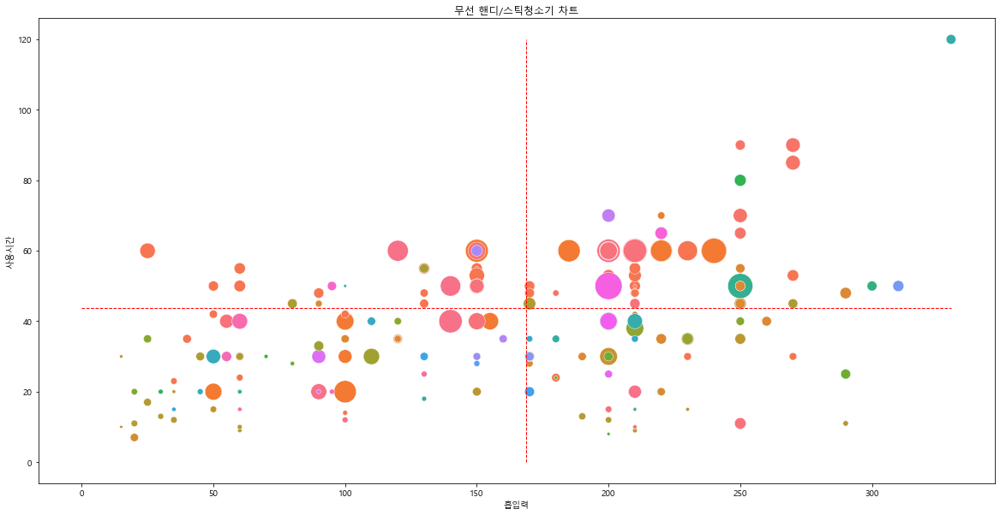
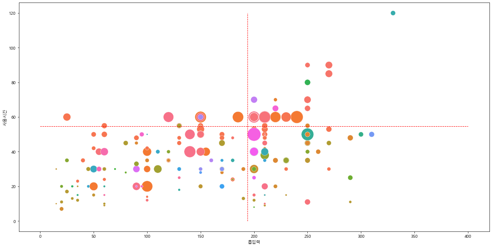
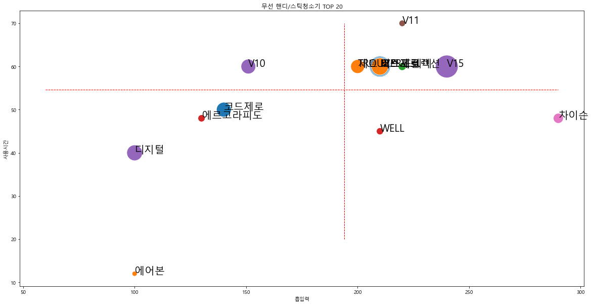
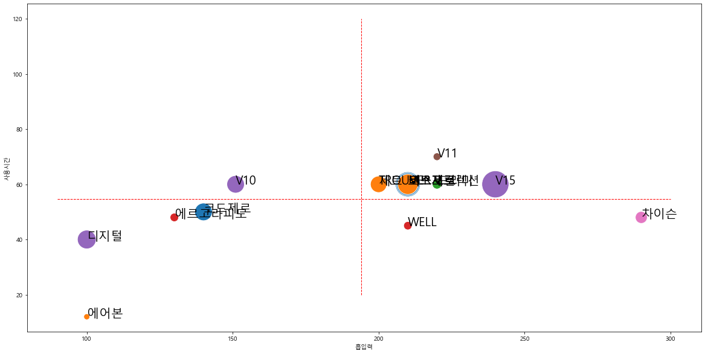

# 006_어떤 청소기가 인기가 좋을까
## 6.1. 데이터 수집하기- 한 페이지 크롤링
### 6.1.1. 크롤잉 준비


```python
from selenium import webdriver
from selenium.webdriver.chrome.service import Service
from bs4 import BeautifulSoup

import pandas as pd
import numpy as np
```


```python
ser=Service('../chromedriver/chromedriver.exe')
driver=webdriver.Chrome(service=ser)
```

### 6.1.2. 상품정보 가져오기


```python
url = 'http://search.danawa.com/dsearch.php?k1=무선청소기'
driver.get(url)
```


```python
html = driver.page_source

soup = BeautifulSoup(html, 'html.parser')
#soup
```


```python
prod_items = soup.select('div.main_prodlist > ul.product_list > li.prod_item ')
print(len(prod_items))
prod_items[0]
```

    44
    


    <li class="prod_item" id="productItem13327520">
    <input id="productItem_categoryInfo_13327520" type="hidden" value="생활가전_청소기"/>
    <input id="min_price_13327520" type="hidden" value="1055260"/>
    <div class="prod_main_info">
    <div class="thumb_image">
    <a class="thumb_link click_log_product_standard_img_" href="http://prod.danawa.com/info/?pcode=13327520&amp;keyword=%EB%AC%B4%EC%84%A0%EC%B2%AD%EC%86%8C%EA%B8%B0&amp;cate=102207" id="thumbLink_13327520" onmousedown="_trkEventLog('통합검색_상품블로그_유입');" target="_blank">
    
    </a>
    <a class="btn_view_zoom" data-assemblygallerycategory="N" href="#" id="imageZoom_13327520" onclick="return false;">
    <span class="ico i_zoom_vw"></span>이미지보기
    						</a>
    <input id="hidden_cate_sub_c1" type="hidden" value="72"/>
    <input id="hidden_cate_sub_c2" type="hidden" value="80"/>
    <input id="hidden_cate_sub_c3" type="hidden" value="81"/>
    <div class="img_selector">
    <a class="sel_item" href="#" onclick="return false;" title="상품 색상"><span class="hide_indent sub_color_w100" style="background-color:#FCE5CD;">상품 색상</span></a><a class="sel_item" href="#" onclick="return false;" title="상품 색상"><span class="hide_indent sub_color_w100" style="background-color:#274E13;">상품 색상</span></a> </div> </div>
    <div class="prod_info">
    <p class="prod_name">
    <a class="click_log_product_standard_title_" href="http://prod.danawa.com/info/?pcode=13327520&amp;keyword=%EB%AC%B4%EC%84%A0%EC%B2%AD%EC%86%8C%EA%B8%B0&amp;cate=102207" onmousedown="_trkEventLog('통합검색_상품블로그_유입'); doCTR('%EB%AC%B4%EC%84%A0%EC%B2%AD%EC%86%8C%EA%B8%B0','13327520',1);" target="_blank">LG전자 오브제컬렉션 코드제로 ThinQ A9S AO9571</a>
    </p>
    <div class="prod_intro">
    <p class="intro_text">올인원타워로 비움, 충전, 보관을 한번에!</p>
    </div>
    <dl class="prod_spec_set">
    <dt class="screen_out">상세 스펙</dt>
    <dd>
    <div class="spec_list"><a class="view_dic" href="#" onclick="$.termDicViewLink(8501,'view',this,0,72,80); return false;">핸디/스틱<b>청소기</b></a> / <a class="view_dic" href="#" onclick="$.termDicViewLink(7445,'view',this,0,72,80); return false;">핸디+스틱형</a> / <a class="view_dic" href="#" onclick="$.termDicViewLink(14900,'view',this,0,72,80); return false;">무선형</a> / <a class="view_dic" href="#" onclick="$.termDicViewLink(217536,'view',this,0,72,80); return false;">흡입+걸레겸용</a> / <a class="view_dic" href="#" onclick="$.termDicViewLink(1743,'view',this,0,72,80); return false;">소비전력</a>: <a class="view_dic" href="#" onclick="$.termDicViewLink(1743,'view',this,0,72,80); return false;">590W</a> / <br/><b>[성능]</b> <a class="view_dic" href="#" onclick="$.termDicViewLink(3996,'view',this,0,72,80); return false;">흡입력</a>: <a class="view_dic" href="#" onclick="$.termDicViewLink(3996,'view',this,0,72,80); return false;">210W</a> / <a class="view_dic" href="#" onclick="$.termDicViewLink(213820,'view',this,0,72,80); return false;">2중터보싸이클론</a> / <a class="view_dic" href="#" onclick="$.termDicViewLink(27442,'view',this,0,72,80); return false;">스마트인버터모터</a> / <br/><b>[배터리]</b> <a class="view_dic" href="#" onclick="$.termDicViewLink(14921,'view',this,0,72,80); return false;">충전시간</a>: <a class="view_dic" href="#" onclick="$.termDicViewLink(14921,'view',this,0,72,80); return false;">4시간</a> / <a class="view_dic" href="#" onclick="$.termDicViewLink(8515,'view',this,0,72,80); return false;">사용시간(개당)</a>: <a class="view_dic" href="#" onclick="$.termDicViewLink(8515,'view',this,0,72,80); return false;">1시간</a> / <a class="view_dic" href="#" onclick="$.termDicViewLink(217578,'view',this,0,72,80); return false;">분리형 (2개)</a> / <a class="view_dic" href="#" onclick="$.termDicViewLink(27314,'view',this,0,72,80); return false;">리튬이온</a> / <br/><b>[필터]</b> <a class="view_dic" href="#" onclick="$.termDicViewLink(14801,'view',this,0,72,80); return false;">분리형배기필터 / 헤파필터</a> / <a class="view_dic" href="#" onclick="$.termDicViewLink(14801,'view',this,0,72,80); return false;">H13급</a> / <a class="view_dic" href="#" onclick="$.termDicViewLink(30024,'view',this,0,72,80); return false;">5단계여과</a> / <br/><b>[기능]</b> <a class="view_dic" href="#" onclick="$.termDicViewLink(216261,'view',this,0,72,80); return false;">자동물공급</a> / <a class="view_dic" href="#" onclick="$.termDicViewLink(27321,'view',this,0,72,80); return false;">배터리잔량표시</a> / <a class="view_dic" href="#" onclick="$.termDicViewLink(214680,'view',this,0,72,80); return false;">IoT기능</a> / <a class="view_dic" href="#" onclick="$.termDicViewLink(219165,'view',this,0,72,80); return false;">자동먼지비움</a> / <br/><b>[구성]</b> <a class="view_dic" href="#" onclick="$.termDicViewLink(18333,'view',this,0,72,80); return false;">바닥</a> / <a class="view_dic" href="#" onclick="$.termDicViewLink(9440,'view',this,0,72,80); return false;">물걸레</a> / <a class="view_dic" href="#" onclick="$.termDicViewLink(18453,'view',this,0,72,80); return false;">침구</a> / <a class="view_dic" href="#" onclick="$.termDicViewLink(18442,'view',this,0,72,80); return false;">솔형</a> / <a class="view_dic" href="#" onclick="$.termDicViewLink(18436,'view',this,0,72,80); return false;">틈새</a> / <a class="view_dic" href="#" onclick="$.termDicViewLink(218112,'view',this,0,72,80); return false;">올인원타워</a> / <br/><b>[부가]</b> <a class="view_dic" href="#" onclick="$.termDicViewLink(14771,'view',this,0,72,80); return false;">색상</a>: <a class="view_dic" href="#" onclick="$.termDicViewLink(14771,'view',this,0,72,80); return false;">카밍베이지</a> / <a class="view_dic" href="#" onclick="$.termDicViewLink(27312,'view',this,0,72,80); return false;">무게</a>: <a class="view_dic" href="#" onclick="$.termDicViewLink(27312,'view',this,0,72,80); return false;">2.6kg</a> / 크기(가로x세로x깊이): 250x1120x260mm								</div>
    </dd>
    </dl>
    <div class="relation_goods_unit" id="relation_goods_unit_13327520"><dl class="unit_goods_list"><dt class="title_unit">관련용품▶</dt><dd class="unit_lists"><a class="unit_link view_dic" data-relationcode="5843801" href="#" onclick="return false;">리튬이온배터리</a><span class="ucomma">,</span><a class="unit_link view_dic" data-relationcode="6421059" href="#" onclick="return false;">바닥브러쉬</a><span class="ucomma">,</span><a class="unit_link view_dic" data-relationcode="8944010" href="#" onclick="return false;">물걸레브러쉬</a><span class="ucomma">,</span><a class="unit_link view_dic" data-relationcode="13321037" href="#" onclick="return false;">펫브러쉬</a><span class="ucomma">,</span><a class="unit_link view_dic" data-relationcode="13442471" href="#" onclick="return false;">침구브러쉬</a><span class="ucomma">,</span><a class="unit_link view_dic" data-relationcode="14083475" href="#" onclick="return false;">올인원타워먼지봉투</a></dd></dl></div>
    <div class="prod_rel_content">
    <dl class="rel_item rel_event">
    <dt>기획전</dt>
    <dd><a href="http://plan.danawa.com/info/?nPlanSeq=4931" rel="noopener" target="_blank">한눈에 보는
    LG전자 코드제로 청소기</a></dd>
    </dl>
    <dl class="rel_item rel_review">
    <dt>사용기</dt>
    <dd><a href="http://prod.danawa.com/community/ProdBoardView.php?nSeq=4748086&amp;nBlogCateSeq1=264&amp;prod_c=13327520" rel="noopener" target="_blank">무선청소기 추천 LG코드제로 A9S 칭찬해요</a></dd>
    </dl>
    </div>
    <div class="prod_sub_info">
    <div class="prod_sub_meta">
    <dl class="meta_item mt_date">
    <dt>등록월</dt>
    <dd>2021.02.</dd>
    </dl>
    <dl class="meta_item mt_comment">
    <dt><span class="dt_behind">상품의견</span></dt>
    <dd>
    <div class="cnt_star">
    <div class="point_type_list">
    <div class="mask" style="width:94%">
    </div>
    </div>
    <div class="point_num">
    <strong>4.7</strong>점
    														</div>
    </div>
    <div class="cnt_opinion">
    														(<a class="click_log_prod_content_count" href="http://prod.danawa.com/info/?pcode=13327520&amp;keyword=%EB%AC%B4%EC%84%A0%EC%B2%AD%EC%86%8C%EA%B8%B0&amp;cate=102207#bookmark_cm_opinion" onmousedown="_trkEventLog('통합검색_상품블로그_유입');" target="_blank"><strong>1,361</strong></a>건)
    													</div>
    </dd>
    </dl>
    <dl class="meta_item">
    <dt class="screen_out">관심상품</dt>
    <dd>
    <a class="click_log_wishList" href="#" onclick="javascript:$.danawaAddProductToWishList(this, '13327520', 'search_bundle', '', '', '1055260');return false;" onmousedown="doCTR('%EB%AC%B4%EC%84%A0%EC%B2%AD%EC%86%8C%EA%B8%B0','13327520',4);" title="관심상품에 담기">관심상품</a>
    </dd>
    <input id="wishListBundleVal_13327520" type="hidden" value="카밍베이지^13327520**카밍그린^13328039**리퍼/중고^14243627//LG전자 오브제컬렉션 코드제로 ThinQ A9S AO9571//13327520"/>
    </dl>
    </div>
    <dl class="prod_category_location">
    <dt class="screen_out">상품분류</dt>
    <dd>
    <a href="http://prod.danawa.com/list/?cate=102207" onmousedown="doCTR('%EB%AC%B4%EC%84%A0%EC%B2%AD%EC%86%8C%EA%B8%B0','13327520',3);" target="_blank"><span>생활가전</span> &gt; <span>청소기</span></a> <div class="more_cate_layer" style="display: none; z-index: 1;">
    <ul class="list_category_location">
    </ul>
    </div>
    </dd>
    </dl>
    </div>
    </div>
    <div class="prod_pricelist" data-cate="72|80|81|0">
    <ul>
    <li class="rank_one" id="productInfoDetail_13327520" style="">
    <p class="chk_sect">
    										675몰
    										<label for="prodCompareCheck_13327520">
    <input id="prodCompareCheck_13327520" type="checkbox"/><strong>상품비교</strong>
    </label>
    <input name="compareValue" type="hidden" value="13327520"/>
    <input name="compareRepValue" type="hidden" value="13327520"/>
    </p>
    <p class="price_sect">
    <a class="click_log_product_standard_price_" href="http://prod.danawa.com/info/?pcode=13327520&amp;keyword=%EB%AC%B4%EC%84%A0%EC%B2%AD%EC%86%8C%EA%B8%B0&amp;cate=102207" onmousedown="doCTR('%EB%AC%B4%EC%84%A0%EC%B2%AD%EC%86%8C%EA%B8%B0','13327520',1);" target="_blank"><strong>1,055,260</strong>원</a>
    <span class="more_btn_wrap">
    <button class="ico i_more">가격정보 더보기</button>
    <span class="layer_price_more" id="layer_price_more_13327520"></span>
    <span class="sep_line"></span>
    </span>
    </p>
    <p class="memory_sect"><span class="rank">1위</span>																				카밍베이지																				<a href="http://prod.danawa.com/info/?pcode=13327520&amp;keyword=%EB%AC%B4%EC%84%A0%EC%B2%AD%EC%86%8C%EA%B8%B0&amp;cate=102207" onmousedown="doCTR('%EB%AC%B4%EC%84%A0%EC%B2%AD%EC%86%8C%EA%B8%B0','13327520',1);" target="_blank">
    </a>
    </p>
    </li>
    <li id="productInfoDetail_13328039" style="">
    <p class="chk_sect">
    										531몰
    										<label for="prodCompareCheck_13328039">
    <input id="prodCompareCheck_13328039" type="checkbox"/><strong>상품비교</strong>
    </label>
    <input name="compareValue" type="hidden" value="13328039"/>
    <input name="compareRepValue" type="hidden" value="13327520"/>
    </p>
    <p class="price_sect">
    <a class="click_log_product_standard_price_" href="http://prod.danawa.com/info/?pcode=13328039&amp;keyword=%EB%AC%B4%EC%84%A0%EC%B2%AD%EC%86%8C%EA%B8%B0&amp;cate=102207" onmousedown="doCTR('%EB%AC%B4%EC%84%A0%EC%B2%AD%EC%86%8C%EA%B8%B0','13328039',1);" target="_blank"><strong>1,036,430</strong>원</a>
    <span class="more_btn_wrap">
    <button class="ico i_more">가격정보 더보기</button>
    <span class="layer_price_more" id="layer_price_more_13328039"></span>
    <span class="sep_line"></span>
    </span>
    </p>
    <p class="memory_sect"><span class="rank">2위</span>																				카밍그린																				<a href="http://prod.danawa.com/info/?pcode=13328039&amp;keyword=%EB%AC%B4%EC%84%A0%EC%B2%AD%EC%86%8C%EA%B8%B0&amp;cate=102207" onmousedown="doCTR('%EB%AC%B4%EC%84%A0%EC%B2%AD%EC%86%8C%EA%B8%B0','13328039',1);" target="_blank">
    </a>
    </p>
    </li>
    <li id="productInfoDetail_14243627" style="">
    <p class="chk_sect">
    										0몰
    										<label for="prodCompareCheck_14243627">
    <input id="prodCompareCheck_14243627" type="checkbox"/><strong>상품비교</strong>
    </label>
    <input name="compareValue" type="hidden" value="14243627"/>
    <input name="compareRepValue" type="hidden" value="13327520"/>
    </p>
    <p class="price_sect">
    <a class="click_log_product_standard_price_" href="http://prod.danawa.com/info/?pcode=14243627&amp;keyword=%EB%AC%B4%EC%84%A0%EC%B2%AD%EC%86%8C%EA%B8%B0&amp;cate=102207" onmousedown="doCTR('%EB%AC%B4%EC%84%A0%EC%B2%AD%EC%86%8C%EA%B8%B0','14243627',1);" target="_blank"><strong class="no_sale">일시품절</strong></a>
    </p>
    <p class="memory_sect">																				리퍼/중고																				<a href="http://prod.danawa.com/info/?pcode=14243627&amp;keyword=%EB%AC%B4%EC%84%A0%EC%B2%AD%EC%86%8C%EA%B8%B0&amp;cate=102207" onmousedown="doCTR('%EB%AC%B4%EC%84%A0%EC%B2%AD%EC%86%8C%EA%B8%B0','14243627',1);" target="_blank">
    </a>
    </p>
    </li>
    </ul>
    </div>
    </div>
    </li>


```python
# prod_items[0].select('a.click_log_product_standard_title_')[0].text
title = prod_items[0].select('p.prod_name > a')[0].text
spec_list = prod_items[0].select('div.spec_list')[0].text.strip()
price = prod_items[0].select('li.rank_one > p.price_sect > a > strong')[0].text.strip().replace(',', "")
print(title, spec_list, price)
```

    LG전자 오브제컬렉션 코드제로 ThinQ A9S AO9571 핸디/스틱청소기 / 핸디+스틱형 / 무선형 / 흡입+걸레겸용 / 소비전력: 590W / [성능] 흡입력: 210W / 2중터보싸이클론 / 스마트인버터모터 / [배터리] 충전시간: 4시간 / 사용시간(개당): 1시간 / 분리형 (2개) / 리튬이온 / [필터] 분리형배기필터 / 헤파필터 / H13급 / 5단계여과 / [기능] 자동물공급 / 배터리잔량표시 / IoT기능 / 자동먼지비움 / [구성] 바닥 / 물걸레 / 침구 / 솔형 / 틈새 / 올인원타워 / [부가] 색상: 카밍베이지 / 무게: 2.6kg / 크기(가로x세로x깊이): 250x1120x260mm 1055260
    


```python
prod_data=[]
for prod_item in prod_items:
    try:
        title = prod_item.select('p.prod_name > a')[0].text
    except: 
        title=" "
    try:
        spec_list = prod_item.select('div.spec_list')[0].text.strip()
    except:     
        spec_list=' '
    try:
        price = prod_item.select('li.rank_one > p.price_sect > a > strong')[0].text.strip().replace(',', "")
    except:     
        price=' '
    mylist=[title, spec_list, price]
    prod_data.append(mylist)
prod_data      
```


    [['LG전자 오브제컬렉션 코드제로 ThinQ A9S AO9571',
      '핸디/스틱청소기 / 핸디+스틱형 / 무선형 / 흡입+걸레겸용 / 소비전력: 590W / [성능] 흡입력: 210W / 2중터보싸이클론 / 스마트인버터모터 / [배터리] 충전시간: 4시간 / 사용시간(개당): 1시간 / 분리형 (2개) / 리튬이온 / [필터] 분리형배기필터 / 헤파필터 / H13급 / 5단계여과 / [기능] 자동물공급 / 배터리잔량표시 / IoT기능 / 자동먼지비움 / [구성] 바닥 / 물걸레 / 침구 / 솔형 / 틈새 / 올인원타워 / [부가] 색상: 카밍베이지 / 무게: 2.6kg / 크기(가로x세로x깊이): 250x1120x260mm',
      '1055260'],
     ['삼성전자 비스포크 제트 VS20A956A3',
      '핸디/스틱청소기 / 핸디+스틱형 / 무선형 / 흡입+걸레겸용 / [성능] 흡입력: 210W / 제트싸이클론 / 디지털인버터모터 / [배터리] 충전시간: 3시간30분 / 사용시간(개당): 1시간 / 분리형 (1개) / 리튬이온 / [필터] 5단계여과 / [기능] 자동물공급 / 디스플레이표시창 / 배터리잔량표시 / 자동먼지비움 / [구성] 바닥 / 솔형 / 틈새 / 연장툴 / 청정스테이션 / [부가] 먼지통용량: 0.5L / 색상: 미스티화이트 / 무게: 2.5kg / 액세서리크래들  / 크기(가로x세로x깊이): 250x930x202mm',
      '564850'],
     ['LG전자 코드제로 ThinQ A9S AS9370IKT',
      '핸디/스틱청소기 / 핸디+스틱형 / 무선형 / 흡입+걸레겸용 / 소비전력: 590W / [성능] 흡입력: 210W / 2중터보싸이클론 / 스마트인버터모터 / [배터리] 충전시간: 4시간 / 사용시간(개당): 1시간 / 분리형 (1개) / 리튬이온 / [필터] 헤파필터 / H13급 / 5단계여과 / [기능] 자동물공급 / 배터리잔량표시 / IoT기능 / 자동먼지비움 / [구성] 바닥 / 물걸레 / 솔형 / 틈새 / 올인원타워 / [부가] 색상: 아이언그레이+딥그레이 / 무게: 2.6kg / 크기(가로x세로x깊이): 250x1120x260mm',
      '784540'],
     ['YM3P35tETT', 'YM3P35tETT185873', '185873'],
     ['샤오미 CLEANFLY 차량용 무선 청소기 4세대 H2 (해외구매)',
      '차량용청소기 / 무선 / 흡입력: 16,800Pa / 최대출력: 120W / 헤파필터 / 스테인리스 필터 / 추가노즐: 틈새, 솔브러쉬, 연장호스 / 사용시간: 30분 / 소음: 73.8dB / 충전방식: USB C타입 / 배터리용량: 2,000mAh / 색상: 블랙, 화이트 / 크기: 369x72mm / 무게: 560g',
      '59840'],
     ['삼성전자 비스포크 제트 VS20A957E3',
      '핸디/스틱청소기 / 핸디+스틱형 / 무선형 / 흡입+걸레겸용 / [성능] 흡입력: 210W / 제트싸이클론 / 디지털인버터모터 / [배터리] 충전시간: 3시간30분 / 사용시간(개당): 1시간 / 분리형 (2개) / 리튬이온 / [필터] 5단계여과 / [기능] 자동물공급 / 디스플레이표시창 / 배터리잔량표시 / 자동먼지비움 / [구성] 바닥 / 물걸레 / 침구 / 솔형 / 틈새 / 연장툴 / 청정스테이션 / [부가] 먼지통용량: 0.5L / 색상: 미드나잇블루 / 무게: 2.5kg / 액세서리크래들  / 크기(가로x세로x깊이): 250x930x202mm',
      '804810'],
     [' ', ' ', ' '],
     ['샤오미 TROUVER POWER 11',
      '핸디/스틱청소기 / 핸디+스틱형 / 무선형 / 흡입전용 / 소비전력: 400W / [성능] 흡입력: 20000Pa / [배터리] 충전시간: 4시간 / 사용시간(개당): 1시간 / 분리형 (1개) / 리튬이온 / [필터] 헤파필터 / 5단계여과 / [기능] 디스플레이표시창 / 배터리잔량표시 / [구성] 바닥 / 카펫 / 솔형 / 틈새 / 거치대 / [부가] 먼지통용량: 0.4L / 색상: 화이트+오렌지 / 무게: 1.45kg / 크기(가로x세로): 227x1227mm',
      '73950'],
     ['베이스어스 차량용 청소기 A3 (해외구매)',
      '차량용청소기 / 무선 / 흡입력: 15,000Pa / 최대출력: 135W / 헤파필터 / 추가노즐: 틈새, 솔브러쉬 / LED라이트 / 사용시간: 45분 / 배터리 잔량표시 / 소음: 75dB / 충전방식: USB C타입 / 충전시간: 3~5시간 / 색상: 그린, 실버 / 크기: 296x56.5mm',
      '49900'],
     ['샤오미 드리미 V10',
      '핸디/스틱청소기 / 핸디+스틱형 / 무선형 / 흡입전용 / 소비전력: 450W / [성능] 흡입력: 140AW / 흡입력: 22000Pa / 멀티싸이클론 / BLDC모터 / [배터리] 충전시간: 3시간30분 / 사용시간(개당): 1시간 / [필터] 헤파필터 / H12급 / 5단계여과 / [구성] 바닥 / 침구 / 솔형 / 틈새 / 연장툴 / 거치대 / [부가] 먼지통용량: 0.5L / 색상: 화이트 / 무게: 1.5kg',
      '155700'],
     ['삼성전자 비스포크 제트 VS20A957D2',
      '핸디/스틱청소기 / 핸디+스틱형 / 무선형 / 흡입+걸레겸용 / [성능] 흡입력: 210W / 제트싸이클론 / 디지털인버터모터 / [배터리] 충전시간: 3시간30분 / 사용시간(개당): 1시간 / 분리형 (2개) / 리튬이온 / [필터] 5단계여과 / [기능] 자동물공급 / 디스플레이표시창 / 배터리잔량표시 / 자동먼지비움 / [구성] 바닥 / 물걸레 / 솔형 / 틈새 / 청정스테이션 / [부가] 먼지통용량: 0.5L / 색상: 미드나잇블루 / 무게: 2.5kg / 액세서리크래들  / 크기(가로x세로x깊이): 250x930x202mm',
      '712970'],
     ['일렉트로룩스 WELL Q6 WQ61-1OGG',
      '핸디/스틱청소기 / 핸디+스틱형 / 무선형 / 흡입전용 / [성능] 싸이클론 / [배터리] 충전시간: 4시간30분 / 사용시간(개당): 45분 / 내장형 / 리튬이온 / [필터] 5단계여과 / [기능] 브러쉬자동청소 / 셀프스탠딩 / LED라이트 / 배터리잔량표시 / [구성] 바닥 / 솔형 / 틈새 / 거치대 / [부가] 먼지통용량: 0.3L / 색상: 그라나이트그레이 / 무게: 2.65kg / 크기(가로x세로x깊이): 386x692x146mm',
      '124380'],
     [' ', ' ', ' '],
     ['LG전자 코드제로 ThinQ A9S A9370',
      '핸디/스틱청소기 / 핸디+스틱형 / 무선형 / 흡입+걸레겸용 / 소비전력: 590W / [성능] 2중터보싸이클론 / 인버터모터 / [배터리] 충전시간: 4시간 / 사용시간(개당): 1시간 / 분리형 (1개) / 리튬이온 / [필터] 헤파필터 / H13급 / 5단계여과 / [기능] 자동물공급 / 디스플레이표시창 / 배터리잔량표시 / IoT기능 / [구성] 바닥 / 물걸레 / 솔형 / 틈새 / 거치대 / [부가] 색상: 아이언그레이 / 크기(가로x세로x깊이): 250x1120x260mm',
      '631860'],
     ['다이슨 V10 플러피 오리진',
      '핸디/스틱청소기 / 핸디+스틱형 / 무선형 / 흡입전용 / [성능] 흡입력: 151AW / 싸이클론 / [배터리] 충전시간: 3시간30분 / 사용시간(개당): 1시간 / [구성] 소프트롤러 / 미니모터 / 솔형 / 더스팅 / 틈새 / 도킹스테이션 / [부가] 먼지통용량: 0.5L / 색상: 레드 / 무게: 2.5kg / 크기(가로x세로x깊이): 256x1241x250mm',
      '527450'],
     ['LG전자 코드제로 A9 A9100N',
      '핸디/스틱청소기 / 핸디+스틱형 / 무선형 / 흡입+걸레겸용 / 소비전력: 450W / [성능] 흡입력: 140W / 2중터보싸이클론 / 인버터모터 / [배터리] 충전시간: 4시간 / 사용시간(개당): 50분 / 분리형 (1개) / 리튬이온 / [필터] 헤파필터 / H13급 / 5단계여과 / [기능] 배터리잔량표시 / [구성] 바닥 / 솔형 / 틈새 / 거치대 / [부가] 색상: 판타지실버 / 크기(가로x세로x깊이): 250x1120x260mm',
      '532370'],
     ['LG전자 코드제로 ThinQ A9S AS9470',
      '핸디/스틱청소기 / 핸디+스틱형 / 무선형 / 흡입+걸레겸용 / 소비전력: 590W / [성능] 흡입력: 210W / 2중터보싸이클론 / 스마트인버터모터 / [배터리] 충전시간: 4시간 / 사용시간(개당): 1시간 / 분리형 (2개) / 리튬이온 / [필터] 일체형배기필터 / 헤파필터 / H13급 / 5단계여과 / [기능] 자동물공급 / 배터리잔량표시 / IoT기능 / 자동먼지비움 / [구성] 바닥 / 물걸레 / 솔형 / 틈새 / 올인원타워 / [부가] 색상: 아이언그레이 / 무게: 2.6kg / 크기(가로x세로x깊이): 250x1120x260mm',
      '887350'],
     ['삼성전자 비스포크 제트 VS20A956A3 + 물걸레',
      '핸디/스틱청소기 / 핸디+스틱형 / 무선형 / 흡입+걸레겸용 / [성능] 흡입력: 210W / 제트싸이클론 / 디지털인버터모터 / [배터리] 충전시간: 3시간30분 / 사용시간(개당): 1시간 / 분리형 (1개) / 리튬이온 / [필터] 5단계여과 / [기능] 자동물공급 / 디스플레이표시창 / 배터리잔량표시 / 자동먼지비움 / [구성] 바닥 / 물걸레 / 솔형 / 틈새 / 연장툴 / 청정스테이션 / [부가] 먼지통용량: 0.5L / 물통용량: 0.15L / 색상: 미드나잇블루 / 무게: 2.5kg / 액세서리크래들  / 크기(가로x세로x깊이): 250x930x202mm',
      '705030'],
     [' ', ' ', ' '],
     ['샤오미 미지아 차량용 핸디 무선 청소기 (해외구매)',
      '차량용청소기 / 무선 / 흡입력: 13,000Pa / 최대출력: 120W / 헤파필터 / 추가노즐: 틈새, 솔브러쉬 / 사용시간: 9~30분 / 버튼 잠금 장치 / 2단 세기 조절 / 크기: 55x267mm / 무게: 500g',
      '40670'],
     ['위드앤올 2in1 휴대용 무선 에어건 핸디 청소기 WNA-AG8',
      '차량용청소기 / 무선 / 흡입력: 8,000Pa / 최대출력: 75W / 추가노즐: 틈새, 솔브러쉬 / 사용시간: 40분 / 충전시간: 3시간 / 배터리용량: 6,000mAh / 크기: 223.5x84x65mm / 무게: 378g',
      '78830'],
     ['델로라 V11 파워 300W',
      '핸디/스틱청소기 / 핸디+스틱형 / 무선형 / 흡입전용 / 소비전력: 300W / [성능] 흡입력: 22000Pa / 싸이클론 / BLDC모터 / [배터리] 충전시간: 5시간 / 사용시간(개당): 1시간10분 / 분리형 (1개) / 리튬이온 / [필터] 헤파필터 / 4단계여과 / [기능] LED라이트 / [구성] 바닥 / 침구 / 솔형 / 틈새 / 연장툴 / 거치대 / [부가] 먼지통용량: 0.6L / 색상: 레드, 블랙 / 무게: 3.89kg / 크기(가로x세로x깊이): 239x1255x105mm',
      '104990'],
     ['삼성전자 제트 VS20T9210BF',
      '핸디/스틱청소기 / 핸디+스틱형 / 무선형 / 흡입+걸레겸용 / 소비전력: 550W / [성능] 흡입력: 200W / 싸이클론 / 인버터모터 / [배터리] 충전시간: 3시간30분 / 사용시간(개당): 1시간 / 분리형 (1개) / 리튬이온 / [필터] 헤파필터 / 5단계여과 / [기능] 디스플레이표시창 / 프리볼트 / [구성] 바닥 / 솔형 / 틈새 / 거치대 / 청정스테이션 / [부가] 먼지통용량: 0.6L / 색상: 코타블랙 / 무게: 2.64kg / 크기(가로x세로x깊이): 250x1136x215mm',
      '465950'],
     ['조아스 차량용 에어건 청소기 JVC-2000',
      '차량용청소기 / 무선 / 흡입력: 5,500Pa / 최대출력: 60W / 헤파필터 / 추가노즐: 틈새, 솔브러쉬 / 사용시간: 20분 / 충전시간: 2시간 / 충전방식: USB C타입 / 크기: 142x172mm / 무게: 280g',
      '38900'],
     ['인트비즈 MORUN 차량용 무선 미니 청소기 V5',
      '차량용청소기 / 무선 / 흡입력: 13,000Pa / 헤파필터 / 추가노즐: 틈새, 솔브러쉬, 연장호스 / 사용시간: 12분(고속),25분(저속) / 리튬이온배터리 / 색상: 바닐라화이트, 메탈그레이 / 크기: 56x330mm / 무게: 540g',
      '89000'],
     ['일렉트로룩스 에르고라피도 ZB3311',
      '핸디/스틱청소기 / 핸디+스틱형 / 무선형 / 흡입전용 / [성능] 싸이클론 / [배터리] 충전시간: 4시간 / 사용시간(개당): 48분 / 내장형 / 리튬이온 / [필터] 4단계여과 / [기능] 브러쉬자동청소 / 셀프스탠딩 / LED라이트 / 배터리잔량표시 / [구성] 바닥 / 틈새 / 거치대 / [부가] 먼지통용량: 0.42L / 색상: 타이탄블루 / 무게: 3.01kg / 크기(가로x세로x깊이): 303x690x162mm',
      '128390'],
     ['다이슨 V15 디텍트 앱솔루트 엑스트라',
      '핸디/스틱청소기 / 핸디+스틱형 / 무선형 / 흡입전용 / [성능] 흡입력: 240AW / 루트싸이클론 / [배터리] 충전시간: 4시간30분 / 사용시간(개당): 1시간 / 분리형 (1개) / [필터] 헤파필터 / [기능] 먼지감지센서 / 디스플레이표시창 / [구성] 레이저슬림플러피 / 하이토크 / 헤어스크류 / 솔형 / 더스팅 / 스터번더트 / 틈새 / 업탑어댑터 / 거치대 / 도킹스테이션 / [부가] 먼지통용량: 0.54L / 색상: 옐로우/아이언/니켈 / 무게: 3kg / 크기(가로x세로x깊이): 250x1086x250mm',
      '1246880'],
     ['DIBEA 차이슨 ALLNEW29000',
      '핸디/스틱청소기 / 핸디+스틱형 / 무선형 / 흡입+걸레겸용 / 소비전력: 380W / [성능] 흡입력: 29000Pa / BLDC모터 / 충전시간: 4시간 / 사용시간(개당): 48분 / 분리형 (1개) / [필터] 헤파필터 / H13급 / 4단계여과 / [기능] LED라이트 / 배터리잔량표시 / [구성] 바닥 / 물걸레 / 침구 / 솔형 / 틈새 / 패브릭 / 연장툴 / 거치대 / [부가] 먼지통용량: 0.7L / 색상: 폴라나이트그레이, 미드나이트블랙 / 무게: 2.4kg / UV살균 / 크기(가로x세로x깊이): 255x1150x200mm',
      '248000'],
     ['다이슨 디지털 슬림 플러피+',
      '핸디/스틱청소기 / 핸디+스틱형 / 무선형 / 흡입전용 / [성능] 흡입력: 100AW / 싸이클론 / [배터리] 충전시간: 3시간30분 / 사용시간(개당): 40분 / 분리형 (1개) / [필터] 5단계여과 / [기능] 디스플레이표시창 / [구성] 슬림소프트롤러 / 미니모터 / 솔형 / 스터번더트 / 틈새 / 매트리스 / 연장툴 / 거치대 / 도킹스테이션 / [부가] 먼지통용량: 0.3L / 색상: 오렌지 / 무게: 1.9kg / 크기(가로x세로x깊이): 250x1100x250mm',
      '601800'],
     ['삼성전자 에어본 VC-H71',
      '핸디/스틱청소기 / 핸디+스틱형 / 무선형 / 소비전력: 48W / [배터리] 충전시간: 8시간 / 사용시간(개당): 12분 / 니켈수소 / [기능] 셀프스탠딩 / [부가] 색상: 에어본+내츄럴그레이 / 무게: 1kg / 크기(가로x세로x깊이): 342x265x119mm',
      '67430'],
     ['허밍 차량용 무선 에어건 프로 HME-C15000G',
      '차량용청소기 / 무선 / 최대출력: 60W / 추가노즐: 틈새, 솔브러쉬 / LED라이트 / 사용시간: 48~60분 / 충전시간: 7시간 / 충전방식: USB C타입 / 배터리용량: 15,000mAh / 크기: 130x79mm / 무게: 475g',
      '50620'],
     ['LG전자 코드제로 A9 AS9100ST',
      '핸디/스틱청소기 / 핸디+스틱형 / 무선형 / 흡입+걸레겸용 / 소비전력: 450W / [성능] 흡입력: 140W / 2중터보싸이클론 / 인버터모터 / [배터리] 충전시간: 4시간 / 사용시간(개당): 50분 / 분리형 (1개) / 리튬이온 / [필터] 헤파필터 / H13급 / 5단계여과 / [기능] 배터리잔량표시 / [구성] 바닥 / 솔형 / 틈새 / 올인원타워 / [부가] 색상: 판타지실버 / 크기(가로x세로x깊이): 250x1120x260mm',
      '685350'],
     ['샤오미 드리미 V12',
      '핸디/스틱청소기 / 핸디+스틱형 / 무선형 / 흡입+걸레겸용 / 소비전력: 550W / [성능] 흡입력: 185AW / 흡입력: 27000Pa / 싸이클론 / [배터리] 충전시간: 4시간 / 사용시간(개당): 1시간30분 / 내장형 / [필터] 5단계여과 / [기능] 디스플레이표시창 / LED라이트 / 배터리잔량표시 / [구성] 바닥 / 물걸레 / 침구 / 솔형 / 틈새 / 연장툴 / 거치대 / [부가] 먼지통용량: 0.5L / 물통용량: 0.25L / 색상: 블랙 / 무게: 1.65kg / 크기(가로x세로): 200x1226mm',
      '282060'],
     ['샤오미 드리미 V11',
      '핸디/스틱청소기 / 핸디+스틱형 / 무선형 / 흡입+걸레겸용 / 소비전력: 450W / [성능] 흡입력: 150AW / 흡입력: 25000Pa / 멀티싸이클론 / BLDC모터 / [배터리] 충전시간: 4시간 / 사용시간(개당): 1시간30분 / [필터] 5단계여과 / [기능] 디스플레이표시창 / [구성] 바닥 / 침구 / 솔형 / 틈새 / 연장툴 / 거치대 / [부가] 먼지통용량: 0.5L / 색상: 레드 / 무게: 1.6kg / 크기(가로x세로): 202x1226mm',
      '194880'],
     ['삼성전자 에어본 화이트 VC-H22',
      '핸디/스틱청소기 / 핸디형 / 무선형 / 소비전력: 48W / [배터리] 충전시간: 8시간 / 사용시간(개당): 10분 / 니켈수소 / [부가] 무게: 0.76kg / 크기(가로x세로x깊이): 103x317x174mm',
      '49000'],
     ['오아 클린보틀 차량용 청소기 OA-CL002',
      '차량용청소기 / 무선 / 흡입력: 6,500Pa / 헤파필터 / 추가노즐: 틈새, 솔브러쉬 / 사용시간: 20분 / 충전시간: 2.5시간 / 크기: 73x73x305mm / 무게 : 703g',
      '57900'],
     ['샤오미 CLEANFLY 차량용 무선 청소기 3세대 (해외구매)',
      '차량용청소기 / 무선 / 흡입력: 16,800Pa / 최대출력: 120W / 헤파필터 / 스테인리스 필터 / 추가노즐: 틈새, 솔브러쉬, 연장호스 / 사용시간: 25분 / 크기: 369x72mm / 무게: 560g / 충전방식: USB C타입 / 배터리용량: 2,000mAh',
      '58470'],
     ['샤오미 LYDSTO 핸디형 에어펌프 진공청소기',
      '차량용청소기 / 무선 / 흡입력: ~7,000Pa / 충전방식: USB C타입 / 배터리용량: 2,500mAH / 크기: 315x54x54mm / 무게: 570g / 압력설정 / 최대압력: 120psi',
      '56530'],
     ['DIBEA M24 MAX',
      '핸디/스틱청소기 / 핸디+스틱형 / 무선형 / 흡입+걸레겸용 / 소비전력: 400W / [성능] 흡입력: 25000Pa / 싸이클론 / BLDC모터 / [배터리] 충전시간: 3시간 / 사용시간(개당): 50분 / 분리형 (1개) / [필터] 헤파필터 / H13급 / [기능] LED라이트 / 배터리잔량표시 / [구성] 바닥 / 물걸레 / 침구 / 솔형 / 틈새 / 거치대 / [부가] 먼지통용량: 0.5L / 물통용량: 0.26L / 색상: 옐로우 / 무게: 2.5kg / 크기(가로x세로x깊이): 256x1172x217mm',
      '139000'],
     ['삼성전자 비스포크 제트 VS20A957D2P',
      '핸디/스틱청소기 / 핸디+스틱형 / 무선형 / 흡입+걸레겸용 / [성능] 흡입력: 210W / 제트싸이클론 / 디지털인버터모터 / [배터리] 충전시간: 3시간30분 / 사용시간(개당): 1시간 / 분리형 (2개) / 리튬이온 / [필터] 5단계여과 / [기능] 자동물공급 / 디스플레이표시창 / 배터리잔량표시 / 자동먼지비움 / [구성] 바닥 / 물걸레 / 솔형 / 틈새 / 청정스테이션 / [부가] 먼지통용량: 0.5L / 색상: 우디그린 / 무게: 2.5kg / 액세서리크래들  / 크기(가로x세로x깊이): 250x930x202mm',
      '763400'],
     ['로엘 듀스핀3 PRO',
      '물걸레청소기 / 스틱형 / 물걸레전용 / 회전식 / 무선형 / 충전시간: 4시간 / 사용시간(개당): 3시간 / [기능] 물분사 / 각도조절 / 셀프스탠딩 / [부가] 먼지통용량: 0.24L / 색상: 화이트 / 무게: 1.99kg / 자동세척탈수 / 크기(가로x세로x깊이): 360x1160x170mm',
      '177900'],
     ['삼성전자 제트 VS20T9218QDCC',
      '핸디/스틱청소기 / 핸디+스틱형 / 무선형 / 흡입+걸레겸용 / 소비전력: 550W / [성능] 흡입력: 200W / 싸이클론 / 인버터모터 / [배터리] 충전시간: 3시간30분 / 사용시간(개당): 1시간 / 분리형 (1개) / 리튬이온 / [필터] 헤파필터 / 5단계여과 / [기능] 디스플레이표시창 / 프리볼트 / [구성] 바닥 / 물걸레 / 솔형 / 틈새 / 연장툴 / 거치대 / 청정스테이션 / [부가] 먼지통용량: 0.5L / 색상: 티탄+그레이 / 무게: 2.64kg / 크기(가로x세로x깊이): 250x1123x215mm',
      '542460'],
     ['삼성전자 비스포크 제트 VS20A956A3P',
      '핸디/스틱청소기 / 핸디+스틱형 / 무선형 / 흡입+걸레겸용 / [성능] 흡입력: 210W / 제트싸이클론 / 디지털인버터모터 / [배터리] 충전시간: 3시간30분 / 사용시간(개당): 1시간 / 분리형 (1개) / 리튬이온 / [필터] 5단계여과 / [기능] 자동물공급 / 디스플레이표시창 / 배터리잔량표시 / 자동먼지비움 / [구성] 바닥 / 솔형 / 틈새 / 연장툴 / 청정스테이션 / [부가] 먼지통용량: 0.5L / 물통용량: 0.15L / 색상: 미드나잇블루 / 무게: 2.5kg / 액세서리크래들  / 크기(가로x세로x깊이): 250x930x202mm',
      '584770'],
     ['LG전자 코드제로 A9 A9100S',
      '핸디/스틱청소기 / 핸디+스틱형 / 무선형 / 흡입+걸레겸용 / 소비전력: 450W / [성능] 흡입력: 140W / 2중터보싸이클론 / 인버터모터 / [배터리] 충전시간: 3시간30분 / 사용시간(개당): 40분 / 분리형 (1개) / 리튬이온 / [필터] 헤파필터 / H13급 / 5단계여과 / [기능] 배터리잔량표시 / [구성] 바닥 / 솔형 / 틈새 / 거치대 / [부가] 색상: 판타지실버 / 크기(가로x세로x깊이): 250x1120x260mm',
      '589970']]


```python
def get_prod_items(prod_items):
    prod_data=[]
    for prod_item in prod_items:
        try:
            title = prod_item.select('p.prod_name > a')[0].text
        except: 
            title=" "
        try:
            spec_list = prod_item.select('div.spec_list')[0].text.strip()
        except:     
            spec_list=' '
        try:
            price = prod_item.select('li.rank_one > p.price_sect > a > strong')[0].text.strip().replace(',', "")
        except:     
            price=' '
        mylist=[title, spec_list, price]
        prod_data.append(mylist)
    return(prod_data)      
```


```python
prod_data=get_prod_items(prod_items)
len(prod_data)
```


    44


## 6.2. 데이터 수집2-여러 페이지에서 크롤링

- 1페이지: http://search.danawa.com/dsearch.php?k1=무선청소기
- 2페이지: http://search.danawa.com/dsearch.php?query=무선청소기&originalQuery=무선청소기&volumeType=allvs&page=2&limit=40&sort=saveDESC&list=list&boost=true&addDelivery=N&recommendedSort=Y&defaultUICategoryCode=102207&defaultPhysicsCategoryCode=72%7C80%7C81%7C0&defaultVmTab=2606&defaultVaTab=390030&tab=goods
- 3페이지: http://search.danawa.com/dsearch.php?query=무선청소기&originalQuery=무선청소기&volumeType=allvs&page=3&limit=40&sort=saveDESC&list=list&boost=true&addDelivery=N&recommendedSort=Y&defaultUICategoryCode=102207&defaultPhysicsCategoryCode=72%7C80%7C81%7C0&defaultVmTab=2606&defaultVaTab=390030&tab=goods
- http://search.danawa.com/dsearch.php?query=무선청소기&originalQuery=무선청소기&volumeType=allvs&page=1&limit=40&sort=saveDESC&list=list&boost=true&addDelivery=N&recommendedSort=Y&defaultUICategoryCode=102207&defaultPhysicsCategoryCode=72%7C80%7C81%7C0&defaultVmTab=2606&defaultVaTab=390030&tab=goods으로 1페이지 추론가능


```python
def get_search_page_url(keyword, page):
    url='http://search.danawa.com/dsearch.php?query={}&originalQuery={}%B0&volumeType=allvs&page={}&limit=40&sort=saveDESC&list=list&boost=true&addDelivery=N&recommendedSort=Y&defaultUICategoryCode=102207&defaultPhysicsCategoryCode=72%7C80%7C81%7C0&defaultVmTab=2606&defaultVaTab=390030&tab=goods'.format(keyword, keyword, page)
    return(url)
```

### 6.2.2. 주피터 노트북에 진행포시줄 추가


```python
import time 
from tqdm import tqdm_notebook
```

### 6.2.3. 여러 페이지에 걸친 상품 정보 수집


```python
keyword='무선청소기'
total_page=10
prod_data_total=[]
for page in tqdm_notebook(range(1, total_page+1)):
    url=get_search_page_url(keyword, page)
    driver.get(url)
    
    time.sleep(5)
    
    
    html=driver.page_source
    soup=BeautifulSoup(html, 'html.parser')
    
    prod_items = soup.select('div.main_prodlist > ul.product_list > li.prod_item ')
    prod_item_list=get_prod_items(prod_items)
    
    prod_data_total=prod_data_total+prod_item_list
```

    C:\Users\nadai\AppData\Local\Temp/ipykernel_11828/242737147.py:4: TqdmDeprecationWarning: This function will be removed in tqdm==5.0.0
    Please use `tqdm.notebook.tqdm` instead of `tqdm.tqdm_notebook`
      for page in tqdm_notebook(range(1, total_page+1)):
    


      0%|          | 0/10 [00:00<?, ?it/s]


```python
prod_data_total[:5]
```


    [['LG전자 오브제컬렉션 코드제로 ThinQ A9S AO9571',
      '핸디/스틱청소기 / 핸디+스틱형 / 무선형 / 흡입+걸레겸용 / 소비전력: 590W / [성능] 흡입력: 210W / 2중터보싸이클론 / 스마트인버터모터 / [배터리] 충전시간: 4시간 / 사용시간(개당): 1시간 / 분리형 (2개) / 리튬이온 / [필터] 분리형배기필터 / 헤파필터 / H13급 / 5단계여과 / [기능] 자동물공급 / 배터리잔량표시 / IoT기능 / 자동먼지비움 / [구성] 바닥 / 물걸레 / 침구 / 솔형 / 틈새 / 올인원타워 / [부가] 색상: 카밍베이지 / 무게: 2.6kg / 크기(가로x세로x깊이): 250x1120x260mm',
      '1055260'],
     ['삼성전자 비스포크 제트 VS20A956A3',
      '핸디/스틱청소기 / 핸디+스틱형 / 무선형 / 흡입+걸레겸용 / [성능] 흡입력: 210W / 제트싸이클론 / 디지털인버터모터 / [배터리] 충전시간: 3시간30분 / 사용시간(개당): 1시간 / 분리형 (1개) / 리튬이온 / [필터] 5단계여과 / [기능] 자동물공급 / 디스플레이표시창 / 배터리잔량표시 / 자동먼지비움 / [구성] 바닥 / 솔형 / 틈새 / 연장툴 / 청정스테이션 / [부가] 먼지통용량: 0.5L / 색상: 미스티화이트 / 무게: 2.5kg / 액세서리크래들  / 크기(가로x세로x깊이): 250x930x202mm',
      '564850'],
     ['LG전자 코드제로 ThinQ A9S AS9370IKT',
      '핸디/스틱청소기 / 핸디+스틱형 / 무선형 / 흡입+걸레겸용 / 소비전력: 590W / [성능] 흡입력: 210W / 2중터보싸이클론 / 스마트인버터모터 / [배터리] 충전시간: 4시간 / 사용시간(개당): 1시간 / 분리형 (1개) / 리튬이온 / [필터] 헤파필터 / H13급 / 5단계여과 / [기능] 자동물공급 / 배터리잔량표시 / IoT기능 / 자동먼지비움 / [구성] 바닥 / 물걸레 / 솔형 / 틈새 / 올인원타워 / [부가] 색상: 아이언그레이+딥그레이 / 무게: 2.6kg / 크기(가로x세로x깊이): 250x1120x260mm',
      '784550'],
     ['vg3dmdwV1s', 'vg3dmdwV1s856981', '856981'],
     ['샤오미 CLEANFLY 차량용 무선 청소기 4세대 H2 (해외구매)',
      '차량용청소기 / 무선 / 흡입력: 16,800Pa / 최대출력: 120W / 헤파필터 / 스테인리스 필터 / 추가노즐: 틈새, 솔브러쉬, 연장호스 / 사용시간: 30분 / 소음: 73.8dB / 충전방식: USB C타입 / 배터리용량: 2,000mAh / 색상: 블랙, 화이트 / 크기: 369x72mm / 무게: 560g',
      '59840']]


### 6.2.4. 수집 데이터 저장


```python
data=pd.DataFrame(prod_data_total)
data.columns=['상품명','스팩 목록','가격']

data.to_excel('./files/1_danawa_crawling_result_class.xlsx', index=False)
```

## 6.3. 다나와 크롤링 데이터 전처리
### 6.3.1. 다나와 크롤링 데이터 불러오기


```python
import pandas as pd
data=pd.read_excel('./files/1_danawa_crawling_result_class.xlsx')
#print(data.info())
data.head()
```


<div>
<style scoped>
    .dataframe tbody tr th:only-of-type {
        vertical-align: middle;
    }

    .dataframe tbody tr th {
        vertical-align: top;
    }

    .dataframe thead th {
        text-align: right;
    }
</style>
<table border="1" class="dataframe">
  <thead>
    <tr style="text-align: right;">
      <th></th>
      <th>상품명</th>
      <th>스팩 목록</th>
      <th>가격</th>
    </tr>
  </thead>
  <tbody>
    <tr>
      <th>0</th>
      <td>LG전자 오브제컬렉션 코드제로 ThinQ A9S AO9571</td>
      <td>핸디/스틱청소기 / 핸디+스틱형 / 무선형 / 흡입+걸레겸용 / 소비전력: 590W...</td>
      <td>1055260</td>
    </tr>
    <tr>
      <th>1</th>
      <td>삼성전자 비스포크 제트 VS20A956A3</td>
      <td>핸디/스틱청소기 / 핸디+스틱형 / 무선형 / 흡입+걸레겸용 / [성능] 흡입력: ...</td>
      <td>564850</td>
    </tr>
    <tr>
      <th>2</th>
      <td>LG전자 코드제로 ThinQ A9S AS9370IKT</td>
      <td>핸디/스틱청소기 / 핸디+스틱형 / 무선형 / 흡입+걸레겸용 / 소비전력: 590W...</td>
      <td>784550</td>
    </tr>
    <tr>
      <th>3</th>
      <td>vg3dmdwV1s</td>
      <td>vg3dmdwV1s856981</td>
      <td>856981</td>
    </tr>
    <tr>
      <th>4</th>
      <td>샤오미 CLEANFLY 차량용 무선 청소기 4세대 H2 (해외구매)</td>
      <td>차량용청소기 / 무선 / 흡입력: 16,800Pa / 최대출력: 120W / 헤파필...</td>
      <td>59840</td>
    </tr>
  </tbody>
</table>
</div>


### 6.3.2. 회사명, 모델명 정리


```python
company_list=[]
product_list=[]
for title in data['상품명']:
    title_info=title.split(' ',1)
    company_name=title_info[0]
    product_name=title_info[-1]
    company_list.append(company_name)
    product_list.append(product_name)
```

### 6.3.3. 스펙 목록 데이터 살펴보기


```python
spec_list=data['스팩 목록'][0].split(' / ')
spec_list
```


    ['핸디/스틱청소기',
     '핸디+스틱형',
     '무선형',
     '흡입+걸레겸용',
     '소비전력: 590W',
     '[성능] 흡입력: 210W',
     '2중터보싸이클론',
     '스마트인버터모터',
     '[배터리] 충전시간: 4시간',
     '사용시간(개당): 1시간',
     '분리형 (2개)',
     '리튬이온',
     '[필터] 분리형배기필터',
     '헤파필터',
     'H13급',
     '5단계여과',
     '[기능] 자동물공급',
     '배터리잔량표시',
     'IoT기능',
     '자동먼지비움',
     '[구성] 바닥',
     '물걸레',
     '침구',
     '솔형',
     '틈새',
     '올인원타워',
     '[부가] 색상: 카밍베이지',
     '무게: 2.6kg',
     '크기(가로x세로x깊이): 250x1120x260mm']


### 6.3.4. 스펙 목록에서 카테고리, 사용시간, 흡입력을 추출해서 정리


```python
category=spec_list[0]
for spec in spec_list:
    if '사용시간' in spec:
        use_time_spec= spec
    elif '흡입력' in spec:
        suction_spec=spec
        
use_time_value=use_time_spec.split(': ')[1].strip()
suction_value=suction_spec.split(': ')[1].strip()

print(use_time_value, suction_value)
```

    1시간 210W
    


```python
category_list=[]
use_time_list=[]
suction_list=[]
for spec_data in data['스팩 목록']:
    spec_list=spec_data.split(' / ')
    
    category=spec_list[0].strip()
    category_list.append(category)
 
    for spec in spec_list:
        if '사용시간' in spec:
            use_time_spec= spec
        elif '흡입력' in spec:
            suction_spec=spec
    use_time_value=use_time_spec.split(': ')[1].strip()
    suction_value=suction_spec.split(': ')[1].strip()   
    use_time_list.append(use_time_value)
    suction_list.append(suction_value)
```


```python
print(category_list[:5])
print(use_time_list[:5])
print(suction_list[:5])
```

    ['핸디/스틱청소기', '핸디/스틱청소기', '핸디/스틱청소기', 'vg3dmdwV1s856981', '차량용청소기']
    ['1시간', '1시간', '1시간', '1시간', '30분']
    ['210W', '210W', '210W', '210W', '16,800Pa']
    

### 6.3.5. 무선청소기 사용시간 단위 통일시키기


```python
def convert_time_minute(time):
    try:
        if '시간'in time:
            hour=time.split('시간')[0]
            if '분' in time:
                minute= time.split('시간')[-1].split('분')[0]
            else:
                minute=0
        else:
            hour=0
            if '분' in time:
                minute= time.split('시간')[-1].split('분')[0]
            else:
                minute=0
        return int(hour)*60+int(minute)
    except:
        return None
```


```python
time='1시간 40분'
convert_time_minute(time)
```


    100


```python
new_use_time_list=[]
for time in use_time_list:
    value=convert_time_minute(time)
    new_use_time_list.append(value)
new_use_time_list[:10]
```


    [60, 60, 60, 60, 30, 60, 60, 60, 45, 60]


### 6.3.6. 흡입력 단위 통일


```python
def get_suction(value):
    try:
        value = value.upper()
        if "AW" in value or "W" in value:
            result = value.replace("A", "").replace("W","")
            result = int(result.replace(",",""))
        elif "PA" in value:
            result = value.replace("PA","")
            result = int(result.replace(",",""))/100
        else:
            result = None
        return result
    except:
        return None
```


```python
new_suction_list = []
for power in suction_list:
    value = get_suction (power)
    new_suction_list.append(value)

print(len(new_suction_list))
print(new_suction_list[0:10])
```

    440
    [210, 210, 210, 210, 168.0, 210, 210, 200.0, 150.0, 220.0]
    

### 6.3.7. 전처리 내용 합치기


```python
pd_data = pd.DataFrame()
pd_data['카테고리'] = category_list
pd_data['회사명'] = company_list
pd_data['제품'] = product_list
pd_data['가격'] = data['가격']
pd_data['사용시간'] = new_use_time_list
pd_data['흡입력'] = new_suction_list
pd_data.head()
```


<div>
<style scoped>
    .dataframe tbody tr th:only-of-type {
        vertical-align: middle;
    }

    .dataframe tbody tr th {
        vertical-align: top;
    }

    .dataframe thead th {
        text-align: right;
    }
</style>
<table border="1" class="dataframe">
  <thead>
    <tr style="text-align: right;">
      <th></th>
      <th>카테고리</th>
      <th>회사명</th>
      <th>제품</th>
      <th>가격</th>
      <th>사용시간</th>
      <th>흡입력</th>
    </tr>
  </thead>
  <tbody>
    <tr>
      <th>0</th>
      <td>핸디/스틱청소기</td>
      <td>LG전자</td>
      <td>오브제컬렉션 코드제로 ThinQ A9S AO9571</td>
      <td>1055260</td>
      <td>60.0</td>
      <td>210.0</td>
    </tr>
    <tr>
      <th>1</th>
      <td>핸디/스틱청소기</td>
      <td>삼성전자</td>
      <td>비스포크 제트 VS20A956A3</td>
      <td>564850</td>
      <td>60.0</td>
      <td>210.0</td>
    </tr>
    <tr>
      <th>2</th>
      <td>핸디/스틱청소기</td>
      <td>LG전자</td>
      <td>코드제로 ThinQ A9S AS9370IKT</td>
      <td>784550</td>
      <td>60.0</td>
      <td>210.0</td>
    </tr>
    <tr>
      <th>3</th>
      <td>vg3dmdwV1s856981</td>
      <td>vg3dmdwV1s</td>
      <td>vg3dmdwV1s</td>
      <td>856981</td>
      <td>60.0</td>
      <td>210.0</td>
    </tr>
    <tr>
      <th>4</th>
      <td>차량용청소기</td>
      <td>샤오미</td>
      <td>CLEANFLY 차량용 무선 청소기 4세대 H2 (해외구매)</td>
      <td>59840</td>
      <td>30.0</td>
      <td>168.0</td>
    </tr>
  </tbody>
</table>
</div>


```python
condition=pd_data['카테고리']=='핸디/스틱청소기'
pd_data_final=pd_data[condition]
len(pd_data_final)
```


    287


### 6.3.8. 엑셀로 저장


```python
pd_data_final.to_excel('./files/2_danawa_data_final_class.xlsx', index=False)
```

## 6.4. 무선청소기 모델별 비교 분석
### 6.4.1. 데이터 살펴보기
#### 6.4.1.1. 기본데이터


```python
danawa_data = pd.read_excel('./files/2_danawa_data_final_class.xlsx')
danawa_data.head()
```


<div>
<style scoped>
    .dataframe tbody tr th:only-of-type {
        vertical-align: middle;
    }

    .dataframe tbody tr th {
        vertical-align: top;
    }

    .dataframe thead th {
        text-align: right;
    }
</style>
<table border="1" class="dataframe">
  <thead>
    <tr style="text-align: right;">
      <th></th>
      <th>카테고리</th>
      <th>회사명</th>
      <th>제품</th>
      <th>가격</th>
      <th>사용시간</th>
      <th>흡입력</th>
    </tr>
  </thead>
  <tbody>
    <tr>
      <th>0</th>
      <td>핸디/스틱청소기</td>
      <td>LG전자</td>
      <td>오브제컬렉션 코드제로 ThinQ A9S AO9571</td>
      <td>1055260</td>
      <td>60.0</td>
      <td>210.0</td>
    </tr>
    <tr>
      <th>1</th>
      <td>핸디/스틱청소기</td>
      <td>삼성전자</td>
      <td>비스포크 제트 VS20A956A3</td>
      <td>564850</td>
      <td>60.0</td>
      <td>210.0</td>
    </tr>
    <tr>
      <th>2</th>
      <td>핸디/스틱청소기</td>
      <td>LG전자</td>
      <td>코드제로 ThinQ A9S AS9370IKT</td>
      <td>784550</td>
      <td>60.0</td>
      <td>210.0</td>
    </tr>
    <tr>
      <th>3</th>
      <td>핸디/스틱청소기</td>
      <td>삼성전자</td>
      <td>비스포크 제트 VS20A957E3</td>
      <td>804800</td>
      <td>60.0</td>
      <td>210.0</td>
    </tr>
    <tr>
      <th>4</th>
      <td>핸디/스틱청소기</td>
      <td>샤오미</td>
      <td>TROUVER POWER 11</td>
      <td>73950</td>
      <td>60.0</td>
      <td>200.0</td>
    </tr>
  </tbody>
</table>
</div>


#### 6.4.1.2. 흡입력 기준 정렬


```python
top_list = danawa_data.sort_values(["흡입력"], ascending = False)
top_list.head()
```


<div>
<style scoped>
    .dataframe tbody tr th:only-of-type {
        vertical-align: middle;
    }

    .dataframe tbody tr th {
        vertical-align: top;
    }

    .dataframe thead th {
        text-align: right;
    }
</style>
<table border="1" class="dataframe">
  <thead>
    <tr style="text-align: right;">
      <th></th>
      <th>카테고리</th>
      <th>회사명</th>
      <th>제품</th>
      <th>가격</th>
      <th>사용시간</th>
      <th>흡입력</th>
    </tr>
  </thead>
  <tbody>
    <tr>
      <th>153</th>
      <td>핸디/스틱청소기</td>
      <td>리하스</td>
      <td>LH20</td>
      <td>184000</td>
      <td>120.0</td>
      <td>330.0</td>
    </tr>
    <tr>
      <th>222</th>
      <td>핸디/스틱청소기</td>
      <td>비브르</td>
      <td>스톰파워 VE35</td>
      <td>235000</td>
      <td>50.0</td>
      <td>310.0</td>
    </tr>
    <tr>
      <th>138</th>
      <td>핸디/스틱청소기</td>
      <td>아이닉</td>
      <td>NEW i20</td>
      <td>188000</td>
      <td>50.0</td>
      <td>300.0</td>
    </tr>
    <tr>
      <th>17</th>
      <td>핸디/스틱청소기</td>
      <td>DIBEA</td>
      <td>차이슨 ALLNEW29000</td>
      <td>248000</td>
      <td>48.0</td>
      <td>290.0</td>
    </tr>
    <tr>
      <th>242</th>
      <td>핸디/스틱청소기</td>
      <td>캐치웰</td>
      <td>NEW F8</td>
      <td>189000</td>
      <td>25.0</td>
      <td>290.0</td>
    </tr>
  </tbody>
</table>
</div>


#### 6.4.1.3. 사용시간 기준 정렬


```python
top_list = danawa_data.sort_values(["사용시간"], ascending = False)
top_list.head()
```


<div>
<style scoped>
    .dataframe tbody tr th:only-of-type {
        vertical-align: middle;
    }

    .dataframe tbody tr th {
        vertical-align: top;
    }

    .dataframe thead th {
        text-align: right;
    }
</style>
<table border="1" class="dataframe">
  <thead>
    <tr style="text-align: right;">
      <th></th>
      <th>카테고리</th>
      <th>회사명</th>
      <th>제품</th>
      <th>가격</th>
      <th>사용시간</th>
      <th>흡입력</th>
    </tr>
  </thead>
  <tbody>
    <tr>
      <th>153</th>
      <td>핸디/스틱청소기</td>
      <td>리하스</td>
      <td>LH20</td>
      <td>184000</td>
      <td>120.0</td>
      <td>330.0</td>
    </tr>
    <tr>
      <th>22</th>
      <td>핸디/스틱청소기</td>
      <td>샤오미</td>
      <td>드리미 V11</td>
      <td>194880</td>
      <td>90.0</td>
      <td>250.0</td>
    </tr>
    <tr>
      <th>74</th>
      <td>핸디/스틱청소기</td>
      <td>샤오미</td>
      <td>드리미 T30</td>
      <td>399000</td>
      <td>90.0</td>
      <td>270.0</td>
    </tr>
    <tr>
      <th>21</th>
      <td>핸디/스틱청소기</td>
      <td>샤오미</td>
      <td>드리미 V12</td>
      <td>282060</td>
      <td>90.0</td>
      <td>270.0</td>
    </tr>
    <tr>
      <th>278</th>
      <td>핸디/스틱청소기</td>
      <td>샤오미</td>
      <td>드리미 V12 프로</td>
      <td>408270</td>
      <td>85.0</td>
      <td>270.0</td>
    </tr>
  </tbody>
</table>
</div>


#### 6.4.1.4. 사용시간, 흡입력 기준 정렬


```python
top_list = danawa_data.sort_values(["사용시간","흡입력"], ascending = False)
top_list.head()
```


<div>
<style scoped>
    .dataframe tbody tr th:only-of-type {
        vertical-align: middle;
    }

    .dataframe tbody tr th {
        vertical-align: top;
    }

    .dataframe thead th {
        text-align: right;
    }
</style>
<table border="1" class="dataframe">
  <thead>
    <tr style="text-align: right;">
      <th></th>
      <th>카테고리</th>
      <th>회사명</th>
      <th>제품</th>
      <th>가격</th>
      <th>사용시간</th>
      <th>흡입력</th>
    </tr>
  </thead>
  <tbody>
    <tr>
      <th>153</th>
      <td>핸디/스틱청소기</td>
      <td>리하스</td>
      <td>LH20</td>
      <td>184000</td>
      <td>120.0</td>
      <td>330.0</td>
    </tr>
    <tr>
      <th>21</th>
      <td>핸디/스틱청소기</td>
      <td>샤오미</td>
      <td>드리미 V12</td>
      <td>282060</td>
      <td>90.0</td>
      <td>270.0</td>
    </tr>
    <tr>
      <th>74</th>
      <td>핸디/스틱청소기</td>
      <td>샤오미</td>
      <td>드리미 T30</td>
      <td>399000</td>
      <td>90.0</td>
      <td>270.0</td>
    </tr>
    <tr>
      <th>22</th>
      <td>핸디/스틱청소기</td>
      <td>샤오미</td>
      <td>드리미 V11</td>
      <td>194880</td>
      <td>90.0</td>
      <td>250.0</td>
    </tr>
    <tr>
      <th>278</th>
      <td>핸디/스틱청소기</td>
      <td>샤오미</td>
      <td>드리미 V12 프로</td>
      <td>408270</td>
      <td>85.0</td>
      <td>270.0</td>
    </tr>
  </tbody>
</table>
</div>


###  6.4.2. 가성비 좋은 제품 살펴보기


```python
price_mean_value = danawa_data['가격'].mean()
suction_mean_value = danawa_data['흡입력'].mean()
use_time_mean_value = danawa_data['사용시간'].mean()
print("가격 평균값", price_mean_value)
print("흡입력 평균값", suction_mean_value)
print("사용시간 평균값", use_time_mean_value)
```

    가격 평균값 364205.3658536585
    흡입력 평균값 168.44405594405595
    사용시간 평균값 43.84507042253521
    


```python
condition_data = danawa_data [
    (danawa_data['가격'] <= price_mean_value) & 
    (danawa_data['흡입력'] >= suction_mean_value) & 
    (danawa_data['사용시간'] >= use_time_mean_value)]
condition_data.head()
```


<div>
<style scoped>
    .dataframe tbody tr th:only-of-type {
        vertical-align: middle;
    }

    .dataframe tbody tr th {
        vertical-align: top;
    }

    .dataframe thead th {
        text-align: right;
    }
</style>
<table border="1" class="dataframe">
  <thead>
    <tr style="text-align: right;">
      <th></th>
      <th>카테고리</th>
      <th>회사명</th>
      <th>제품</th>
      <th>가격</th>
      <th>사용시간</th>
      <th>흡입력</th>
    </tr>
  </thead>
  <tbody>
    <tr>
      <th>4</th>
      <td>핸디/스틱청소기</td>
      <td>샤오미</td>
      <td>TROUVER POWER 11</td>
      <td>73950</td>
      <td>60.0</td>
      <td>200.0</td>
    </tr>
    <tr>
      <th>5</th>
      <td>핸디/스틱청소기</td>
      <td>샤오미</td>
      <td>드리미 V10</td>
      <td>155700</td>
      <td>60.0</td>
      <td>220.0</td>
    </tr>
    <tr>
      <th>7</th>
      <td>핸디/스틱청소기</td>
      <td>일렉트로룩스</td>
      <td>WELL Q6 WQ61-1OGG</td>
      <td>124380</td>
      <td>45.0</td>
      <td>210.0</td>
    </tr>
    <tr>
      <th>13</th>
      <td>핸디/스틱청소기</td>
      <td>델로라</td>
      <td>V11 파워 300W</td>
      <td>104990</td>
      <td>70.0</td>
      <td>220.0</td>
    </tr>
    <tr>
      <th>17</th>
      <td>핸디/스틱청소기</td>
      <td>DIBEA</td>
      <td>차이슨 ALLNEW29000</td>
      <td>248000</td>
      <td>48.0</td>
      <td>290.0</td>
    </tr>
  </tbody>
</table>
</div>


### 6.4.3. 데이터 시각화


```python
from matplotlib import font_manager, rc
import matplotlib.pyplot as plt
import seaborn as sns

rc('font', family='Malgun Gothic')
```

#### 6.4.3.+ 글꼴 윈도우와 맥용


```python
# 그래프에서 한글 표기를 위한 글꼴 변경(윈도우, macOS에 대해 처리)
font_path = ''
if platform.system() == 'Windows': 
    font_path = 'c:/Windows/Fonts/malgun.ttf'
    font_name = font_manager.FontProperties(fname = font_path).get_name()
    rc('font', family = font_name)
elif platform.system() == 'Darwin':
    font_path = '/Users/$USER/Library/Fonts/AppleGothic.ttf'
    rc('font', family = 'AppleGothic')
else: 
    print('Check your OS system')
```

#### 6.4.3.1. 결측치 제거


```python
chart_data = danawa_data.dropna(axis = 0)
len(chart_data)
```


    283


#### 6.4.3.2. 흡입력, 사용시간 최대, 최소


```python
suction_max_value = chart_data['흡입력'].max()
suction_mean_value = chart_data['흡입력'].mean()
use_time_max_value = chart_data['사용시간'].max()
use_time_mean_value = chart_data['사용시간'].mean()
```

#### 6.4.3.3. 청소기 성능 시각화


```python
plt.figure(figsize=(20, 10))
plt.title("무선 핸디/스틱청소기 차트")
sns.scatterplot(x = '흡입력', y = '사용시간', size = '가격', hue = chart_data['회사명'], 
             data = chart_data, sizes = (10, 1000), legend = False)
plt.plot([0, suction_max_value], 
          [use_time_mean_value, use_time_mean_value], 
          'r--', 
          lw = 1 )
plt.plot([suction_mean_value, suction_mean_value], 
          [0, use_time_max_value], 
          'r--', 
          lw = 1 )
plt.show()
```


    

    


```python
plt.figure(figsize = (20, 10))
sns.scatterplot(x = '흡입력', y = '사용시간',
               size = '가격', hue = danawa_data['회사명'],
               data = danawa_data, legend = False,
               sizes = (10, 1000))
plt.hlines(use_time_mean_value, 0, 400, color='red', 
           linestyle='dashed', linewidth=1)
plt.vlines(suction_mean_value, 0, 120, color='red', 
           linestyle='dashed', linewidth=1)
plt.show()
```


    

    


#### 6.4.4. 인기 제품의 데이터 시각화


```python
chart_data_selected = chart_data[:20]

```


```python
# 흡입력, 사용시간의 최댓값, 최솟값 구하기
suction_max_value = chart_data_selected['흡입력'].max()
suction_mean_value = chart_data_selected['흡입력'].mean()
use_time_max_value = chart_data_selected['사용시간'].max()
use_time_mean_value = chart_data_selected['사용시간'].mean()
plt.figure(figsize=(20, 10))
plt.title("무선 핸디/스틱청소기 TOP 20")
sns.scatterplot(x = '흡입력', 
                  y = '사용시간', 
                  size = '가격', 
                  hue = chart_data_selected['회사명'], 
                  data = chart_data_selected, sizes = (100, 2000),
                  legend = False)
plt.plot([60, suction_max_value], 
          [use_time_mean_value, use_time_mean_value], 
          'r--', 
          lw = 1 )
plt.plot([suction_mean_value, suction_mean_value], 
          [20, use_time_max_value], 
          'r--', 
          lw = 1 )
for index, row in chart_data_selected.iterrows():
    x = row['흡입력']
    y = row['사용시간']
    s = row['제품'].split(' ')[0]
    plt.text(x, y, s, size=20)
plt.show()
```


    

    


```python
# suction_max_value = chart_data_selected['흡입력'].max()
suction_mean_value = chart_data_selected['흡입력'].mean()
# use_time_max_value = chart_data_selected['사용시간'].max()
use_time_mean_value = chart_data_selected['사용시간'].mean()

plt.figure(figsize = (20, 10))
sns.scatterplot(x = '흡입력', y = '사용시간',
               size = '가격', hue = chart_data_selected['회사명'],
               data = chart_data_selected, legend = False,
               sizes = (100, 2000))
plt.hlines(use_time_mean_value, 90, 300, color='red', 
           linestyle='dashed', linewidth=1)
plt.vlines(suction_mean_value, 20, 120, color='red', 
           linestyle='dashed', linewidth=1)

for index, row in chart_data_selected.iterrows():
    x = row['흡입력']
    y = row['사용시간']
    s = row['제품'].split(' ')[0]
    plt.text(x, y, s, size=20)
    
    
plt.show()
```


    

    

