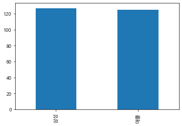

---
# 4.파이썬으로 하는 통계기초
---
## 4.1. 데이터 정보
---
## 4.2. 데이터 불러오기 및 데이터 프레임 변환

---


```python
import numpy as np 
import pandas as pd 
import matplotlib.pyplot as plt 
import seaborn as sns

from scipy.stats import chisquare
from scipy import stats
import scipy as sp
import statsmodels.api as sm 
from statsmodels.formula.api import ols, logit, glm
```


```python
df=pd.read_csv('../spstat1.csv', sep=',', encoding='euc-kr')
df.head(1)
```


<div>
<style scoped>
    .dataframe tbody tr th:only-of-type {
        vertical-align: middle;
    }


    .dataframe tbody tr th {
        vertical-align: top;
    }
    
    .dataframe thead th {
        text-align: right;
    }

</style>

<table border="1" class="dataframe">
  <thead>
    <tr style="text-align: right;">
      <th></th>
      <th>번호</th>
      <th>사용브랜드</th>
      <th>사용기간</th>
      <th>구매장소</th>
      <th>구매가격</th>
      <th>정보획득</th>
      <th>구입조언</th>
      <th>하루사용시간</th>
      <th>브랜드이미지</th>
      <th>가격만족도</th>
      <th>...</th>
      <th>구매중요도9_A/S</th>
      <th>구매중요도10_명성</th>
      <th>성별</th>
      <th>연령</th>
      <th>연령2</th>
      <th>학력</th>
      <th>직업</th>
      <th>월수입</th>
      <th>결혼</th>
      <th>가족수</th>
    </tr>
  </thead>
  <tbody>
    <tr>
      <th>0</th>
      <td>181</td>
      <td>1</td>
      <td>3</td>
      <td>1</td>
      <td>15</td>
      <td>1</td>
      <td>2</td>
      <td>1</td>
      <td>2</td>
      <td>4</td>
      <td>...</td>
      <td>4</td>
      <td>3</td>
      <td>0</td>
      <td>4</td>
      <td>2</td>
      <td>2</td>
      <td>4</td>
      <td>2</td>
      <td>2</td>
      <td>3</td>
    </tr>
  </tbody>
</table>
<p>1 rows × 29 columns</p>

</div>


```python
df.tail(2)
```


<div>
<style scoped>
    .dataframe tbody tr th:only-of-type {
        vertical-align: middle;
    }


    .dataframe tbody tr th {
        vertical-align: top;
    }
    
    .dataframe thead th {
        text-align: right;
    }

</style>

<table border="1" class="dataframe">
  <thead>
    <tr style="text-align: right;">
      <th></th>
      <th>번호</th>
      <th>사용브랜드</th>
      <th>사용기간</th>
      <th>구매장소</th>
      <th>구매가격</th>
      <th>정보획득</th>
      <th>구입조언</th>
      <th>하루사용시간</th>
      <th>브랜드이미지</th>
      <th>가격만족도</th>
      <th>...</th>
      <th>구매중요도9_A/S</th>
      <th>구매중요도10_명성</th>
      <th>성별</th>
      <th>연령</th>
      <th>연령2</th>
      <th>학력</th>
      <th>직업</th>
      <th>월수입</th>
      <th>결혼</th>
      <th>가족수</th>
    </tr>
  </thead>
  <tbody>
    <tr>
      <th>250</th>
      <td>242</td>
      <td>2</td>
      <td>3</td>
      <td>1</td>
      <td>200</td>
      <td>2</td>
      <td>1</td>
      <td>2</td>
      <td>4</td>
      <td>2</td>
      <td>...</td>
      <td>5</td>
      <td>5</td>
      <td>1</td>
      <td>1</td>
      <td>1</td>
      <td>2</td>
      <td>1</td>
      <td>2</td>
      <td>1</td>
      <td>1</td>
    </tr>
    <tr>
      <th>251</th>
      <td>72</td>
      <td>2</td>
      <td>5</td>
      <td>2</td>
      <td>250</td>
      <td>1</td>
      <td>4</td>
      <td>2</td>
      <td>3</td>
      <td>3</td>
      <td>...</td>
      <td>2</td>
      <td>1</td>
      <td>0</td>
      <td>3</td>
      <td>2</td>
      <td>8</td>
      <td>3</td>
      <td>6</td>
      <td>1</td>
      <td>1</td>
    </tr>
  </tbody>
</table>
<p>2 rows × 29 columns</p>

</div>


```python
df[:3]
```


<div>
<style scoped>
    .dataframe tbody tr th:only-of-type {
        vertical-align: middle;
    }


    .dataframe tbody tr th {
        vertical-align: top;
    }
    
    .dataframe thead th {
        text-align: right;
    }

</style>

<table border="1" class="dataframe">
  <thead>
    <tr style="text-align: right;">
      <th></th>
      <th>번호</th>
      <th>사용브랜드</th>
      <th>사용기간</th>
      <th>구매장소</th>
      <th>구매가격</th>
      <th>정보획득</th>
      <th>구입조언</th>
      <th>하루사용시간</th>
      <th>브랜드이미지</th>
      <th>가격만족도</th>
      <th>...</th>
      <th>구매중요도9_A/S</th>
      <th>구매중요도10_명성</th>
      <th>성별</th>
      <th>연령</th>
      <th>연령2</th>
      <th>학력</th>
      <th>직업</th>
      <th>월수입</th>
      <th>결혼</th>
      <th>가족수</th>
    </tr>
  </thead>
  <tbody>
    <tr>
      <th>0</th>
      <td>181</td>
      <td>1</td>
      <td>3</td>
      <td>1</td>
      <td>15</td>
      <td>1</td>
      <td>2</td>
      <td>1</td>
      <td>2</td>
      <td>4</td>
      <td>...</td>
      <td>4</td>
      <td>3</td>
      <td>0</td>
      <td>4</td>
      <td>2</td>
      <td>2</td>
      <td>4</td>
      <td>2</td>
      <td>2</td>
      <td>3</td>
    </tr>
    <tr>
      <th>1</th>
      <td>94</td>
      <td>1</td>
      <td>3</td>
      <td>3</td>
      <td>20</td>
      <td>4</td>
      <td>3</td>
      <td>3</td>
      <td>4</td>
      <td>3</td>
      <td>...</td>
      <td>4</td>
      <td>5</td>
      <td>1</td>
      <td>3</td>
      <td>2</td>
      <td>4</td>
      <td>4</td>
      <td>4</td>
      <td>2</td>
      <td>3</td>
    </tr>
    <tr>
      <th>2</th>
      <td>12</td>
      <td>1</td>
      <td>2</td>
      <td>1</td>
      <td>25</td>
      <td>1</td>
      <td>1</td>
      <td>1</td>
      <td>3</td>
      <td>2</td>
      <td>...</td>
      <td>4</td>
      <td>4</td>
      <td>0</td>
      <td>4</td>
      <td>2</td>
      <td>4</td>
      <td>7</td>
      <td>4</td>
      <td>2</td>
      <td>1</td>
    </tr>
  </tbody>
</table>
<p>3 rows × 29 columns</p>

</div>


```python
df['구매장소']
```


    0      1
    1      3
    2      1
    3      3
    4      5
          ..
    247    5
    248    5
    249    1
    250    1
    251    2
    Name: 구매장소, Length: 252, dtype: int64


```python
df.columns[[1,4,5]]
```


    Index(['사용브랜드', '구매가격', '정보획득'], dtype='object')


```python
df[df.columns[[1,4,5]]]
```


<div>
<style scoped>
    .dataframe tbody tr th:only-of-type {
        vertical-align: middle;
    }


    .dataframe tbody tr th {
        vertical-align: top;
    }
    
    .dataframe thead th {
        text-align: right;
    }

</style>

<table border="1" class="dataframe">
  <thead>
    <tr style="text-align: right;">
      <th></th>
      <th>사용브랜드</th>
      <th>구매가격</th>
      <th>정보획득</th>
    </tr>
  </thead>
  <tbody>
    <tr>
      <th>0</th>
      <td>1</td>
      <td>15</td>
      <td>1</td>
    </tr>
    <tr>
      <th>1</th>
      <td>1</td>
      <td>20</td>
      <td>4</td>
    </tr>
    <tr>
      <th>2</th>
      <td>1</td>
      <td>25</td>
      <td>1</td>
    </tr>
    <tr>
      <th>3</th>
      <td>1</td>
      <td>26</td>
      <td>4</td>
    </tr>
    <tr>
      <th>4</th>
      <td>1</td>
      <td>30</td>
      <td>6</td>
    </tr>
    <tr>
      <th>...</th>
      <td>...</td>
      <td>...</td>
      <td>...</td>
    </tr>
    <tr>
      <th>247</th>
      <td>2</td>
      <td>200</td>
      <td>6</td>
    </tr>
    <tr>
      <th>248</th>
      <td>2</td>
      <td>200</td>
      <td>6</td>
    </tr>
    <tr>
      <th>249</th>
      <td>2</td>
      <td>200</td>
      <td>2</td>
    </tr>
    <tr>
      <th>250</th>
      <td>2</td>
      <td>200</td>
      <td>2</td>
    </tr>
    <tr>
      <th>251</th>
      <td>2</td>
      <td>250</td>
      <td>1</td>
    </tr>
  </tbody>
</table>
<p>252 rows × 3 columns</p>

</div>


```python
df.loc[:,'학력':'결혼'] #loc[행,열]
```


<div>
<style scoped>
    .dataframe tbody tr th:only-of-type {
        vertical-align: middle;
    }


    .dataframe tbody tr th {
        vertical-align: top;
    }
    
    .dataframe thead th {
        text-align: right;
    }

</style>

<table border="1" class="dataframe">
  <thead>
    <tr style="text-align: right;">
      <th></th>
      <th>학력</th>
      <th>직업</th>
      <th>월수입</th>
      <th>결혼</th>
    </tr>
  </thead>
  <tbody>
    <tr>
      <th>0</th>
      <td>2</td>
      <td>4</td>
      <td>2</td>
      <td>2</td>
    </tr>
    <tr>
      <th>1</th>
      <td>4</td>
      <td>4</td>
      <td>4</td>
      <td>2</td>
    </tr>
    <tr>
      <th>2</th>
      <td>4</td>
      <td>7</td>
      <td>4</td>
      <td>2</td>
    </tr>
    <tr>
      <th>3</th>
      <td>2</td>
      <td>2</td>
      <td>5</td>
      <td>3</td>
    </tr>
    <tr>
      <th>4</th>
      <td>4</td>
      <td>9</td>
      <td>2</td>
      <td>1</td>
    </tr>
    <tr>
      <th>...</th>
      <td>...</td>
      <td>...</td>
      <td>...</td>
      <td>...</td>
    </tr>
    <tr>
      <th>247</th>
      <td>7</td>
      <td>8</td>
      <td>2</td>
      <td>1</td>
    </tr>
    <tr>
      <th>248</th>
      <td>6</td>
      <td>4</td>
      <td>6</td>
      <td>2</td>
    </tr>
    <tr>
      <th>249</th>
      <td>6</td>
      <td>4</td>
      <td>3</td>
      <td>2</td>
    </tr>
    <tr>
      <th>250</th>
      <td>2</td>
      <td>1</td>
      <td>2</td>
      <td>1</td>
    </tr>
    <tr>
      <th>251</th>
      <td>8</td>
      <td>3</td>
      <td>6</td>
      <td>1</td>
    </tr>
  </tbody>
</table>
<p>252 rows × 4 columns</p>

</div>


```python
df.iloc[1:7, 2:5]
```


<div>
<style scoped>
    .dataframe tbody tr th:only-of-type {
        vertical-align: middle;
    }


    .dataframe tbody tr th {
        vertical-align: top;
    }
    
    .dataframe thead th {
        text-align: right;
    }

</style>

<table border="1" class="dataframe">
  <thead>
    <tr style="text-align: right;">
      <th></th>
      <th>사용기간</th>
      <th>구매장소</th>
      <th>구매가격</th>
    </tr>
  </thead>
  <tbody>
    <tr>
      <th>1</th>
      <td>3</td>
      <td>3</td>
      <td>20</td>
    </tr>
    <tr>
      <th>2</th>
      <td>2</td>
      <td>1</td>
      <td>25</td>
    </tr>
    <tr>
      <th>3</th>
      <td>5</td>
      <td>3</td>
      <td>26</td>
    </tr>
    <tr>
      <th>4</th>
      <td>3</td>
      <td>5</td>
      <td>30</td>
    </tr>
    <tr>
      <th>5</th>
      <td>1</td>
      <td>4</td>
      <td>30</td>
    </tr>
    <tr>
      <th>6</th>
      <td>5</td>
      <td>2</td>
      <td>40</td>
    </tr>
  </tbody>
</table>

</div>


```python
df.at[5,'구매가격'] #5행에 있는 '구매가격' 값 펴시
```


    30


```python
df[df['구매가격']<50].tail(3)
```


<div>
<style scoped>
    .dataframe tbody tr th:only-of-type {
        vertical-align: middle;
    }


    .dataframe tbody tr th {
        vertical-align: top;
    }
    
    .dataframe thead th {
        text-align: right;
    }

</style>

<table border="1" class="dataframe">
  <thead>
    <tr style="text-align: right;">
      <th></th>
      <th>번호</th>
      <th>사용브랜드</th>
      <th>사용기간</th>
      <th>구매장소</th>
      <th>구매가격</th>
      <th>정보획득</th>
      <th>구입조언</th>
      <th>하루사용시간</th>
      <th>브랜드이미지</th>
      <th>가격만족도</th>
      <th>...</th>
      <th>구매중요도9_A/S</th>
      <th>구매중요도10_명성</th>
      <th>성별</th>
      <th>연령</th>
      <th>연령2</th>
      <th>학력</th>
      <th>직업</th>
      <th>월수입</th>
      <th>결혼</th>
      <th>가족수</th>
    </tr>
  </thead>
  <tbody>
    <tr>
      <th>11</th>
      <td>27</td>
      <td>1</td>
      <td>2</td>
      <td>5</td>
      <td>45</td>
      <td>5</td>
      <td>2</td>
      <td>3</td>
      <td>3</td>
      <td>3</td>
      <td>...</td>
      <td>4</td>
      <td>4</td>
      <td>0</td>
      <td>4</td>
      <td>2</td>
      <td>4</td>
      <td>5</td>
      <td>2</td>
      <td>2</td>
      <td>2</td>
    </tr>
    <tr>
      <th>127</th>
      <td>160</td>
      <td>2</td>
      <td>1</td>
      <td>4</td>
      <td>10</td>
      <td>6</td>
      <td>1</td>
      <td>2</td>
      <td>1</td>
      <td>1</td>
      <td>...</td>
      <td>2</td>
      <td>2</td>
      <td>1</td>
      <td>2</td>
      <td>1</td>
      <td>4</td>
      <td>10</td>
      <td>3</td>
      <td>1</td>
      <td>3</td>
    </tr>
    <tr>
      <th>128</th>
      <td>92</td>
      <td>2</td>
      <td>3</td>
      <td>1</td>
      <td>48</td>
      <td>1</td>
      <td>2</td>
      <td>2</td>
      <td>2</td>
      <td>2</td>
      <td>...</td>
      <td>3</td>
      <td>3</td>
      <td>0</td>
      <td>6</td>
      <td>3</td>
      <td>2</td>
      <td>7</td>
      <td>3</td>
      <td>2</td>
      <td>3</td>
    </tr>
  </tbody>
</table>
<p>3 rows × 29 columns</p>

</div>


```python
df[(df['구매가격']>150)&(df['구매가격']<200)].tail()
```


<div>
<style scoped>
    .dataframe tbody tr th:only-of-type {
        vertical-align: middle;
    }


    .dataframe tbody tr th {
        vertical-align: top;
    }
    
    .dataframe thead th {
        text-align: right;
    }

</style>

<table border="1" class="dataframe">
  <thead>
    <tr style="text-align: right;">
      <th></th>
      <th>번호</th>
      <th>사용브랜드</th>
      <th>사용기간</th>
      <th>구매장소</th>
      <th>구매가격</th>
      <th>정보획득</th>
      <th>구입조언</th>
      <th>하루사용시간</th>
      <th>브랜드이미지</th>
      <th>가격만족도</th>
      <th>...</th>
      <th>구매중요도9_A/S</th>
      <th>구매중요도10_명성</th>
      <th>성별</th>
      <th>연령</th>
      <th>연령2</th>
      <th>학력</th>
      <th>직업</th>
      <th>월수입</th>
      <th>결혼</th>
      <th>가족수</th>
    </tr>
  </thead>
  <tbody>
    <tr>
      <th>235</th>
      <td>128</td>
      <td>2</td>
      <td>5</td>
      <td>4</td>
      <td>180</td>
      <td>6</td>
      <td>4</td>
      <td>3</td>
      <td>4</td>
      <td>5</td>
      <td>...</td>
      <td>5</td>
      <td>3</td>
      <td>1</td>
      <td>6</td>
      <td>3</td>
      <td>1</td>
      <td>9</td>
      <td>3</td>
      <td>3</td>
      <td>2</td>
    </tr>
    <tr>
      <th>236</th>
      <td>25</td>
      <td>2</td>
      <td>3</td>
      <td>5</td>
      <td>180</td>
      <td>6</td>
      <td>5</td>
      <td>3</td>
      <td>3</td>
      <td>3</td>
      <td>...</td>
      <td>4</td>
      <td>4</td>
      <td>1</td>
      <td>4</td>
      <td>2</td>
      <td>6</td>
      <td>4</td>
      <td>5</td>
      <td>1</td>
      <td>4</td>
    </tr>
    <tr>
      <th>237</th>
      <td>149</td>
      <td>2</td>
      <td>2</td>
      <td>3</td>
      <td>182</td>
      <td>6</td>
      <td>2</td>
      <td>5</td>
      <td>2</td>
      <td>3</td>
      <td>...</td>
      <td>3</td>
      <td>4</td>
      <td>1</td>
      <td>3</td>
      <td>2</td>
      <td>4</td>
      <td>4</td>
      <td>6</td>
      <td>2</td>
      <td>2</td>
    </tr>
    <tr>
      <th>238</th>
      <td>244</td>
      <td>2</td>
      <td>4</td>
      <td>1</td>
      <td>190</td>
      <td>5</td>
      <td>5</td>
      <td>2</td>
      <td>3</td>
      <td>5</td>
      <td>...</td>
      <td>4</td>
      <td>2</td>
      <td>0</td>
      <td>5</td>
      <td>3</td>
      <td>4</td>
      <td>4</td>
      <td>2</td>
      <td>2</td>
      <td>4</td>
    </tr>
    <tr>
      <th>239</th>
      <td>90</td>
      <td>2</td>
      <td>3</td>
      <td>2</td>
      <td>190</td>
      <td>6</td>
      <td>2</td>
      <td>2</td>
      <td>2</td>
      <td>4</td>
      <td>...</td>
      <td>4</td>
      <td>5</td>
      <td>0</td>
      <td>4</td>
      <td>2</td>
      <td>4</td>
      <td>4</td>
      <td>5</td>
      <td>1</td>
      <td>4</td>
    </tr>
  </tbody>
</table>
<p>5 rows × 29 columns</p>

</div>


```python
df_columns=df.copy()
df_columns.columns
```


    Index(['번호', '사용브랜드', '사용기간', '구매장소', '구매가격', '정보획득', '구입조언', '하루사용시간',
           '브랜드이미지', '가격만족도', '재구매의향', '구매중요도1_메모리', '구매중요도2_배터리', '구매중요도3_카메라',
           '구매중요도4_처리속도', '구매중요도5_보안기능', '구매중요도6_운영체계', '구매중요도7_디자인', '구매중요도8_음질',
           '구매중요도9_A/S', '구매중요도10_명성 ', '성별', '연령', '연령2', '학력', '직업', '월수입', '결혼',
           '가족수'],
          dtype='object')


---

## 4.3. 데이터 탐사와 통계분석 방법의 결정

---

1. 데이터 탐사분석:데이터의 전체적인 구조 및 각 변인의 현황, 변인 사이의 기본적인 관계들을 탐색하여 데이터의 초보적 오류를 제거하는 것

   - 결측치, 이상치 등 색출, 정규분초성등의 기본가정 정검가능
   - 사례수, 빈도, 최댓값, 최솟값, 평균, SD, 왜도(퍼진정도), 첨도(표족성)

2. 변인들의 관계를 규명하려면 변인들의 성격에 맞는 통계기법이 필요함

   1. 명목척도: 단순히 붐주적으로 구분(남녀)
   2. 서열척도: 명목+서열이 있는 척도(교육수준)
   3. 등간척도: 서열+ 측정값 사이에 일정한 간격이 존재(재구매의향 1점, 5점)
   4. 비율척도: 등간척도+ 절대영점의 속성이 추가(가격)

   - 만약 가격이 임의의 구간으로 쪼개지면 서열척도이다.


```python
df.info()
```

    <class 'pandas.core.frame.DataFrame'>
    RangeIndex: 252 entries, 0 to 251
    Data columns (total 29 columns):
     #   Column       Non-Null Count  Dtype
    ---  ------       --------------  -----
     0   번호           252 non-null    int64
     1   사용브랜드        252 non-null    int64
     2   사용기간         252 non-null    int64
     3   구매장소         252 non-null    int64
     4   구매가격         252 non-null    int64
     5   정보획득         252 non-null    int64
     6   구입조언         252 non-null    int64
     7   하루사용시간       252 non-null    int64
     8   브랜드이미지       252 non-null    int64
     9   가격만족도        252 non-null    int64
     10  재구매의향        252 non-null    int64
     11  구매중요도1_메모리   252 non-null    int64
     12  구매중요도2_배터리   252 non-null    int64
     13  구매중요도3_카메라   252 non-null    int64
     14  구매중요도4_처리속도  252 non-null    int64
     15  구매중요도5_보안기능  252 non-null    int64
     16  구매중요도6_운영체계  252 non-null    int64
     17  구매중요도7_디자인   252 non-null    int64
     18  구매중요도8_음질    252 non-null    int64
     19  구매중요도9_A/S   252 non-null    int64
     20  구매중요도10_명성   252 non-null    int64
     21  성별           252 non-null    int64
     22  연령           252 non-null    int64
     23  연령2          252 non-null    int64
     24  학력           252 non-null    int64
     25  직업           252 non-null    int64
     26  월수입          252 non-null    int64
     27  결혼           252 non-null    int64
     28  가족수          252 non-null    int64
    dtypes: int64(29)
    memory usage: 57.2 KB


```python
df.describe()#전체 요약통계량(단점: 숫자만 나옴)
```


<div>
<style scoped>
    .dataframe tbody tr th:only-of-type {
        vertical-align: middle;
    }


    .dataframe tbody tr th {
        vertical-align: top;
    }
    
    .dataframe thead th {
        text-align: right;
    }

</style>

<table border="1" class="dataframe">
  <thead>
    <tr style="text-align: right;">
      <th></th>
      <th>번호</th>
      <th>사용브랜드</th>
      <th>사용기간</th>
      <th>구매장소</th>
      <th>구매가격</th>
      <th>정보획득</th>
      <th>구입조언</th>
      <th>하루사용시간</th>
      <th>브랜드이미지</th>
      <th>가격만족도</th>
      <th>...</th>
      <th>구매중요도9_A/S</th>
      <th>구매중요도10_명성</th>
      <th>성별</th>
      <th>연령</th>
      <th>연령2</th>
      <th>학력</th>
      <th>직업</th>
      <th>월수입</th>
      <th>결혼</th>
      <th>가족수</th>
    </tr>
  </thead>
  <tbody>
    <tr>
      <th>count</th>
      <td>252.000000</td>
      <td>252.000000</td>
      <td>252.000000</td>
      <td>252.000000</td>
      <td>252.000000</td>
      <td>252.000000</td>
      <td>252.000000</td>
      <td>252.000000</td>
      <td>252.000000</td>
      <td>252.000000</td>
      <td>...</td>
      <td>252.000000</td>
      <td>252.000000</td>
      <td>252.000000</td>
      <td>252.000000</td>
      <td>252.000000</td>
      <td>252.000000</td>
      <td>252.000000</td>
      <td>252.000000</td>
      <td>252.000000</td>
      <td>252.000000</td>
    </tr>
    <tr>
      <th>mean</th>
      <td>126.500000</td>
      <td>1.496032</td>
      <td>3.091270</td>
      <td>2.940476</td>
      <td>101.226190</td>
      <td>3.924603</td>
      <td>2.313492</td>
      <td>2.896825</td>
      <td>2.730159</td>
      <td>2.777778</td>
      <td>...</td>
      <td>3.146825</td>
      <td>3.027778</td>
      <td>0.500000</td>
      <td>3.130952</td>
      <td>1.809524</td>
      <td>4.484127</td>
      <td>4.678571</td>
      <td>3.702381</td>
      <td>1.722222</td>
      <td>2.468254</td>
    </tr>
    <tr>
      <th>std</th>
      <td>72.890329</td>
      <td>0.500979</td>
      <td>1.328362</td>
      <td>1.318135</td>
      <td>38.654982</td>
      <td>2.193405</td>
      <td>1.111752</td>
      <td>1.393379</td>
      <td>1.128499</td>
      <td>1.024706</td>
      <td>...</td>
      <td>1.128352</td>
      <td>1.346096</td>
      <td>0.500995</td>
      <td>1.244396</td>
      <td>0.699622</td>
      <td>1.766145</td>
      <td>2.246701</td>
      <td>1.701509</td>
      <td>0.499225</td>
      <td>0.937799</td>
    </tr>
    <tr>
      <th>min</th>
      <td>1.000000</td>
      <td>1.000000</td>
      <td>1.000000</td>
      <td>1.000000</td>
      <td>10.000000</td>
      <td>1.000000</td>
      <td>1.000000</td>
      <td>1.000000</td>
      <td>1.000000</td>
      <td>1.000000</td>
      <td>...</td>
      <td>1.000000</td>
      <td>1.000000</td>
      <td>0.000000</td>
      <td>1.000000</td>
      <td>1.000000</td>
      <td>1.000000</td>
      <td>1.000000</td>
      <td>1.000000</td>
      <td>1.000000</td>
      <td>1.000000</td>
    </tr>
    <tr>
      <th>25%</th>
      <td>63.750000</td>
      <td>1.000000</td>
      <td>2.000000</td>
      <td>2.000000</td>
      <td>80.000000</td>
      <td>1.000000</td>
      <td>2.000000</td>
      <td>2.000000</td>
      <td>2.000000</td>
      <td>2.000000</td>
      <td>...</td>
      <td>2.000000</td>
      <td>2.000000</td>
      <td>0.000000</td>
      <td>2.000000</td>
      <td>1.000000</td>
      <td>4.000000</td>
      <td>3.000000</td>
      <td>2.000000</td>
      <td>1.000000</td>
      <td>2.000000</td>
    </tr>
    <tr>
      <th>50%</th>
      <td>126.500000</td>
      <td>1.000000</td>
      <td>3.000000</td>
      <td>3.000000</td>
      <td>100.000000</td>
      <td>5.000000</td>
      <td>2.000000</td>
      <td>3.000000</td>
      <td>3.000000</td>
      <td>3.000000</td>
      <td>...</td>
      <td>3.000000</td>
      <td>3.000000</td>
      <td>0.500000</td>
      <td>3.000000</td>
      <td>2.000000</td>
      <td>4.000000</td>
      <td>4.000000</td>
      <td>4.000000</td>
      <td>2.000000</td>
      <td>3.000000</td>
    </tr>
    <tr>
      <th>75%</th>
      <td>189.250000</td>
      <td>2.000000</td>
      <td>4.000000</td>
      <td>4.000000</td>
      <td>120.000000</td>
      <td>6.000000</td>
      <td>3.000000</td>
      <td>4.000000</td>
      <td>3.250000</td>
      <td>3.000000</td>
      <td>...</td>
      <td>4.000000</td>
      <td>4.000000</td>
      <td>1.000000</td>
      <td>4.000000</td>
      <td>2.000000</td>
      <td>6.000000</td>
      <td>6.250000</td>
      <td>5.000000</td>
      <td>2.000000</td>
      <td>3.000000</td>
    </tr>
    <tr>
      <th>max</th>
      <td>252.000000</td>
      <td>2.000000</td>
      <td>5.000000</td>
      <td>5.000000</td>
      <td>250.000000</td>
      <td>6.000000</td>
      <td>5.000000</td>
      <td>5.000000</td>
      <td>5.000000</td>
      <td>5.000000</td>
      <td>...</td>
      <td>5.000000</td>
      <td>5.000000</td>
      <td>1.000000</td>
      <td>6.000000</td>
      <td>3.000000</td>
      <td>8.000000</td>
      <td>10.000000</td>
      <td>6.000000</td>
      <td>3.000000</td>
      <td>5.000000</td>
    </tr>
  </tbody>
</table>
<p>8 rows × 29 columns</p>

</div>


```python
df['구매가격'].describe()
```


    count    252.000000
    mean     101.226190
    std       38.654982
    min       10.000000
    25%       80.000000
    50%      100.000000
    75%      120.000000
    max      250.000000
    Name: 구매가격, dtype: float64


```python
df['구매가격'].kurtosis()
```


    1.3613500036652209


```python
df['구매가격'].skew()
```


    0.8074518614845148


```python
df['사용브랜드'].value_counts
```


    <bound method IndexOpsMixin.value_counts of 0      1
    1      1
    2      1
    3      1
    4      1
          ..
    247    2
    248    2
    249    2
    250    2
    251    2
    Name: 사용브랜드, Length: 252, dtype: int64>


```python
df['사용브랜드'].value_counts()
```


    1    127
    2    125
    Name: 사용브랜드, dtype: int64


```python
from matplotlib import font_manager, rc, rcParams
rc('font', family='Malgun Gothic')
rcParams['font.family']
```


    ['Malgun Gothic']


```python
%matplotlib inline
df['사용브랜드'].replace([1,2],['삼성','애플']).value_counts().plot(kind='bar')
```


    <AxesSubplot:>


​    

​    


```python
df['성별']
```


    0      0
    1      1
    2      0
    3      0
    4      0
          ..
    247    0
    248    0
    249    0
    250    1
    251    0
    Name: 성별, Length: 252, dtype: int64


```python
df['성별'].value_counts()
```


    0    126
    1    126
    Name: 성별, dtype: int64


```python
%matplotlib inline
df['성별'].value_counts().plot(kind='bar')
```


    <AxesSubplot:>


​    

​    


```python
%matplotlib inline
df['구매장소'].value_counts().plot(kind='pie')
```


    <AxesSubplot:ylabel='구매장소'>


​    

​    


---

## 4.4. 파이썬으로 하는 통계분석

---

| 중요            | 종속변인 불연속 | 종속변인 연속     |
| --------------- | --------------- | ----------------- |
| 독립변인 불연속 | 교차분석        | t검정, 분산분석   |
| 독립변인 연속   | 군집분석        | 상관분석,회귀분석 |

### 4.4.1.교차분석(카이제곱 검정)

- 독립 변인과 종속 변인이 모두 명목 혹은 서열 척도일때 사용가능
- 예시: 사용 브랜드에 따른 월수입 구간의 차이
- 교차 분석은 관찰빈도와 기대빈도를 비교하여 카이제곱값을 통해 검정


```python
import numpy as np
fobs = np.array([10,20])
fexp = np.array([30,60])
# adjust the totals
# gives array([10., 20.]), the same as observed
fexp = fexp * (np.sum(fobs)/np.sum(fexp)) 
chisquare(f_obs=fobs, f_exp=fexp)
# the correct result
# Power_divergenceResult(statistic=0.0, pvalue=1.0)

# 관찰빈도(fobs)와 기대빈도(fexp)가 정확히 일치 해야 함 
# 한 벡터는 다른 벡터의 정확한 배수여야 함 (p-value =1 >> 전혀 유효하지 않음)
# (f_obs=[10,20], f_exp=[30,60])
# Power_divergenceResult(statistic=40.0, pvalue=2.5396285894708634e-10)
# p-value가 0에 가까우기 때문에 유효함 
# ((10-30)**2 /30) + ((20-60)** 2 / 60) = 40
```


    Power_divergenceResult(statistic=0.0, pvalue=1.0)


```python
pd.crosstab(df['월수입'],df['사용브랜드'])
```


<div>
<style scoped>
    .dataframe tbody tr th:only-of-type {
        vertical-align: middle;
    }


    .dataframe tbody tr th {
        vertical-align: top;
    }
    
    .dataframe thead th {
        text-align: right;
    }

</style>

<table border="1" class="dataframe">
  <thead>
    <tr style="text-align: right;">
      <th>사용브랜드</th>
      <th>1</th>
      <th>2</th>
    </tr>
    <tr>
      <th>월수입</th>
      <th></th>
      <th></th>
    </tr>
  </thead>
  <tbody>
    <tr>
      <th>1</th>
      <td>20</td>
      <td>13</td>
    </tr>
    <tr>
      <th>2</th>
      <td>14</td>
      <td>22</td>
    </tr>
    <tr>
      <th>3</th>
      <td>28</td>
      <td>24</td>
    </tr>
    <tr>
      <th>4</th>
      <td>20</td>
      <td>17</td>
    </tr>
    <tr>
      <th>5</th>
      <td>12</td>
      <td>28</td>
    </tr>
    <tr>
      <th>6</th>
      <td>33</td>
      <td>21</td>
    </tr>
  </tbody>
</table>

</div>


#### 다른 방식


```python
result=pd.crosstab(df['월수입'],df['사용브랜드'])
stats.chi2_contingency(observed=result)
```


    (12.86516581745558,
     0.024675611662926037,
     5,
     array([[16.63095238, 16.36904762],
            [18.14285714, 17.85714286],
            [26.20634921, 25.79365079],
            [18.6468254 , 18.3531746 ],
            [20.15873016, 19.84126984],
            [27.21428571, 26.78571429]]))


- 카이제곱값:12.86516581745558
- p-value:  0.024675611662926037<0.05
- 통계적 유의한 차이가 있음 귀무가설 기각
- 월수입에 따라 사용브랜드 차이가 있음
- 자유도: K-1>>5
- array: 기대치

### 4.4.2. t-검정

- 독립변인이 불연속이고 종속변인이 연속변인데 독립변인의 집단이 2개일 때만 
- 예: '사용브랜드'에 따라 '구매가격'과 '재구매의향'에 통계적 차이가 있는가?


```python
mean=df['구매가격'].values
mean1=df[df['사용브랜드']==1].구매가격.values
mean2=df[df['사용브랜드']==2].구매가격.values
```


```python
%matplotlib inline

sns.distplot(mean1, kde=True, fit=sp.stats.norm)
sns.distplot(mean2, kde=True, fit=sp.stats.norm)
plt.show()
sp.stats.shapiro(mean1)
# Shapiro-Wilk Test on Normally Distributed Data ( 정규성 검정 테스트 )
# https://www.statology.org/shapiro-wilk-test-python/
```

    C:\ProgramData\Anaconda3\lib\site-packages\seaborn\distributions.py:2619: FutureWarning: `distplot` is a deprecated function and will be removed in a future version. Please adapt your code to use either `displot` (a figure-level function with similar flexibility) or `histplot` (an axes-level function for histograms).
      warnings.warn(msg, FutureWarning)
    C:\ProgramData\Anaconda3\lib\site-packages\seaborn\distributions.py:2619: FutureWarning: `distplot` is a deprecated function and will be removed in a future version. Please adapt your code to use either `displot` (a figure-level function with similar flexibility) or `histplot` (an axes-level function for histograms).
      warnings.warn(msg, FutureWarning)
    C:\ProgramData\Anaconda3\lib\site-packages\matplotlib\backends\backend_agg.py:240: RuntimeWarning: Glyph 8722 missing from current font.
      font.set_text(s, 0.0, flags=flags)
    C:\ProgramData\Anaconda3\lib\site-packages\matplotlib\backends\backend_agg.py:203: RuntimeWarning: Glyph 8722 missing from current font.
      font.set_text(s, 0, flags=flags)


    


    ShapiroResult(statistic=0.9720979928970337, pvalue=0.009973179548978806)


```python
sp.stats.levene(mean1,mean2)
#레빈테스트 결과 사용브랜드 간 등반산성 가정은 위배됨
# p-value가 0.0003 <0.05 >> 등분산성 가정 위배
#H0:mean1,mean2 분산은 같다.(등분산)
```


    LeveneResult(statistic=13.443717170975082, pvalue=0.00030027808643848084)


```python
#독립 표본 t 검정(등분산성 위배 조건)
stats.ttest_ind(mean1, mean2, equal_var=False)
#pvalue=3.598124628532717e-17<0.5이므로 두 집단 간 유의한 차이가 있다.
```


    Ttest_indResult(statistic=-9.2004623883404, pvalue=3.598124628532717e-17)


```python
df['재구매의향']
```


    0      3
    1      3
    2      2
    3      5
    4      3
          ..
    247    3
    248    3
    249    4
    250    3
    251    3
    Name: 재구매의향, Length: 252, dtype: int64


```python
mean=df['재구매의향'].values
mean1 = df[df['사용브랜드'] == 1].재구매의향.values
mean2 = df[df['사용브랜드'] == 2].재구매의향.values
```


```python
%matplotlib inline

sns.distplot(mean1, kde=False, fit=sp.stats.norm)
sns.distplot(mean2, kde=False, fit=sp.stats.norm)
plt.show()
sp.stats.shapiro(mean1)
```

    C:\ProgramData\Anaconda3\lib\site-packages\seaborn\distributions.py:2619: FutureWarning: `distplot` is a deprecated function and will be removed in a future version. Please adapt your code to use either `displot` (a figure-level function with similar flexibility) or `histplot` (an axes-level function for histograms).
      warnings.warn(msg, FutureWarning)
    C:\ProgramData\Anaconda3\lib\site-packages\seaborn\distributions.py:2619: FutureWarning: `distplot` is a deprecated function and will be removed in a future version. Please adapt your code to use either `displot` (a figure-level function with similar flexibility) or `histplot` (an axes-level function for histograms).
      warnings.warn(msg, FutureWarning)


    


    ShapiroResult(statistic=0.8974907994270325, pvalue=7.541181901160598e-08)


```python
sp.stats.levene(mean1, mean2)
# pvalue=0.7315465812585951 > 0.05 
# 귀무가설(등분산 가정 기각 못함 >> 가정 충족함)
```


    LeveneResult(statistic=0.1179597504462619, pvalue=0.7315465812585951)


```python
# independent 2 sample t_test
stats.ttest_ind(mean1, mean2, equal_var=True) # 등분산 가정
# pvalue=0.92902583778205 > 0.05 
# 통계적으로 유의미한 차이가 없음
```


    Ttest_indResult(statistic=-0.0891603787635918, pvalue=0.9290258377820513)


### 4.4.3. 분산분석


```python
anova1=df[df['연령2']==1].재구매의향.values
anova2=df[df['연령2']==2].재구매의향.values
anova3=df[df['연령2']==3].재구매의향.values
```


```python
sns.distplot(anova1,kde=False, fit=sp.stats.norm)
sns.distplot(anova2,kde=False, fit=sp.stats.norm)
sns.distplot(anova3,kde=False, fit=sp.stats.norm)
plt.show()
```

    C:\ProgramData\Anaconda3\lib\site-packages\seaborn\distributions.py:2619: FutureWarning: `distplot` is a deprecated function and will be removed in a future version. Please adapt your code to use either `displot` (a figure-level function with similar flexibility) or `histplot` (an axes-level function for histograms).
      warnings.warn(msg, FutureWarning)
    C:\ProgramData\Anaconda3\lib\site-packages\seaborn\distributions.py:2619: FutureWarning: `distplot` is a deprecated function and will be removed in a future version. Please adapt your code to use either `displot` (a figure-level function with similar flexibility) or `histplot` (an axes-level function for histograms).
      warnings.warn(msg, FutureWarning)


    <function matplotlib.pyplot.show(close=None, block=None)>


​    

​    


```python
stats.f_oneway(anova1, anova2,anova3)
#p-vlaue=1.613686022426391e-25<0.05
#H0: 연령2의 세 집단간 재구매 의향은 차이가 없다.
#세 집단 간 모두 차이가 없다고 말할 수 없다. >>사후 테스트 필요
```


    F_onewayResult(statistic=72.42612494637737, pvalue=1.613686022426391e-25)


```python
from statsmodels.stats.multicomp import pairwise_tukeyhsd

tuckey=pairwise_tukeyhsd(endog=df['재구매의향'],  #data
                        groups=df['연령2'],       #groups
                        alpha=0.05)               #유의수준

tuckey.summary()
#결과 해석
#1-3 2-3집단간 평균 차이 존재 : p-value=0.01 귀무가설 기각
```


<table class="simpletable">
<caption>Multiple Comparison of Means - Tukey HSD, FWER=0.05</caption>
<tr>
  <th>group1</th> <th>group2</th> <th>meandiff</th>  <th>p-adj</th>  <th>lower</th>   <th>upper</th> <th>reject</th>
</tr>
<tr>
     <td>1</td>      <td>2</td>     <td>0.25</td>   <td>0.1275</td> <td>-0.0526</td> <td>0.5526</td>  <td>False</td>
</tr>
<tr>
     <td>1</td>      <td>3</td>    <td>1.9905</td>   <td>0.001</td> <td>1.5849</td>   <td>2.396</td>  <td>True</td> 
</tr>
<tr>
     <td>2</td>      <td>3</td>    <td>1.7405</td>   <td>0.001</td> <td>1.3514</td>  <td>2.1295</td>  <td>True</td> 
</tr>
</table>


```python
tuckey.plot_simultaneous()
plt.vlines(x=49.57, ymin=-0.5,ymax=4.5, colors='red')
```

    C:\ProgramData\Anaconda3\lib\site-packages\statsmodels\sandbox\stats\multicomp.py:775: UserWarning: FixedFormatter should only be used together with FixedLocator
      ax1.set_yticklabels(np.insert(self.groupsunique.astype(str), 0, ''))


    <matplotlib.collections.LineCollection at 0x20313427be0>


​    

​    


```python
#연령에 따른 구매가격 차이
anova1=df[df['연령2']==1].구매가격.values
anova2=df[df['연령2']==2].구매가격.values
anova3=df[df['연령2']==3].구매가격.values

stats.f_oneway(anova1,anova2,anova3)
#일원분산분석 결과, f 통계량은 0.818이고, pvalue=0.442450>0.05임
```


    F_onewayResult(statistic=0.8181036982598708, pvalue=0.44245014422691564)


```python
sns.distplot(anova1,kde=False, fit=sp.stats.norm)
sns.distplot(anova2,kde=False, fit=sp.stats.norm)
sns.distplot(anova3,kde=False, fit=sp.stats.norm)
plt.show()
```

    C:\ProgramData\Anaconda3\lib\site-packages\seaborn\distributions.py:2619: FutureWarning: `distplot` is a deprecated function and will be removed in a future version. Please adapt your code to use either `displot` (a figure-level function with similar flexibility) or `histplot` (an axes-level function for histograms).
      warnings.warn(msg, FutureWarning)
    C:\ProgramData\Anaconda3\lib\site-packages\seaborn\distributions.py:2619: FutureWarning: `distplot` is a deprecated function and will be removed in a future version. Please adapt your code to use either `displot` (a figure-level function with similar flexibility) or `histplot` (an axes-level function for histograms).
      warnings.warn(msg, FutureWarning)
    C:\ProgramData\Anaconda3\lib\site-packages\seaborn\distributions.py:2619: FutureWarning: `distplot` is a deprecated function and will be removed in a future version. Please adapt your code to use either `displot` (a figure-level function with similar flexibility) or `histplot` (an axes-level function for histograms).
      warnings.warn(msg, FutureWarning)
    C:\ProgramData\Anaconda3\lib\site-packages\matplotlib\backends\backend_agg.py:240: RuntimeWarning: Glyph 8722 missing from current font.
      font.set_text(s, 0.0, flags=flags)
    C:\ProgramData\Anaconda3\lib\site-packages\matplotlib\backends\backend_agg.py:203: RuntimeWarning: Glyph 8722 missing from current font.
      font.set_text(s, 0, flags=flags)


    


### 4.4.4. 상관분석


```python
sp.stats.pearsonr(df.재구매의향,df.구입조언)
```


    (0.41783620648818565, 4.546075388272401e-12)


```python
corr=sp.stats.pearsonr(df.재구매의향,df.구입조언)
print('상관계수=%.2f, p-value=%.2f'%(corr))
```

    상관계수=0.42, p-value=0.00


```python
df.corr(method='pearson')
```


<div>
<style scoped>
    .dataframe tbody tr th:only-of-type {
        vertical-align: middle;
    }


    .dataframe tbody tr th {
        vertical-align: top;
    }
    
    .dataframe thead th {
        text-align: right;
    }

</style>

<table border="1" class="dataframe">
  <thead>
    <tr style="text-align: right;">
      <th></th>
      <th>번호</th>
      <th>사용브랜드</th>
      <th>사용기간</th>
      <th>구매장소</th>
      <th>구매가격</th>
      <th>정보획득</th>
      <th>구입조언</th>
      <th>하루사용시간</th>
      <th>브랜드이미지</th>
      <th>가격만족도</th>
      <th>...</th>
      <th>구매중요도9_A/S</th>
      <th>구매중요도10_명성</th>
      <th>성별</th>
      <th>연령</th>
      <th>연령2</th>
      <th>학력</th>
      <th>직업</th>
      <th>월수입</th>
      <th>결혼</th>
      <th>가족수</th>
    </tr>
  </thead>
  <tbody>
    <tr>
      <th>번호</th>
      <td>1.000000</td>
      <td>-0.047623</td>
      <td>0.055364</td>
      <td>-0.025606</td>
      <td>-0.086080</td>
      <td>-0.051147</td>
      <td>-0.050270</td>
      <td>0.016985</td>
      <td>0.136440</td>
      <td>0.078784</td>
      <td>...</td>
      <td>0.052534</td>
      <td>-0.010902</td>
      <td>-1.080086e-02</td>
      <td>-0.038587</td>
      <td>-3.437524e-03</td>
      <td>-0.018785</td>
      <td>0.014950</td>
      <td>-0.201912</td>
      <td>-0.155690</td>
      <td>0.020283</td>
    </tr>
    <tr>
      <th>사용브랜드</th>
      <td>-0.047623</td>
      <td>1.000000</td>
      <td>0.015513</td>
      <td>-0.009409</td>
      <td>0.504192</td>
      <td>-0.056471</td>
      <td>-0.022794</td>
      <td>-0.023418</td>
      <td>-0.086466</td>
      <td>-0.048290</td>
      <td>...</td>
      <td>-0.319646</td>
      <td>-0.268644</td>
      <td>7.936758e-03</td>
      <td>0.035986</td>
      <td>2.056873e-02</td>
      <td>0.015688</td>
      <td>0.078505</td>
      <td>0.000946</td>
      <td>0.011505</td>
      <td>-0.012989</td>
    </tr>
    <tr>
      <th>사용기간</th>
      <td>0.055364</td>
      <td>0.015513</td>
      <td>1.000000</td>
      <td>-0.033291</td>
      <td>0.055694</td>
      <td>-0.041385</td>
      <td>0.163995</td>
      <td>-0.031484</td>
      <td>0.364656</td>
      <td>0.275456</td>
      <td>...</td>
      <td>0.049501</td>
      <td>-0.070494</td>
      <td>2.095292e-02</td>
      <td>0.289194</td>
      <td>2.802837e-01</td>
      <td>0.135625</td>
      <td>-0.067558</td>
      <td>0.170708</td>
      <td>0.200593</td>
      <td>-0.031246</td>
    </tr>
    <tr>
      <th>구매장소</th>
      <td>-0.025606</td>
      <td>-0.009409</td>
      <td>-0.033291</td>
      <td>1.000000</td>
      <td>0.000500</td>
      <td>0.154155</td>
      <td>0.129688</td>
      <td>0.096426</td>
      <td>-0.112618</td>
      <td>-0.101271</td>
      <td>...</td>
      <td>-0.015530</td>
      <td>-0.003555</td>
      <td>1.116104e-01</td>
      <td>0.063064</td>
      <td>3.949891e-02</td>
      <td>0.005582</td>
      <td>0.052707</td>
      <td>-0.052339</td>
      <td>-0.025227</td>
      <td>-0.125619</td>
    </tr>
    <tr>
      <th>구매가격</th>
      <td>-0.086080</td>
      <td>0.504192</td>
      <td>0.055694</td>
      <td>0.000500</td>
      <td>1.000000</td>
      <td>0.036478</td>
      <td>0.166607</td>
      <td>0.162502</td>
      <td>0.016474</td>
      <td>0.121168</td>
      <td>...</td>
      <td>-0.061142</td>
      <td>-0.089322</td>
      <td>5.441430e-02</td>
      <td>0.026217</td>
      <td>4.756285e-02</td>
      <td>0.102732</td>
      <td>-0.021546</td>
      <td>0.140954</td>
      <td>0.010288</td>
      <td>0.031466</td>
    </tr>
    <tr>
      <th>정보획득</th>
      <td>-0.051147</td>
      <td>-0.056471</td>
      <td>-0.041385</td>
      <td>0.154155</td>
      <td>0.036478</td>
      <td>1.000000</td>
      <td>0.044041</td>
      <td>0.036552</td>
      <td>-0.109654</td>
      <td>0.001379</td>
      <td>...</td>
      <td>0.031857</td>
      <td>0.084373</td>
      <td>2.084692e-01</td>
      <td>-0.028481</td>
      <td>-5.093567e-02</td>
      <td>-0.030649</td>
      <td>0.040337</td>
      <td>0.024921</td>
      <td>-0.008287</td>
      <td>0.110201</td>
    </tr>
    <tr>
      <th>구입조언</th>
      <td>-0.050270</td>
      <td>-0.022794</td>
      <td>0.163995</td>
      <td>0.129688</td>
      <td>0.166607</td>
      <td>0.044041</td>
      <td>1.000000</td>
      <td>0.152128</td>
      <td>0.255051</td>
      <td>0.365651</td>
      <td>...</td>
      <td>0.315692</td>
      <td>0.199148</td>
      <td>9.656477e-02</td>
      <td>0.623919</td>
      <td>6.405167e-01</td>
      <td>0.202405</td>
      <td>-0.178018</td>
      <td>0.203266</td>
      <td>0.243664</td>
      <td>-0.011434</td>
    </tr>
    <tr>
      <th>하루사용시간</th>
      <td>0.016985</td>
      <td>-0.023418</td>
      <td>-0.031484</td>
      <td>0.096426</td>
      <td>0.162502</td>
      <td>0.036552</td>
      <td>0.152128</td>
      <td>1.000000</td>
      <td>-0.045647</td>
      <td>0.050846</td>
      <td>...</td>
      <td>0.019810</td>
      <td>0.010031</td>
      <td>-6.277929e-02</td>
      <td>0.033098</td>
      <td>2.471600e-02</td>
      <td>0.225983</td>
      <td>0.023726</td>
      <td>0.107988</td>
      <td>-0.087184</td>
      <td>0.085902</td>
    </tr>
    <tr>
      <th>브랜드이미지</th>
      <td>0.136440</td>
      <td>-0.086466</td>
      <td>0.364656</td>
      <td>-0.112618</td>
      <td>0.016474</td>
      <td>-0.109654</td>
      <td>0.255051</td>
      <td>-0.045647</td>
      <td>1.000000</td>
      <td>0.512966</td>
      <td>...</td>
      <td>0.240870</td>
      <td>0.141335</td>
      <td>-7.046798e-03</td>
      <td>0.300457</td>
      <td>3.383337e-01</td>
      <td>0.089793</td>
      <td>-0.023346</td>
      <td>0.113624</td>
      <td>0.121006</td>
      <td>0.029519</td>
    </tr>
    <tr>
      <th>가격만족도</th>
      <td>0.078784</td>
      <td>-0.048290</td>
      <td>0.275456</td>
      <td>-0.101271</td>
      <td>0.121168</td>
      <td>0.001379</td>
      <td>0.365651</td>
      <td>0.050846</td>
      <td>0.512966</td>
      <td>1.000000</td>
      <td>...</td>
      <td>0.283316</td>
      <td>0.218231</td>
      <td>-8.536627e-02</td>
      <td>0.494699</td>
      <td>5.186812e-01</td>
      <td>0.057481</td>
      <td>0.015575</td>
      <td>0.137864</td>
      <td>0.307197</td>
      <td>0.079693</td>
    </tr>
    <tr>
      <th>재구매의향</th>
      <td>0.160107</td>
      <td>0.005639</td>
      <td>0.437576</td>
      <td>-0.043883</td>
      <td>0.084073</td>
      <td>-0.035400</td>
      <td>0.417836</td>
      <td>0.005590</td>
      <td>0.718376</td>
      <td>0.687236</td>
      <td>...</td>
      <td>0.259575</td>
      <td>0.147048</td>
      <td>-6.897864e-03</td>
      <td>0.477725</td>
      <td>5.198256e-01</td>
      <td>0.104232</td>
      <td>-0.011976</td>
      <td>0.112335</td>
      <td>0.202286</td>
      <td>0.024099</td>
    </tr>
    <tr>
      <th>구매중요도1_메모리</th>
      <td>-0.018018</td>
      <td>-0.585049</td>
      <td>-0.048485</td>
      <td>-0.027008</td>
      <td>-0.183833</td>
      <td>0.075859</td>
      <td>-0.147773</td>
      <td>0.007177</td>
      <td>0.003874</td>
      <td>-0.115503</td>
      <td>...</td>
      <td>0.102691</td>
      <td>0.110390</td>
      <td>1.296455e-02</td>
      <td>-0.187183</td>
      <td>-1.747130e-01</td>
      <td>0.018014</td>
      <td>-0.061743</td>
      <td>0.035864</td>
      <td>-0.098591</td>
      <td>0.035993</td>
    </tr>
    <tr>
      <th>구매중요도2_배터리</th>
      <td>-0.053099</td>
      <td>-0.340735</td>
      <td>0.010242</td>
      <td>0.003947</td>
      <td>0.031399</td>
      <td>0.052697</td>
      <td>-0.023678</td>
      <td>0.067658</td>
      <td>0.056284</td>
      <td>-0.062136</td>
      <td>...</td>
      <td>0.196167</td>
      <td>0.179381</td>
      <td>-3.231073e-03</td>
      <td>-0.061232</td>
      <td>-8.726150e-02</td>
      <td>0.100078</td>
      <td>-0.071072</td>
      <td>0.049539</td>
      <td>0.014051</td>
      <td>0.033454</td>
    </tr>
    <tr>
      <th>구매중요도3_카메라</th>
      <td>-0.151147</td>
      <td>-0.106874</td>
      <td>-0.172805</td>
      <td>-0.019319</td>
      <td>-0.087194</td>
      <td>0.083842</td>
      <td>-0.323500</td>
      <td>-0.120396</td>
      <td>-0.160745</td>
      <td>-0.338452</td>
      <td>...</td>
      <td>-0.195200</td>
      <td>-0.093054</td>
      <td>1.101127e-01</td>
      <td>-0.463506</td>
      <td>-4.583293e-01</td>
      <td>0.018792</td>
      <td>0.028458</td>
      <td>-0.022536</td>
      <td>-0.178627</td>
      <td>-0.010813</td>
    </tr>
    <tr>
      <th>구매중요도4_처리속도</th>
      <td>-0.020964</td>
      <td>-0.375996</td>
      <td>-0.065231</td>
      <td>-0.044312</td>
      <td>-0.105032</td>
      <td>0.080248</td>
      <td>-0.162144</td>
      <td>-0.005476</td>
      <td>-0.060925</td>
      <td>-0.156917</td>
      <td>...</td>
      <td>0.005682</td>
      <td>-0.005932</td>
      <td>-9.892266e-03</td>
      <td>-0.223312</td>
      <td>-2.010448e-01</td>
      <td>0.043873</td>
      <td>-0.047742</td>
      <td>0.053607</td>
      <td>-0.051843</td>
      <td>-0.044375</td>
    </tr>
    <tr>
      <th>구매중요도5_보안기능</th>
      <td>-0.034794</td>
      <td>-0.326274</td>
      <td>0.066387</td>
      <td>-0.060124</td>
      <td>-0.037961</td>
      <td>0.107348</td>
      <td>0.251546</td>
      <td>0.048557</td>
      <td>0.218322</td>
      <td>0.255049</td>
      <td>...</td>
      <td>0.704430</td>
      <td>0.575520</td>
      <td>-3.452179e-02</td>
      <td>0.282633</td>
      <td>2.559839e-01</td>
      <td>-0.000749</td>
      <td>-0.125818</td>
      <td>0.171853</td>
      <td>0.204016</td>
      <td>0.055859</td>
    </tr>
    <tr>
      <th>구매중요도6_운영체계</th>
      <td>-0.119073</td>
      <td>-0.415133</td>
      <td>-0.101203</td>
      <td>-0.040761</td>
      <td>-0.113967</td>
      <td>0.017707</td>
      <td>-0.206953</td>
      <td>-0.002158</td>
      <td>-0.050563</td>
      <td>-0.149211</td>
      <td>...</td>
      <td>0.057104</td>
      <td>0.085127</td>
      <td>-1.512494e-02</td>
      <td>-0.283037</td>
      <td>-2.622105e-01</td>
      <td>0.005217</td>
      <td>-0.030114</td>
      <td>0.025597</td>
      <td>-0.103552</td>
      <td>0.072978</td>
    </tr>
    <tr>
      <th>구매중요도7_디자인</th>
      <td>-0.195526</td>
      <td>-0.064535</td>
      <td>-0.181043</td>
      <td>-0.045440</td>
      <td>-0.150045</td>
      <td>0.088673</td>
      <td>-0.384920</td>
      <td>-0.126104</td>
      <td>-0.262693</td>
      <td>-0.414275</td>
      <td>...</td>
      <td>-0.316228</td>
      <td>-0.167307</td>
      <td>1.485585e-01</td>
      <td>-0.510282</td>
      <td>-5.254928e-01</td>
      <td>-0.072286</td>
      <td>-0.023820</td>
      <td>-0.030203</td>
      <td>-0.252893</td>
      <td>-0.016545</td>
    </tr>
    <tr>
      <th>구매중요도8_음질</th>
      <td>-0.137432</td>
      <td>-0.140730</td>
      <td>0.019943</td>
      <td>-0.001288</td>
      <td>-0.079770</td>
      <td>0.022916</td>
      <td>-0.167400</td>
      <td>-0.022253</td>
      <td>-0.061900</td>
      <td>-0.145609</td>
      <td>...</td>
      <td>-0.023625</td>
      <td>-0.006820</td>
      <td>1.701276e-01</td>
      <td>-0.211704</td>
      <td>-2.076630e-01</td>
      <td>-0.050354</td>
      <td>-0.128577</td>
      <td>0.125864</td>
      <td>-0.129694</td>
      <td>-0.024584</td>
    </tr>
    <tr>
      <th>구매중요도9_A/S</th>
      <td>0.052534</td>
      <td>-0.319646</td>
      <td>0.049501</td>
      <td>-0.015530</td>
      <td>-0.061142</td>
      <td>0.031857</td>
      <td>0.315692</td>
      <td>0.019810</td>
      <td>0.240870</td>
      <td>0.283316</td>
      <td>...</td>
      <td>1.000000</td>
      <td>0.799956</td>
      <td>4.581016e-02</td>
      <td>0.369304</td>
      <td>3.282842e-01</td>
      <td>0.040158</td>
      <td>-0.122752</td>
      <td>0.168111</td>
      <td>0.270728</td>
      <td>-0.057701</td>
    </tr>
    <tr>
      <th>구매중요도10_명성</th>
      <td>-0.010902</td>
      <td>-0.268644</td>
      <td>-0.070494</td>
      <td>-0.003555</td>
      <td>-0.089322</td>
      <td>0.084373</td>
      <td>0.199148</td>
      <td>0.010031</td>
      <td>0.141335</td>
      <td>0.218231</td>
      <td>...</td>
      <td>0.799956</td>
      <td>1.000000</td>
      <td>5.612294e-02</td>
      <td>0.235664</td>
      <td>2.044719e-01</td>
      <td>-0.019086</td>
      <td>-0.143263</td>
      <td>0.125387</td>
      <td>0.219030</td>
      <td>0.030684</td>
    </tr>
    <tr>
      <th>성별</th>
      <td>-0.010801</td>
      <td>0.007937</td>
      <td>0.020953</td>
      <td>0.111610</td>
      <td>0.054414</td>
      <td>0.208469</td>
      <td>0.096565</td>
      <td>-0.062779</td>
      <td>-0.007047</td>
      <td>-0.085366</td>
      <td>...</td>
      <td>0.045810</td>
      <td>0.056123</td>
      <td>1.000000e+00</td>
      <td>0.009586</td>
      <td>-6.467458e-18</td>
      <td>0.022513</td>
      <td>-0.235380</td>
      <td>0.240694</td>
      <td>-0.015929</td>
      <td>0.033919</td>
    </tr>
    <tr>
      <th>연령</th>
      <td>-0.038587</td>
      <td>0.035986</td>
      <td>0.289194</td>
      <td>0.063064</td>
      <td>0.026217</td>
      <td>-0.028481</td>
      <td>0.623919</td>
      <td>0.033098</td>
      <td>0.300457</td>
      <td>0.494699</td>
      <td>...</td>
      <td>0.369304</td>
      <td>0.235664</td>
      <td>9.585741e-03</td>
      <td>1.000000</td>
      <td>9.348512e-01</td>
      <td>0.163192</td>
      <td>-0.164438</td>
      <td>0.217933</td>
      <td>0.501295</td>
      <td>-0.025442</td>
    </tr>
    <tr>
      <th>연령2</th>
      <td>-0.003438</td>
      <td>0.020569</td>
      <td>0.280284</td>
      <td>0.039499</td>
      <td>0.047563</td>
      <td>-0.050936</td>
      <td>0.640517</td>
      <td>0.024716</td>
      <td>0.338334</td>
      <td>0.518681</td>
      <td>...</td>
      <td>0.328284</td>
      <td>0.204472</td>
      <td>-6.467458e-18</td>
      <td>0.934851</td>
      <td>1.000000e+00</td>
      <td>0.181329</td>
      <td>-0.170908</td>
      <td>0.226626</td>
      <td>0.452473</td>
      <td>0.002892</td>
    </tr>
    <tr>
      <th>학력</th>
      <td>-0.018785</td>
      <td>0.015688</td>
      <td>0.135625</td>
      <td>0.005582</td>
      <td>0.102732</td>
      <td>-0.030649</td>
      <td>0.202405</td>
      <td>0.225983</td>
      <td>0.089793</td>
      <td>0.057481</td>
      <td>...</td>
      <td>0.040158</td>
      <td>-0.019086</td>
      <td>2.251316e-02</td>
      <td>0.163192</td>
      <td>1.813289e-01</td>
      <td>1.000000</td>
      <td>-0.220675</td>
      <td>0.315942</td>
      <td>0.089870</td>
      <td>-0.077279</td>
    </tr>
    <tr>
      <th>직업</th>
      <td>0.014950</td>
      <td>0.078505</td>
      <td>-0.067558</td>
      <td>0.052707</td>
      <td>-0.021546</td>
      <td>0.040337</td>
      <td>-0.178018</td>
      <td>0.023726</td>
      <td>-0.023346</td>
      <td>0.015575</td>
      <td>...</td>
      <td>-0.122752</td>
      <td>-0.143263</td>
      <td>-2.353798e-01</td>
      <td>-0.164438</td>
      <td>-1.709077e-01</td>
      <td>-0.220675</td>
      <td>1.000000</td>
      <td>-0.329444</td>
      <td>-0.133204</td>
      <td>-0.047408</td>
    </tr>
    <tr>
      <th>월수입</th>
      <td>-0.201912</td>
      <td>0.000946</td>
      <td>0.170708</td>
      <td>-0.052339</td>
      <td>0.140954</td>
      <td>0.024921</td>
      <td>0.203266</td>
      <td>0.107988</td>
      <td>0.113624</td>
      <td>0.137864</td>
      <td>...</td>
      <td>0.168111</td>
      <td>0.125387</td>
      <td>2.406943e-01</td>
      <td>0.217933</td>
      <td>2.266256e-01</td>
      <td>0.315942</td>
      <td>-0.329444</td>
      <td>1.000000</td>
      <td>0.324409</td>
      <td>-0.032161</td>
    </tr>
    <tr>
      <th>결혼</th>
      <td>-0.155690</td>
      <td>0.011505</td>
      <td>0.200593</td>
      <td>-0.025227</td>
      <td>0.010288</td>
      <td>-0.008287</td>
      <td>0.243664</td>
      <td>-0.087184</td>
      <td>0.121006</td>
      <td>0.307197</td>
      <td>...</td>
      <td>0.270728</td>
      <td>0.219030</td>
      <td>-1.592930e-02</td>
      <td>0.501295</td>
      <td>4.524729e-01</td>
      <td>0.089870</td>
      <td>-0.133204</td>
      <td>0.324409</td>
      <td>1.000000</td>
      <td>-0.095499</td>
    </tr>
    <tr>
      <th>가족수</th>
      <td>0.020283</td>
      <td>-0.012989</td>
      <td>-0.031246</td>
      <td>-0.125619</td>
      <td>0.031466</td>
      <td>0.110201</td>
      <td>-0.011434</td>
      <td>0.085902</td>
      <td>0.029519</td>
      <td>0.079693</td>
      <td>...</td>
      <td>-0.057701</td>
      <td>0.030684</td>
      <td>3.391902e-02</td>
      <td>-0.025442</td>
      <td>2.891572e-03</td>
      <td>-0.077279</td>
      <td>-0.047408</td>
      <td>-0.032161</td>
      <td>-0.095499</td>
      <td>1.000000</td>
    </tr>
  </tbody>
</table>
<p>29 rows × 29 columns</p>

</div>


### 4.4.5. 회귀분석


```python
ols(formula='재구매의향 ~ 성별+연령+학력+월수입+사용기간+구매가격+구입조언+브랜드이미지+가격만족도+구매중요도1_메모리+하루사용시간', data=df).fit().summary()
#ols(formula='종속병수' ~ 원인변수,data=df).fit().summary()
```


<table class="simpletable">
<caption>OLS Regression Results</caption>
<tr>
  <th>Dep. Variable:</th>          <td>재구매의향</td>      <th>  R-squared:         </th> <td>   0.702</td>
</tr>
<tr>
  <th>Model:</th>                   <td>OLS</td>       <th>  Adj. R-squared:    </th> <td>   0.689</td>
</tr>
<tr>
  <th>Method:</th>             <td>Least Squares</td>  <th>  F-statistic:       </th> <td>   51.44</td>
</tr>
<tr>
  <th>Date:</th>             <td>Tue, 08 Feb 2022</td> <th>  Prob (F-statistic):</th> <td>7.46e-57</td>
</tr>
<tr>
  <th>Time:</th>                 <td>11:36:19</td>     <th>  Log-Likelihood:    </th> <td> -240.30</td>
</tr>
<tr>
  <th>No. Observations:</th>      <td>   252</td>      <th>  AIC:               </th> <td>   504.6</td>
</tr>
<tr>
  <th>Df Residuals:</th>          <td>   240</td>      <th>  BIC:               </th> <td>   547.0</td>
</tr>
<tr>
  <th>Df Model:</th>              <td>    11</td>      <th>                     </th>     <td> </td>   
</tr>
<tr>
  <th>Covariance Type:</th>      <td>nonrobust</td>    <th>                     </th>     <td> </td>   
</tr>
</table>
<table class="simpletable">
<tr>
       <td></td>         <th>coef</th>     <th>std err</th>      <th>t</th>      <th>P>|t|</th>  <th>[0.025</th>    <th>0.975]</th>  
</tr>
<tr>
  <th>Intercept</th>  <td>   -0.1580</td> <td>    0.226</td> <td>   -0.699</td> <td> 0.485</td> <td>   -0.603</td> <td>    0.287</td>
</tr>
<tr>
  <th>성별</th>         <td>    0.0573</td> <td>    0.085</td> <td>    0.672</td> <td> 0.502</td> <td>   -0.111</td> <td>    0.225</td>
</tr>
<tr>
  <th>연령</th>         <td>    0.0503</td> <td>    0.047</td> <td>    1.071</td> <td> 0.285</td> <td>   -0.042</td> <td>    0.143</td>
</tr>
<tr>
  <th>학력</th>         <td>    0.0062</td> <td>    0.025</td> <td>    0.246</td> <td> 0.806</td> <td>   -0.043</td> <td>    0.056</td>
</tr>
<tr>
  <th>월수입</th>        <td>   -0.0368</td> <td>    0.027</td> <td>   -1.372</td> <td> 0.171</td> <td>   -0.090</td> <td>    0.016</td>
</tr>
<tr>
  <th>사용기간</th>       <td>    0.1292</td> <td>    0.034</td> <td>    3.807</td> <td> 0.000</td> <td>    0.062</td> <td>    0.196</td>
</tr>
<tr>
  <th>구매가격</th>       <td> 3.583e-06</td> <td>    0.001</td> <td>    0.003</td> <td> 0.997</td> <td>   -0.002</td> <td>    0.002</td>
</tr>
<tr>
  <th>구입조언</th>       <td>    0.1206</td> <td>    0.049</td> <td>    2.459</td> <td> 0.015</td> <td>    0.024</td> <td>    0.217</td>
</tr>
<tr>
  <th>브랜드이미지</th>     <td>    0.4527</td> <td>    0.044</td> <td>   10.261</td> <td> 0.000</td> <td>    0.366</td> <td>    0.540</td>
</tr>
<tr>
  <th>가격만족도</th>      <td>    0.3961</td> <td>    0.052</td> <td>    7.626</td> <td> 0.000</td> <td>    0.294</td> <td>    0.498</td>
</tr>
<tr>
  <th>구매중요도1_메모리</th> <td>   -0.0426</td> <td>    0.028</td> <td>   -1.538</td> <td> 0.125</td> <td>   -0.097</td> <td>    0.012</td>
</tr>
<tr>
  <th>하루사용시간</th>     <td>   -0.0010</td> <td>    0.031</td> <td>   -0.033</td> <td> 0.974</td> <td>   -0.062</td> <td>    0.060</td>
</tr>
</table>
<table class="simpletable">
<tr>
  <th>Omnibus:</th>       <td> 4.865</td> <th>  Durbin-Watson:     </th> <td>   2.144</td>
</tr>
<tr>
  <th>Prob(Omnibus):</th> <td> 0.088</td> <th>  Jarque-Bera (JB):  </th> <td>   4.345</td>
</tr>
<tr>
  <th>Skew:</th>          <td>-0.249</td> <th>  Prob(JB):          </th> <td>   0.114</td>
</tr>
<tr>
  <th>Kurtosis:</th>      <td> 2.592</td> <th>  Cond. No.          </th> <td>    611.</td>
</tr>
</table><br/><br/>Notes:<br/>[1] Standard Errors assume that the covariance matrix of the errors is correctly specified.


```python
sns.lmplot(y='재구매의향',x='사용기간',data=df)
```


    <seaborn.axisgrid.FacetGrid at 0x2031346e580>


​    

​    


